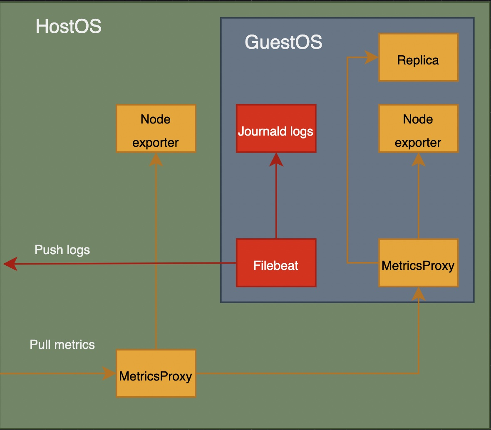
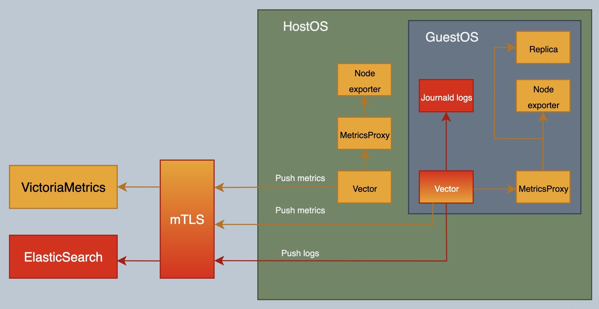

# IC metrics & logs

## Current architecture

This is the current metrics and logs architecture deployed at IC nodes.



## Propossed architecture

These are the main goals of this project:
1. Unify the software used to ship metrics and logs to [vector](https://vector.dev/).
1. Allow the chance to push metrics from IC nodes to its provider, in a prometheus exporter format (prometheus or victoriametrics).



## Vector

[Vector](https://vector.dev/) is a lightweight, ultra-fast tool for building observability pipelines written in Rust. It may collect, transform, and route all your logs and metrics with one simple tool.

### Installation

Vector is a new third party software installed at hostos and guestos to unify the logs and metrics shipping. The installation is done at the base docker used for dev and pro envs.

https://github.com/Zondax/ic/blob/metrics/ic-os/hostos/context/Dockerfile.base#L46C1-L50C28
https://github.com/Zondax/ic/blob/metrics/ic-os/guestos/context/Dockerfile.base#L44-L48
```
# Download and verify vector
RUN cd /tmp/ && \
    curl -L -O https://packages.timber.io/vector/0.40.0/vector-0.40.0-x86_64-unknown-linux-gnu.tar.gz && \
    echo "112b047df17df46feb22fc69234e8fc2ad5a411cd2e7d369f3b70c00617a4e90  vector-0.40.0-x86_64-unknown-linux-gnu.tar.gz" > vector.sha256 && \
    shasum -c vector.sha256
```

https://github.com/Zondax/ic/blob/metrics/ic-os/hostos/context/Dockerfile.base#L122-L126
https://github.com/Zondax/ic/blob/metrics/ic-os/guestos/context/Dockerfile.base#L90-L94
```

# Install vector
COPY --from=download /tmp/vector-0.40.0-x86_64-unknown-linux-gnu.tar.gz /tmp/vector-0.40.0-x86_64-unknown-linux-gnu.tar.gz
RUN cd /tmp/ && \
    tar --strip-components=3 -C /usr/local/bin/ -zvxf vector-0.40.0-x86_64-unknown-linux-gnu.tar.gz ./vector-x86_64-unknown-linux-gnu/bin/vector && \
    rm /tmp/vector-0.40.0-x86_64-unknown-linux-gnu.tar.gz
```

Also the creation of the user to run the vector instance
https://github.com/Zondax/ic/blob/metrics/ic-os/hostos/context/Dockerfile#L171-L174
https://github.com/Zondax/ic/blob/metrics/ic-os/guestos/context/Dockerfile#L213-L216
```
# The "vector" account. Used to run vector binary to ship logs and metrics of the
RUN useradd --system --create-home -d /var/lib/vector -s /usr/sbin/nologin -c "Vector user" -U -G systemd-journal vector && \
    chown root:root /usr/local/bin/vector
```

### Configuration

The vector configuration has been added to the monitoring components as the ic repo, https://github.com/Zondax/ic/tree/metrics/ic-os/components/monitoring/vector

These are the configuration components:
- Shared: Files are shared for hostos and guestos.
    - [setup-vector-permissions.sh](https://github.com/Zondax/ic/blob/metrics/ic-os/components/monitoring/vector/setup-vector-permissions.sh): Script used to create and secure the vector work folder, `/var/lib/vector`
    - [vector.service](https://github.com/Zondax/ic/blob/metrics/ic-os/components/monitoring/vector/vector.service): Vector hardened service file used to manage the vector service within the os. This file manages the calls to `setup-vector-permissions.sh` and `generate-vector-config.sh`
    - [build-bootstrap-config-image.sh](https://github.com/Zondax/ic/blob/metrics/ic-os/components/hostos-scripts/build-bootstrap-config-image.sh): Integrated the option to generate bootstrap `vector.conf` based on `elasticsearch_hosts` for guestos
    - [Services.adoc](https://github.com/Zondax/ic/blob/metrics/ic-os/docs/Services.adoc): Added vector service info to the docs
- Hostos:
    - [vector.yaml.template](https://github.com/Zondax/ic/blob/metrics/ic-os/components/monitoring/vector/hostos/vector.yaml.template): Template to properly generate vector configuration based on the hostos and guestos metrics proxy sources and configurable sinks where to send hostos and guestos metrics `victoriametric_hosts` variable at `vector.conf`
    - [README.adoc](https://github.com/Zondax/ic/blob/metrics/ic-os/components/monitoring/vector/hostos/README.adoc): Readme file
    - [ic-node.conf](https://github.com/Zondax/ic/blob/metrics/ic-os/components/misc/hostos/ic-node.conf): Secure vector etc folder
    - [generate-vector-config.sh](https://github.com/Zondax/ic/blob/metrics/ic-os/components/monitoring/vector/hostos/generate-vector-config.sh): Script used to generate vector config, based on the type of os and its template
- Guestos:
    - [vector.yaml.template](https://github.com/Zondax/ic/blob/metrics/ic-os/components/monitoring/vector/guestos/vector.yaml.template): Template to properly generate vector configuration based on the guestos metrics proxy, replica, node exporter and journal logs sources, hostos sink and configurable sinks where to send logs `elasticsearch_hosts` variable at `vector.conf`
    - [README.adoc](https://github.com/Zondax/ic/blob/metrics/ic-os/components/monitoring/vector/guestos/README.adoc): Readme file
    - [bootstrap-ic-node.sh](https://github.com/Zondax/ic/blob/metrics/ic-os/components/init/bootstrap-ic-node/guestos/bootstrap-ic-node.sh): Check `vector.conf` bootstrap file to configure vector
    - [ic-node.conf](https://github.com/Zondax/ic/blob/metrics/ic-os/components/misc/guestos/ic-node.conf): Secure vector etc folder
    - [ConfigStore.adoc](https://github.com/Zondax/ic/blob/metrics/ic-os/guestos/docs/ConfigStore.adoc): Added `vector.conf` docs
    - [generate-vector-config.sh](https://github.com/Zondax/ic/blob/metrics/ic-os/components/monitoring/vector/guestos/generate-vector-config.sh): Script used to generate vector config, based on the type of os and its template

### Instances

Once instance of vector has been configured to be running at:
* guestos: It is responsible to:
  * pull guestos metrics from metrics-proxy service, including replica, node-exporter and metrics-proxy metrics.
  * push collected metrics to configurable prometheus remote writer compatible servers instances.
  * pull journald logs.
  * push collected logs to configurable elasticsearch instances.
* hostos: It is responsible to
  * pull hostos metrics from metrics-proxy service, including replica, node-exporter and metrics-proxy metrics.
  * push collected metrics to configurable prometheus remote writer compatible servers instances.

### Data flow

The logs data flow (just running at guestos) is unchanged, but now it is integrated and managed by vector as single tool to manage logs and metrics, replacing filebeat. Vector instance running at guestos is configured to send logs to elasticsearch instances.

The metrics data is also managed by vector but its flow has been updated. There is a new option to push metrics (guestos and hostos) to distinct prometheus remote writer compatible servers, like vistoriametrics. At the same time, the previous data flow may be also configured to maintain backward compatibility, facilitate the potential transition to production environment, allowing the execution of deeper tests, the creation of parallel metrics server, the comparison between flows, etc.


## ic-os

Once all the changes has been applied in our fork repo, the build process for hostos and guestos has been done following the bazel procedure explained, [managing-ic-os-files](https://github.com/dfinity/ic/tree/master/ic-os#managing-ic-os-files)

### build

Due to the docker image with vector installed has not been published yet, the ic nodes images has been generated using the bazel environment `local-base-dev`.

```
bazel build //ic-os/{hostos,guestos}/envs/local-base-dev
```

### run

- hostos:
```
cd bazel-out/k8-opt/bin/ic-os/hostos/envs/local-base-dev
tar xvf disk.img.tar
qemu-system-x86_64 -machine type=q35 -nographic -m 4G -bios /usr/share/OVMF/OVMF_CODE.fd -drive file=disk.img,format=raw,if=virtio -netdev user,id=user.0,hostfwd=tcp::2222-:22 -device virtio-net,netdev=user.0
```

- guestos:
```
cd bazel-out/k8-opt/bin/ic-os/guestos/envs/local-base-dev
tar xvf disk.img.tar
qemu-system-x86_64 -machine type=q35 -nographic -m 4G -bios /usr/share/OVMF/OVMF_CODE.fd -drive file=disk.img,format=raw,if=virtio -netdev user,id=user.0,hostfwd=tcp::2222-:22 -device virtio-net,netdev=user.0
```

## Tests

A test enviroment based on containers has been built to run elasticsearch, victoriametrics and a reverse proxy to manage mTLS auth from the simulated nodes. Simulated nodes, hostos and guestos, has been deployed based on vms, running them with qemu. Due to the docker image with vector installed has not been published yet, the ic nodes images has been generated using the bazel environment `local-base-dev`.


### mtls

The mTLS configuration has been included to check the concept during the tests. This mTLS configuration requires manual steps and is not intended to be used as production deployment.

These are the files and scripts that has been used to generate the CA and the server and client certificates:
* cert.config
```
[ req ]
distinguished_name     = req_distinguished_name
x509_extensions        = v3_ca

dirstring_type = nobmp

[ req_distinguished_name ]
countryName                    = Country Name (2 letter code)
countryName_value              = CH

localityName                   = Locality Name (eg, city)
localityName_value             = Zug

organizationName               = Organization Name (e.g., company)
organizationName_value         = Zondax

organizationalUnitName         = Organizational Unit Name (eg, section)
organizationalUnitName_value   = mtls

commonName                     = Common Name (eg, YOUR name)
#commonName_value               = mtls.zondax.ch

emailAddress                   = Email Address
emailAddress_value             = mtls@zondax.ch

[ v3_ca ]

basicConstraints               = critical,CA:TRUE, pathlen:3
keyUsage                       = critical, keyCertSign, digitalSignature, cRLSign, nonRepudiation
```
* generate_CA.sh
```
#!/usr/bin/env bash

ALGORITHM=ed25519
CA_NAME=ca
CA_DURATION=3652
CERT_CONFIG=cert.config
CERT_DURATION=365
TLS_PATH=tls
SERVER_NAME=mtls-server
CLIENT_NAME=mtls-client01

if [ ! -f ${TLS_PATH}/${CA_NAME}.key ]; then
    openssl genpkey -algorithm ${ALGORITHM} > ${TLS_PATH}/${CA_NAME}.key
    chmod 400 ${TLS_PATH}/${CA_NAME}.key
    openssl pkey -in ${TLS_PATH}/${CA_NAME}.key -pubout -out ${TLS_PATH}/${CA_NAME}.pub
    openssl req -config ${CERT_CONFIG} -new -x509 -days ${CA_DURATION} -key ${TLS_PATH}/${CA_NAME}.key -out ${TLS_PATH}/${CA_NAME}.crt
fi

if [ ! -f ${TLS_PATH}/${SERVER_NAME}.key ]; then
    openssl genpkey -algorithm ${ALGORITHM} > ${TLS_PATH}/${SERVER_NAME}.key
    chmod 400 ${TLS_PATH}/${SERVER_NAME}.key
    openssl pkey -in ${TLS_PATH}/${SERVER_NAME}.key -pubout -out ${TLS_PATH}/${SERVER_NAME}.pub
    openssl req -config ${CERT_CONFIG} -new -x509 -days ${CERT_DURATION} -CA ${TLS_PATH}/${CA_NAME}.crt -CAkey ${TLS_PATH}/${CA_NAME}.key -key ${TLS_PATH}/${SERVER_NAME}.key -out ${TLS_PATH}/${SERVER_NAME}.crt
fi

if [ ! -f ${TLS_PATH}/${CLIENT_NAME}.key ]; then
    openssl genpkey -algorithm ${ALGORITHM} > ${TLS_PATH}/${CLIENT_NAME}.key
    chmod 400 ${TLS_PATH}/${CLIENT_NAME}.key
    openssl pkey -in ${TLS_PATH}/${CLIENT_NAME}.key -pubout -out ${TLS_PATH}/${CLIENT_NAME}.pub
    openssl req -config ${CERT_CONFIG} -new -x509 -days ${CERT_DURATION} -CA ${TLS_PATH}/${CA_NAME}.crt -CAkey ${TLS_PATH}/${CA_NAME}.key -key ${TLS_PATH}/${CLIENT_NAME}.key -out ${TLS_PATH}/${CLIENT_NAME}.crt
fi
```

* mtls-nginx.conf
```
user nginx;
worker_processes 2;

error_log /var/log/nginx/error.log notice;
pid /var/run/nginx.pid;


events {
    worker_connections 1024;
}


http {
    include /etc/nginx/mime.types;
    default_type application/octet-stream;

    log_format main '$remote_addr - $remote_user [$time_local] "$request" '
                    '$status $body_bytes_sent "$http_referer" '
                    '"$http_user_agent" "$http_x_forwarded_for"';

    access_log /var/log/nginx/access.log main;

    charset utf-8;
    server_tokens off;
    sendfile on;
    tcp_nopush on;
    tcp_nodelay on;
    keepalive_timeout 65;
    client_max_body_size 16M;

    #gzip on;

    server {
        listen 80 default_server;
        return 301 https://$host$request_uri;
    }
    server {
        listen 443 ssl;

        # Server certificate and key
        ssl_certificate /tmp/tls/mtls-server.crt;
        ssl_certificate_key /tmp//tls/mtls-server.key;

        # CA certificate for client verification
        ssl_client_certificate /tmp/tls/ca.crt;
        ssl_verify_client on;

        location /logs/ {
            proxy_pass http://elasticsearch:9200/;

            proxy_buffering off;
            proxy_set_header X-Real-IP $remote_addr;
            proxy_set_header X-Forwarded-For $proxy_add_x_forwarded_for;
        }
        location /metrics/ {
            proxy_pass http://victoriametrics:8428/;

            proxy_buffering off;
            proxy_set_header X-Real-IP $remote_addr;
            proxy_set_header X-Forwarded-For $proxy_add_x_forwarded_for;
        }
    }
}
```

### compose

Compose file to deploy test environment

```
services:
  victoriametrics:
    container_name: victoriametrics
    image: docker.io/victoriametrics/victoria-metrics:v1.102.1
    ports:
      - 8428:8428
    volumes:
      - vmdata:/storage
    command:
      - "--storageDataPath=/storage"
      - "--httpListenAddr=:8428"
    networks:
      - icp_net
    restart: always
  elasticsearch:
    container_name: elasticsearch
    image: docker.elastic.co/elasticsearch/elasticsearch:8.15.0
    ports:
      - 9200:9200
    mem_limit: 1GB
    environment: ['bootstrap.memory_lock=true','discovery.type=single-node','xpack.security.enabled=false', 'xpack.security.enrollment.enabled=false']
    networks:
      - icp_net
    restart: always
  mtls-server:
    container_name: mtls-server
    image: docker.io/nginx:1.27.1-alpine3.20-slim
    ports:
      - 8080:80
      - 8443:443
    volumes:
      - ./mtls/tls:/tmp/tls:ro
      - ./mtls/mtls-nginx.conf:/etc/nginx/nginx.conf:ro
    networks:
      - icp_net
    restart: always
volumes:
  vmdata: {}
networks:
  icp_net:
```
