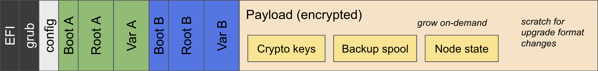

= Guest OS

A GuestOS image is comprised of the base Ubuntu plus the replica and orchestrator binaries.
GuestOS runs inside a QEMU virtual machine. The IC protocol runs inside of the guestOS virtual machine.

For more details on the goals, structure, and disk layout of GuestOS, https://docs.google.com/presentation/d/1xECozJhVCqzFC3mMMvROD7rlB-xWDHHLKvZuVnuLgJc/edit?usp=sharing[see here]

== How to build and run guestOS
=== Building guestOS

To build with Bazel, you need https://bazel.build/install[Bazel] installed.
Alternatively, the following script allows building IC-OS in a container with the correct environment already configured:

    ./gitlab-ci/container/container-run.sh

Build a guestOS image:

    bazel build //ic-os/guestos/dev/...

This will output disk-img.tar{.gz,.zst} in /ic/bazel-bin/ic-os/guestos/dev, which is your tarred guestOS image.

=== Running guestOS

The guestOS image (disk.img) can booted directly in qemu:

    qemu-system-x86_64 \
    -nographic -m 4G \
    -bios /usr/share/OVMF/OVMF_CODE.fd \
    -drive file=disk.img,format=raw,if=virtio

* Note: `ctrl-a x` to quit the qemu console.

You can also use bazel to do a testnet deployment. For documentation on this process, see ic/testnet/tools/README.md

== Upgrade GuestOS
The GuestOS disk layout contains two sets of system partitions, called partition sets "A" and "B".

Above is the guestOS disk layout—partition set "A" in green, partition set "B" in blue.

At any point in time, one partition set is "active" and the other is "passive". 
We can write to the passive partition set, and when we are ready, we can swap the active and passive partition sets, thereby upgrading the GuestOS.

=== Building upgrade image

The same bazel command to build a guestOS image will also produce a guestOS upgrade image:

    bazel build //ic-os/guestos/dev/...

This will output update-img.tar{.gz,.zst} in /ic/bazel-bin/ic-os/guestos/dev, which is your tarred guestOS-update image.

=== Installing upgrade image

    rootfs/opt/ic/bin/manageboot.sh upgrade-install update-img.tar
    rootfs/opt/ic/bin/manageboot.sh upgrade-commit

After that, the newly installed system will be booted. Note that on the next boot, it will revert to the original system unless you then confirm that the new system is actually fully operational:

    rootfs/opt/ic/bin/manageboot.sh confirm

For more information on the upgrade commands, see https://github.com/dfinity/ic/blob/master/ic-os/guestos/rootfs/opt/ic/bin/manageboot.sh[rootfs/opt/ic/bin/manageboot.sh]

== Developing the Ubuntu system

The Ubuntu configuration and system logic is contained in the rootfs/ subdirectory.
See instructions link:rootfs/README.adoc#[here] on how to make changes to the OS.

For further reading, see the docs in the
link:doc/README.adoc#[doc/ subdirectory]

== Alternate build paths

GuestOS images can also be built with Docker or by using the build scripts directly.

=== Building with Podman

The container-based build process is described https://github.com/dfinity/ic#building-the-code[here].
Be sure *not* to use Nix to build the IC binary artifacts. 

    ./gitlab-ci/container/build-ic.sh

This command will output a tarred guestOS image in the artifacts/icos folder: "disk-img.tar.gz"

Note that building with Podman creates a production image as opposed to a development image. When you run production images inside of QEMU, you will not be able to access the console and other debugging tools.

=== Building directly from the build scripts

In order to build directly from the build scripts, you must first build the release binaries. These binaries can be built locally, but they can also be downloaded remotely from a previous build.

Downloading the binaries from a previous build is much faster, but it will not include your local changes to the replica and orchestrator. 
However, this is not a problem if you are not working on the release binaries. 
In fact, this is preferable if you do not want your local environment to impact the creation of the release binaries.

As the node team rarely touches the release binaries, we prefer this build path.

    GET_GUEST_OS=0 ./ic-os/guestos/scripts/get-artifacts.sh

This will download the release binaries and place them in the ic/artifacts folder.

Setting GET_GUEST_OS=0 will tell the get-artifacts script to ignore downloading a complete guestOS image.
Leave out GET_GUEST_OS=0 if you want to quickly obtain a guestOS image!

Once you have the canister and release binaries, you can build the image:

    ./scripts/build-disk-image.sh -o <output> -v <version> -t dev -p <password> -x ../../artifacts/release

This command will take up to 10 minutes to run. 
It will output disk.img, which is the guestOS image.

Similar to a guestOS image, a guestOS-upgrade image can be built by using the build scripts directly:

    ./scripts/build-ubuntu.sh -o /tmp/upgrade-image.tar