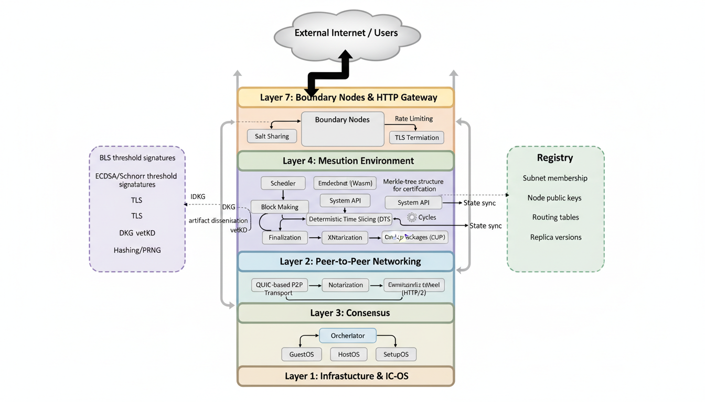
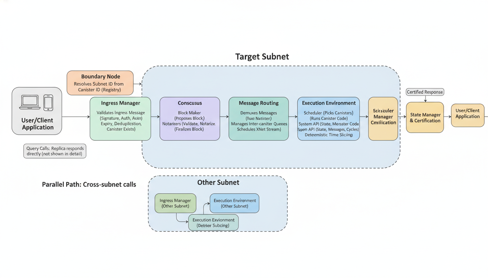
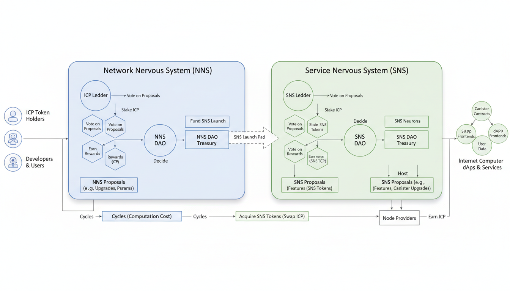
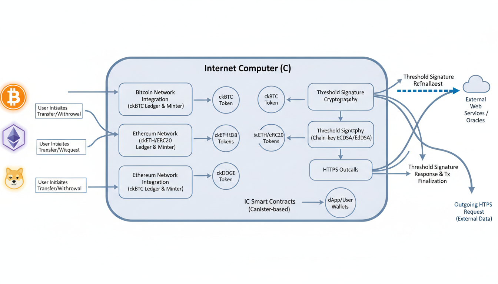
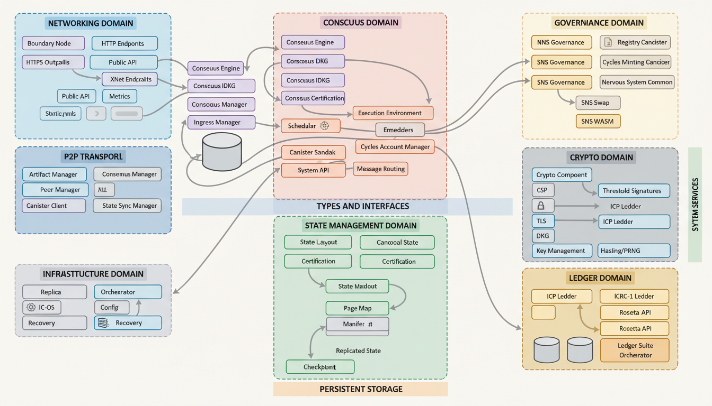

# IC Architecture Diagrams

Publication-quality diagrams of the Internet Computer protocol architecture, generated with [PaperBanana](https://github.com/llmsresearch/paperbanana).

## Diagrams

| Diagram | Description |
|---------|-------------|
|  | **01 - Layered Architecture**: The 7-layer IC protocol stack from IC-OS infrastructure at the bottom to Boundary Nodes at the top, with cross-cutting Crypto and Registry services. |
|  | **02 - Request Flow**: End-to-end path of a user request through the IC: HTTPS request -> Boundary Node -> Consensus -> Execution -> State Certification -> certified response. Includes cross-subnet call path. |
|  | **03 - Governance & Tokenomics**: The NNS/SNS governance ecosystem showing neurons, voting, ICP Ledger, Cycles Minting Canister, SNS Swap, and token flows. |
|  | **04 - Cross-Chain Integrations**: Trustless bridges to Bitcoin (ckBTC), Ethereum (ckETH/ckERC20), and Dogecoin (ckDOGE) using threshold ECDSA signatures and HTTPS outcalls. |
|  | **05 - Component Map**: Comprehensive subsystem interconnection diagram organized by domain: Networking, Consensus, Execution, State Management, Crypto, Governance, Ledger, and Infrastructure. |

## Regenerating

Each diagram has a corresponding `.txt` methodology file describing the architecture. To regenerate:

```bash
paperbanana generate \
  -i openspec/diagrams/01-layered-architecture.txt \
  -c "Layered architecture of the Internet Computer protocol stack" \
  -o openspec/diagrams/01-layered-architecture.png \
  --vlm-provider gemini --vlm-model gemini-2.5-flash \
  --image-provider google_imagen --image-model gemini-2.5-flash-image \
  -n 2
```

Requires `pip install paperbanana` and a `GOOGLE_API_KEY` environment variable.
