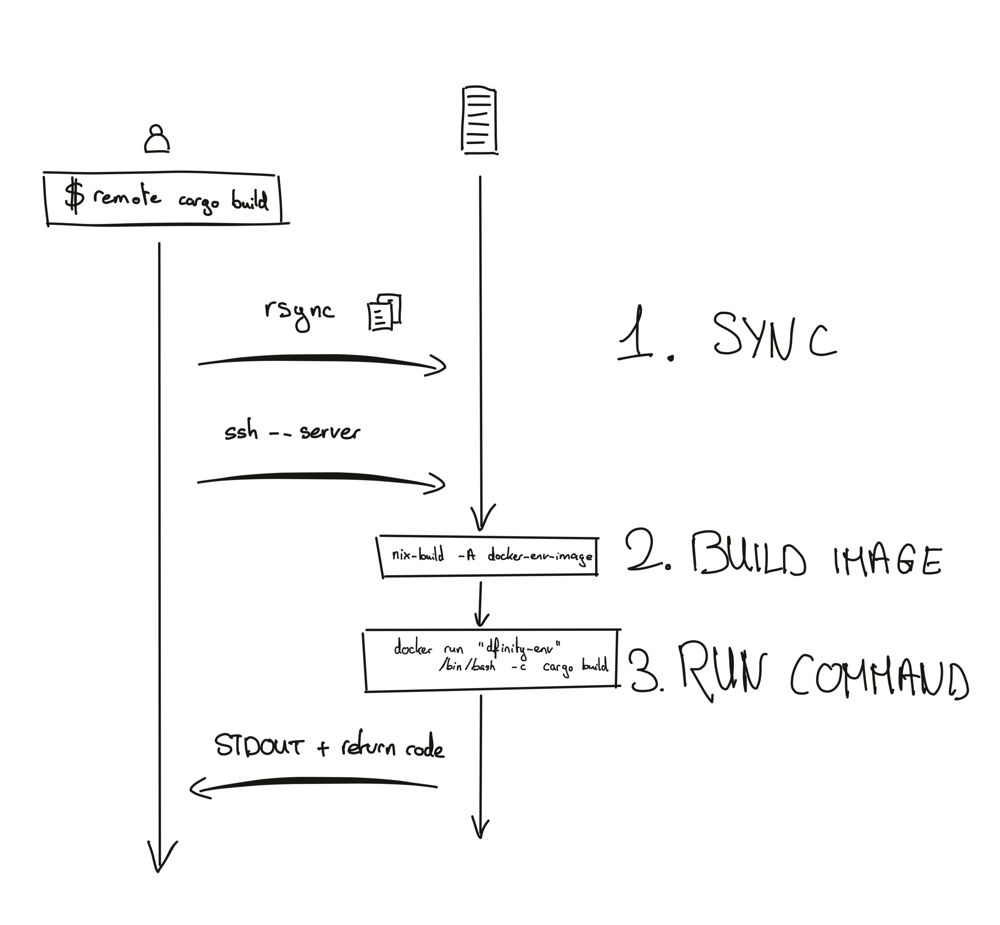
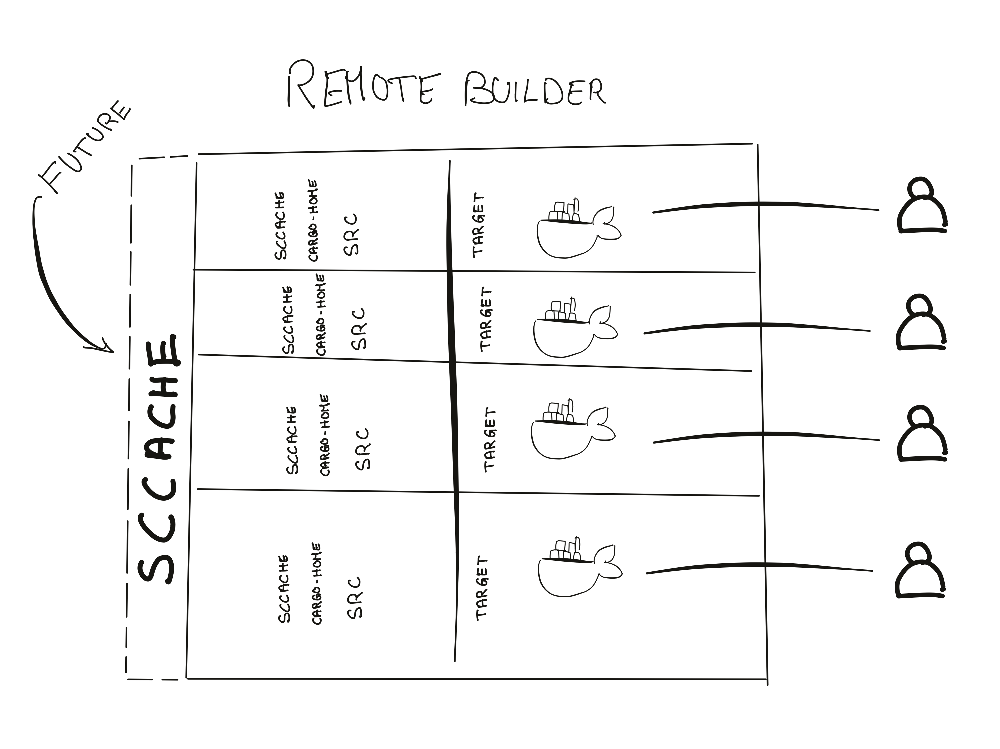

# Remote Builder Design

This document describes a design for docker-based remote build execution. This
design was motivated by the following goals:

_Goals for the user_:

* Same environment: The user should not be surprised by differences between the
  local and remote environments. The same tools should be available in the
  remote environment as in the local environment.
* Same codebase: The user should not spend time debugging issues due to
  differences between the source code that is being built.
* Seamless execution: The build offloading should be easy to use. The user
  should not have to think about the fact that the build is run remotely, and
  the offloading should fit our engineers' current workflow. Moreover a remote
  build should be drastically faster than a local build and provide immediate
  feedback.
* Isolation: If a remote builder is shared, the user should not have to care
  about scarce resources. E.g., if user A binds to port 8080 on a particular
  builder, user B should _also_ be allowed to bind to port 8080. Same goes for
  the filesystem.
* Allow SSH login: In some circumstances (VSCode execution, debugging) the user
  should be able to open a TTY in the remote environment.

Goals for IDX:

* Avoid NIH: The remote builder infrastructure should rely on off-the-shelve
  products like Docker, rsync and SSH.
* Limits are enforced: The user may not use more resources than intended, which
  would lead to resource starvation for other users and IDX involvement.
* Unused resources are released: If critical resources are not used for a
  while, the resources should be released (like disk space).

## Implementation



On each execution, rsync, then SSH and run `server` command that opens a TTY in
a docker container. The image used is built from the user's codebase. The image
is a vanilla ubuntu with a script that sets the environment. The script is
first `source`d.

Every invocation of the `remote` command spawns a new, short-lived container.
As much as possible the host directory mounts should be read-only.

**Container mounts**

* `/src`: Host volume, `/home/$user/outsource-checkout`. Populated by `rsync`.
* `/persisted`: Docker volume persisted across builds.
* `/nix/store`: The host Nix store is mounted as read-only.
* `/tmp/daemon-socket/socket`: The Nix daemon socket.
* `/home/ubuntu/.ssh`: Host's SSH directory is mounted.

In the future, all users may use the same SCCACHE instance (e.g. S3-backed).



## Image creation

The image is a vanilla (docker-hub) Ubuntu image with some dependencies
pre-installed (Nix, rsync, ...). When the container is started, `sorri` is used
to load the nix-shell environment. The image is described in [`outsource/docker/Dockerfile`](./Dockerfile).

## Keepalive, Garbage Collection and Container Reaper

There is a "keepalive" container present for every recent user connected to the
remote builder. The container checks for a keepalive file and shuts down once
the keepalive file hasn't been `touch`ed for 3 hours. Every invocation of
`remote` `touch`es the file. The volumes are [regularly
pruned](https://github.com/dfinity-lab/dcs/tree/1fe265eb344642e786be2f682739a756e4906544/ansible-internal/roles/docker_volume_gc);
as long as the keepalive container is running, the `/persisted` volume won't be
removed. Similarly, docker images are [regularly pruned](https://github.com/dfinity-lab/dcs/tree/1fe265eb344642e786be2f682739a756e4906544/ansible-internal/roles/docker_image_gc). Images are deleted unless they're in use by a container.

### Container Reaper

All command containers are labeled with the ID of the process running
`server.py`. The [container
reaper](https://github.com/dfinity-lab/dcs/tree/1fe265eb344642e786be2f682739a756e4906544/ansible-internal/roles/docker_container_reaper)
is a service that kills all containers labeled with a PID that does not exist
anymore. This prevents zombine containers from running for too long.


## Timing

| Command | Directory | Remote | Local | Speedup |
| --- | --- | ---| --- | --- |
| cargo check | `rs/phantom_newtype` | 3s | 20s | 566% |
| cargo build | `rs/phantom_newtype` | 15s | 114s | 660% |
| cargo check | `rs/crypto` | 49s | 188s | 283% |
| cargo build | `rs/crypto` | 65s | 321s | 393 % |

## VSCode

These are some notes from the VSCode support investigation.

**TL;DR**: we need to set up `authorized_keys` for directly booting the
container, we need to share `$HOME` across container invokes and we need to set
--network=host.

VSCode works in three steps:

1. SSHes into the remote: `VSCode` runs a TTY-less SSH session throughout: `ssh -v -T -D 62542 zh1-spm24.zh1.dfinity.network`
2. `scp`es some vscode javascript: `scp` is used to copy over some server: ` scp -v -o ConnectTimeout=15 'vscode-server.tar.gz' 'vscode-scp-done.flag' 'zh1-spm24.zh1.dfinity.network':'/home/ubuntu/.vscode-server/bin/ea3859d4ba2f3e577a159bc91e3074c5d85c0523'`
3. The server is booted on the remote and binds to a port which is forwarded to 62XXX or similar


For the first step to work, we need to make sure that `ssh`ing lands us
directly in the container (as opposed to the host). For that reason -- and for security reasons -- we can specify a `command` in the `authorized_keys` on the host. For instance:

```
command="~/foobar" ssh-ed25519 AAAAC3NzaC1lZDI1NTE5AAAAICkrw58g9XyA6R+MqrVVzkdATxeJ4kwTf1aTTAiEm+kH nicolas@dfinity.org
```


Then `foobar` will be run (instead of /bin/bash) whenever someone logs in. `foobar` will then need to act differently depending on the command sent by the user, where `$SSH_ORIGINAL_COMMAND` is set by SSH:

``` bash
#!/usr/bin/env bash

echo "---" >> ~/commands

case $SSH_ORIGINAL_COMMAND in
       rsync*)
               # this makes sure that `rsync` still works when syncing code
               echo "RSYNC $SSH_ORIGINAL_COMMAND" >> ~/commands
               $SSH_ORIGINAL_COMMAND
               ;;
       server*)
               # all the "remote" exec commands will now need to be prefixed
               # with 'server'
               echo "SERVER $SSH_ORIGINAL_COMMAND" >> ~/commands
               /bin/bash -l -c "~/outsource-checkout/outsource/server ${SSH_ORIGINAL_COMMAND#"server"}"
               ;;
       scp*)
               # needed when VSCode does an scp thingy
               echo "SCP" >> ~/commands
               /bin/bash -l -c "~/outsource-checkout/outsource/server . $SSH_ORIGINAL_COMMAND"
               ;;
       "")
               # here we assume a simple SSH session, like what vscode does
               echo "NO COMMAND" >> ~/commands
               /bin/bash -l -c "~/outsource-checkout/outsource/server ."
               ;;
       *)
               echo "BAD COMMAND $SSH_ORIGINAL_COMMAND" >> ~/commands
               exit 1
               ;;
esac
```

The `foobar` above already takes care of step 2, where VSCode performs `scp`.

_NOTE:_ here we handle `rsync` and `scp` differently (rsync goes to the host,
scp goes to the container). It would be nice to clean this up or at least
clarify.

Finally, in `outsource/server` we need to make sure that the container is run
with `--network=host` by default (i.e. in `NO COMMAND`) so that VSCode can bind
to the port on the host.
