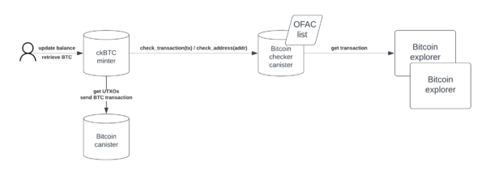

# Bitcoin Checker Canister

## Overview

The [Bitcoin checker canister](https://dashboard.internetcomputer.org/canister/oltsj-fqaaa-aaaar-qal5q-cai) provides a useful service to canisters that make use of the [Bitcoin integration](https://learn.internetcomputer.org/hc/en-us/articles/34211154520084-Bitcoin-Integration) of the Internet Computer: Given any Bitcoin address or transaction, the Bitcoin checker canister checks whether the address or transaction may be associated with illicit activities.

The following figure shows a high-level overview of how the [ckBTC minter canister](https://dashboard.internetcomputer.org/canister/mqygn-kiaaa-aaaar-qaadq-cai) interacts with the Bitcoin checker canister. When a user deposits or wishes to withdraw bitcoin, the ckBTC minter sends a request to the Bitcoin checker canister, which in turn checks the involved Bitcoin addresses against the [Specially Designated Nationals (SDN](https://sanctionslist.ofac.treas.gov/Home/SdnList) list of the [OFAC](https://ofac.treasury.gov). If there is a hit, the check is considered `Failed`. When receiving the response `Failed`, the actions of the ckBTC minter depend on the type of request.

- If the user deposited bitcoin, the ckBTC refuses to mint ckBTC and quarantines the received bitcoin instead.
- If the user attempted a Bitcoin withdrawal, the ckBTC returns an error and drops the request.

*The ckBTC minter interacts with the Bitcoin checker canister to check if Bitcoin addresses or transactions are tainted.*

The canister ID of the Bitcoin checker canister is `oltsj-fqaaa-aaaar-qal5q-cai`.

## Technical Details

The Bitcoin checker canister stores a copy of the SDN list internally. The list can only be modified by upgrading the Bitcoin checker canister itself, which requires an NNS proposal as the NNS is the only controller of the Bitcoin checker canister.

The Bitcoin checker canister offers a simple API to other canisters, which is discussed next. The candid file of the Bitcoin checker canister is available [here](./btc_checker_canister.did).

### Checking Bitcoin Addresses

The Bitcoin checker canister exposes the endpoint `check_address`, which takes a Bitcoin address in the form of a string as its sole parameter. It is then simply checked if the address is found on the SDN list. Since this is a simple lookup operation, no cycles are charged.

### Checking Bitcoin Transactions

The main endpoint to check a Bitcoin transaction is `check_transaction`, which takes the transaction ID as a `blob` as its sole parameter. Given such a transaction ID, the Bitcoin checker canister performs the following steps.

1. It uses an HTTPS outcall to obtain the (binary) transaction that corresponds to the given transaction ID.
1. The received transaction is hashed and the result is compared against the transaction ID as they should match.
1. If there is a match, it makes another HTTPS outcall for each input in the transaction as the inputs themselves are only references to previous transactions with an index that identifies the output that is consumed with the given input.
1. For each received input transaction, the Bitcoin address is derived that corresponds to the output at the right index.
1. Each address is looked up in the SDN list. If any address appears on the list, `Failed` is returned. Otherwise, the result is `Passed`.

Since this lookup is expensive due to the (potentially many) HTTPS outcalls, at least **40 billion cycles** must be attached to the call. The actual cost is likely lower, and unused cycles are refunded.

There is also the `check_transaction_str` endpoint, which is identical to `check_transaction` except for the fact that the transaction ID parameter must be provided as a string.

Lastly, there is the `check_transaction_query` endpoint, which can be used to check the status of a previous call to `check_transaction` or `check_transaction_str` using a query call. Note that a call to this endpoint does not trigger any HTTPS outcalls, nor is it guaranteed that this endpoint will be maintained in a backwards-compatible manner.