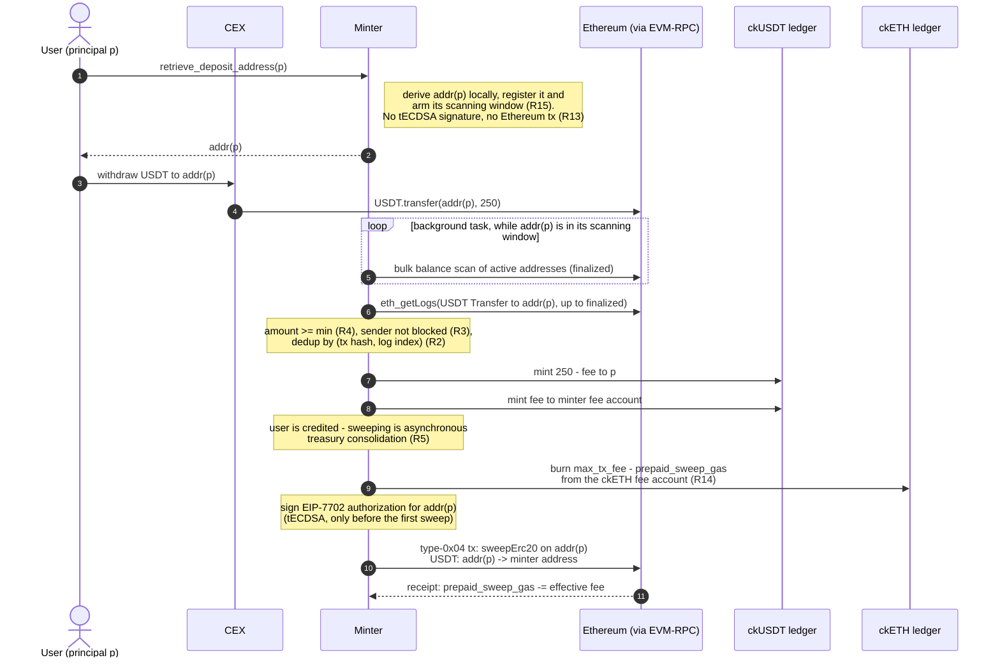
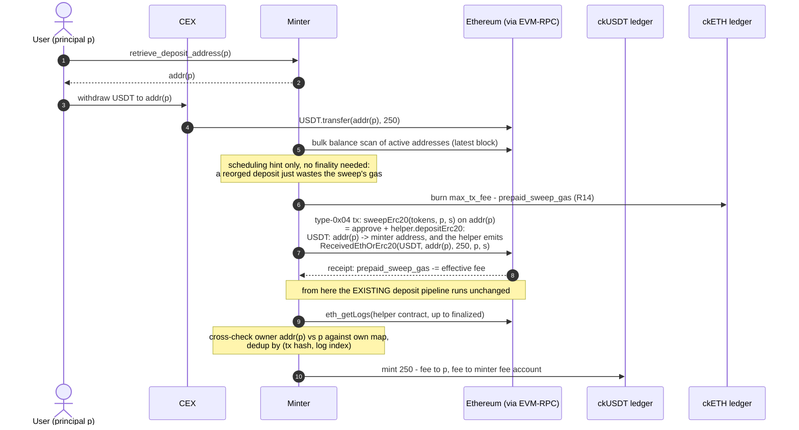
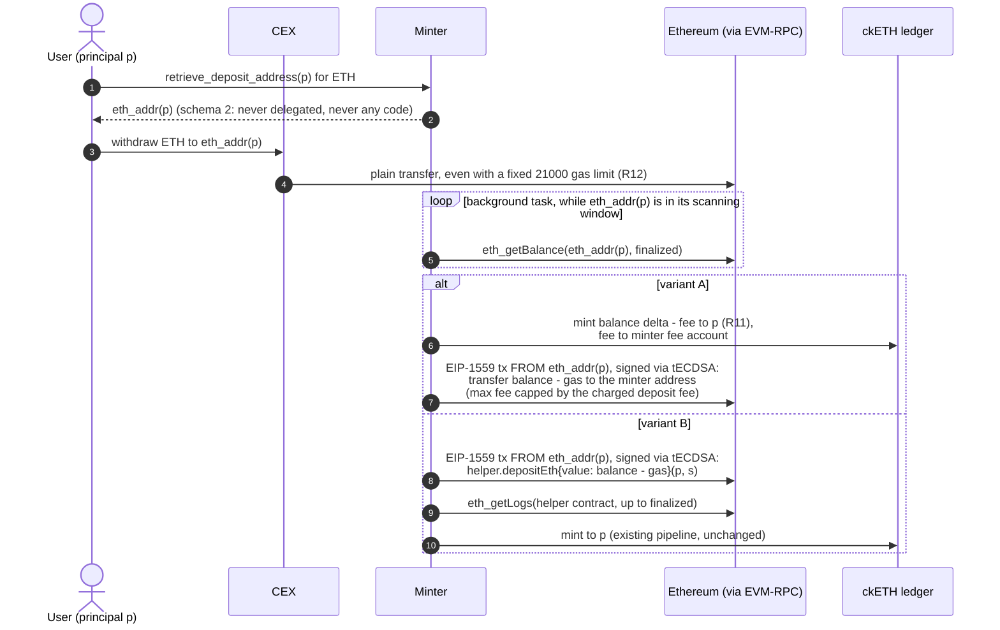

# Support deposit from CEX via per-account deposit addresses (EIP-7702 sweeping)

## Motivation

Today the only way to deposit ETH or ERC-20 tokens into ckETH/ckERC20 is to call the
helper smart contract (`DepositHelperWithSubaccount.sol`), which forwards the funds to
the minter's single tECDSA address and emits a `ReceivedEthOrErc20` event carrying the
beneficiary IC principal and subaccount. The minter discovers deposits exclusively by
scraping this event (`src/deposit.rs`, `src/eth_logs/`), i.e. attribution of funds to an
IC account relies entirely on the depositor *executing a contract call*.

A withdrawal from a centralized exchange (CEX) cannot fit through this path:

* A CEX only performs plain transfers: a bare ERC-20 `transfer(to, value)` (standard
  `Transfer` event, no principal) or a native ETH send (no log at all).
* The sender is the exchange's omnibus hot wallet, shared by all its customers, so
  sender-based attribution is impossible.
* Ethereum has no memo/data side-channel on plain transfers.

Consequently a user holding e.g. USDT or USDC on Coinbase/Binance cannot onramp into
ckUSDT/ckUSDC without first withdrawing to a self-custody wallet, funding it with ETH
for gas, and interacting with the helper contract — a prohibitive UX. Funds sent
directly to the minter address today are simply unaccounted, with no recovery path
(see the documentation of the `eth_balance` field of the `EthBalance` struct in
`src/state.rs`).

The only attribution channel a CEX supports is the **destination address**. This design
therefore gives each IC account a **unique, deterministic deposit address**, controlled
by the minter through threshold ECDSA (the ckBTC model), and uses **EIP-7702**
(live on Ethereum mainnet since the Pectra upgrade, May 2025) to sweep funds from these
addresses to the minter's main address **without pre-funding them with ETH for gas**:
the deposit EOA signs a one-time authorization delegating its code to a minimal sweeper
contract, and the minter's main (funded) address submits the sweep transaction and pays
for gas.

Target UX: *"I have USDT on a CEX and I want ckUSDT: I paste my deposit address into
the exchange withdrawal form and the tokens automagically appear as ckUSDT."*

The design is delivered in two phases:

* **Phase 1 — ckERC20 only** (ckUSDC, ckUSDT, …): deposits are ERC-20 `Transfer`s,
  which always emit logs and never execute recipient code, making detection and
  crediting straightforward.
* **Phase 2 — ckETH**: native ETH transfers emit no logs and interact badly with
  EIP-7702 delegated code under fixed 21'000 gas limits; this phase has additional
  design constraints, described per step.

## Requirements

### Phase 1 (ckERC20)

* `R1`: For every IC account `(principal, subaccount)`, the minter returns a unique,
  deterministic Ethereum deposit address. Repeated calls return the same address. Two
  distinct accounts never share an address, and no deposit address ever equals the
  minter's main address or a helper contract address.
* `R2`: If a supported ERC-20 token is transferred to a registered deposit address, and
  the transfer is in a finalized block, and the amount is at least the per-token
  minimum deposit amount, then the minter mints `amount - deposit_fee` ckERC20 to the
  associated IC account, exactly once (deduplication by `(transaction hash, log
  index)`, as for helper-based deposits).
* `R3`: If the ERC-20 `Transfer` sender is on the blocklist, no mint occurs and the
  deposit address is excluded from sweeping: the deposit is recorded as invalid and
  the funds stay segregated at the deposit address (release only via explicit manual
  or governance intervention — they never mix with the funds backing ckTokens at the
  minter's main address). An address holding both blocked and clean un-swept
  deposits is frozen entirely: no sweep and no further mint for that address.
* `R4`: Transfers below the per-token minimum deposit amount, and transfers of
  unsupported ERC-20 tokens, are not credited. No funds are ever burned or destroyed:
  they remain at a tECDSA-controlled address and remain recoverable by the minter.
* `R5`: Every credited deposit is eventually swept to the minter's main address. A
  sweep failure or delay never affects already-minted balances; sweeps are retried
  until confirmed.
* `R6`: A sweep transaction moves funds only to the minter's main address, regardless
  of who triggers it. No other destination is reachable through the sweeper delegate.
* `R7`: The per-token `deposit_fee` and minimum deposit amount are configurable
  (upgrade argument / NNS proposal) such that fees cover the amortized sweep gas cost.
* `R8`: All new state transitions (address registration, accepted/invalid deposit,
  delegation, sweep sent/confirmed) are recorded as audit events, replayable on
  upgrade, consistent with the minter's event-sourcing architecture.
* `R9`: The minter dashboard and metrics expose: registered deposit addresses,
  credited-but-unswept balances per token, delegation status, and sweep activity.
* `R10`: Withdrawals (ckERC20 → ERC-20 and ckETH → ETH) are unaffected: they continue
  to be served from the minter's main address and its existing nonce sequence.
* `R13`: Registering a deposit address (`retrieve_deposit_address`) triggers no
  threshold-ECDSA signature and no Ethereum transaction. The minter only signs a
  delegation and sweeps an address after having observed there a balance of a
  supported token of at least the per-token minimum deposit amount. (Registrations
  are free for callers; anything the minter spends per registration is a DoS vector
  on its cycles and ETH.)
* `R14`: Sweeping never reduces the 1:1 backing of ckETH. Before any ETH is spent on
  a sweep transaction, the minter burns from its fee account on the ckETH ledger at
  least the maximum fee of that transaction; at all times, cumulative ckETH burned
  for sweeping ≥ cumulative ETH spent on sweeping. Burned-but-unspent amounts are
  tracked and offset against subsequent burns; they are never re-minted. If the fee
  account cannot cover a sweep, no sweep is submitted.
* `R15`: A single user-visible step suffices: after one `retrieve_deposit_address`
  call, a deposit arriving at that address within its *scanning window* is credited
  with no further canister call by the user or frontend. Re-calling
  `retrieve_deposit_address` (idempotent, free of per-address spending per `R13`)
  re-arms the window; a deposit arriving on a dormant address is credited once the
  address is re-armed and is never lost in the meantime.

### Phase 2 (ckETH)

* `R11`: If the finalized ETH balance of a deposit address exceeds the sum of all
  previously credited (minus swept) amounts by at least the minimum ETH deposit
  amount, the minter mints the difference minus the deposit fee to the associated
  account, exactly once per balance observation (monotone accounting: total credited
  never exceeds total received).
* `R12`: A plain ETH transfer sent with a fixed 21'000 gas limit to a deposit address
  MUST NOT be permanently locked: it either succeeds (address has no code at transfer
  time) or fails on the sender side (funds never leave the exchange).

## Non-goals

* **Gasless deposits from self-custody wallets** (EIP-2612 `permit` / Permit2
  sponsoring): a related but different problem — and mainnet USDT does not implement
  EIP-2612. Deposit addresses incidentally also cover this use case (a self-custody
  wallet can simply `transfer` to the deposit address), which further reduces its
  urgency.
* **Deposits from L2s / other chains**: only Ethereum L1 withdrawals are in scope. A
  CEX withdrawal on Arbitrum/Base to the deposit address is out of scope (and must be
  documented as unsupported).
* **Replacing the helper-contract flow**: the existing flow remains the cheapest path
  for power users and is untouched.
* **Indefinite unattended scanning**: an address is actively scanned only within its
  scanning window (`R15`); scanning every registered address forever would hand an
  attacker an unbounded cycles bill (the registered set is inflatable for free,
  `R13`).
* **Automatic recovery of unsupported-token deposits**: funds remain recoverable
  (key-controlled address) but recovery tooling is future work.
* **Replenishing the sweep-gas fee account**: sweep gas is burned from the minter's
  ckETH fee account (`R14`), while deposit-fee revenue accrues per ckToken
  (ckUSDC, ckUSDT, …). Converting that revenue into ckETH to keep the fee account
  funded is a treasury/market operation outside this design; the design only
  requires that sweeping halts safely when the fee account is empty.
* Accepted residual limitations:
  * A deposit arriving *after* the scanning window has expired is credited only once
    the address is re-armed (`R15`) — e.g. the user re-opens the frontend. Funds sit
    safely at a key-controlled address in the meantime.
  * A CEX that batches ETH withdrawals through a contract (internal transactions)
    provides no sender information without trace APIs; Phase 2 compliance screening is
    therefore weaker for ETH than for ERC-20 (see step 3).
  * An account's ETH deposit address (Phase 2) differs from its ERC-20 one, matching
    the per-asset deposit-address UX of exchanges; sending the wrong asset class to
    an address is not credited automatically, but funds always remain recoverable
    (key-controlled addresses, `R12` guarantees no loss on the sender side).

## Design

The flow is five steps: **(1)** retrieve the deposit address, **(2)** withdraw from
the CEX to it, **(3)** detect the deposit, **(4)** credit (mint) the ckToken,
**(5)** sweep the funds to the minter, paying the fees **(6)** without touching the
ckETH backing. One section per step below; where a step has design variants, a table
weighs them.

Two variants cut across steps 3–6 and the decision between them is **not yet taken**:

* **Variant A — direct sweep**: the sweeper delegate transfers funds straight to the
  minter's main address; crediting happens through a *new* detection→mint path,
  independent of sweeping.
* **Variant B — sweep through the existing helper contract**: the sweeper delegate
  calls `depositErc20`/`depositEth` on the already-deployed helper
  (`DepositHelperWithSubaccount.sol`), so every sweep emits the canonical
  `ReceivedEthOrErc20` event and the **existing** scrape→parse→dedup→mint pipeline
  credits the deposit unchanged.

Both variants are exercised end-to-end in the runnable demo (see Test plan),
including the adversarial case for variant B (a non-minter caller attempting to
sweep with their own principal is rejected).

### End-to-end flows

Deposit of USDT from a CEX under **variant A** (direct sweep; crediting via a new
detection path, mint on finalized deposit, sweep asynchronously):



Deposit of USDT from a CEX under **variant B** (sweep through the existing helper
contract; crediting via the unchanged existing pipeline):



Deposit of ETH from a CEX (**Phase 2**, dedicated never-delegated ETH deposit
address; the deposit pays its own sweep gas, no `R14` burn involved):



### Step 1: Retrieve the deposit address

Attribution is by **destination address** — the only channel a CEX supports (the
sender is a shared hot wallet, plain transfers carry no memo). Each IC account gets a
unique, deterministic deposit address, derived from the minter's threshold-ECDSA key:

* Derivation path for account `(p, s)`: `[SCHEMA, p.as_slice(), s]` where `SCHEMA`
  is a 1-byte tag (`[1u8]` for ERC-20 deposit addresses, `[2u8]` for Phase 2 ETH
  deposit addresses) and `s` is the 32-byte subaccount (all-zero for the default
  subaccount). Non-empty by construction, hence distinct from the main address' empty
  path (`MAIN_DERIVATION_PATH`).
* The child *public key* (and hence the address) is computed locally from the cached
  master public key using non-hardened derivation (`ic-secp256k1`'s
  `derive_subkey` / `DerivationPath`, as ckBTC does) — no management-canister call
  and no signature is needed to *create* an address. Decisive property: **the minter
  holds the key.** Funds at a deposit address are never dependent on contract code
  being correct — even with no EIP-7702 at all, any balance is recoverable by
  classically funding the address with gas and signing a normal transfer.
* Endpoint `retrieve_deposit_address(account) -> String` (EIP-55 checksummed). This
  is deliberately an **update call** — despite returning a deterministically derivable
  value — because it has side effects: it registers the address in state
  (`deposit_addresses: Account ↔ Address` bimap + per-address bookkeeping:
  `registered_at_block`, delegation status, credited/swept counters, scanning-window
  expiry), arms the address' scanning window (`R15`) and emits a
  `DepositAddressRegistered` audit event. The `retrieve_` naming (rather than `get_`)
  signals this: a query could neither register nor re-arm. It does nothing else — no
  threshold-ECDSA signature, no Ethereum transaction (`R13`): registrations are free
  for callers, so any eager per-address spending would let an attacker drain the
  minter's cycles and ETH by spamming registrations. Repeated calls are cheap
  lookups that re-arm the window.

**Variants — address layout across asset classes** (decided: per-asset, introduced
with Phase 2):

| Variant | Pros | Cons |
|---|---|---|
| **Per-asset addresses** (chosen): ERC-20 address (schema 1, delegated once, permanently) + ETH address (schema 2, never delegated) | ETH address never has code → fixed-21'000-gas CEX withdrawals always work (`R12`), no failure window; ETH sweeps need no EIP-7702 at all (deposit pays its own gas, 21'000 gas, cheapest possible); ERC-20 delegation stays one-signature-ever | Two addresses per account to register/scan; user must use the right address per asset (matches CEX per-asset UX; wrong-asset deposits recoverable, see Non-goals) |
| **Single shared address** with *set-and-clear* delegation (install delegate, sweep, re-delegate to `address(0)`) | One address per account | Two tECDSA signatures + ≈ 2 × 12'500–25'000 gas per sweep cycle; short window in which fixed-gas ETH transfers fail at the sender; more complex delegation lifecycle |
| **Single shared address** with permanent delegation | One address, one authorization ever | Breaks ETH deposits entirely: plain sends to a delegated address without `receive()` revert — funds bounce at the CEX (`R12` holds, but ETH deposits are impossible) |

### Step 2: Withdraw from the CEX to the deposit address

The user pastes the deposit address into the exchange withdrawal form; the CEX
performs a plain ERC-20 `transfer` (or a native ETH send, Phase 2) from its hot
wallet. Properties the design must absorb:

* The transfer may come from any address (shared hot wallet), possibly via an
  internal transaction (contract-batched withdrawal) for ETH.
* ERC-20 transfers always emit a `Transfer` log and never execute recipient code, so
  a delegated ERC-20 deposit address is harmless to the sender. Native ETH sends
  execute recipient code — hence the per-asset address layout of step 1.
* Amounts below the per-token minimum, and unsupported ERC-20 tokens, are not
  credited (`R4`) — the minimum is not only fee economics but the anti-DoS bound
  that keeps an attacker from forcing unprofitable sweeps. Nothing is ever lost:
  funds sit at a key-controlled address.

No variants for this step: the CEX side is not under our control by definition.

### Step 3: Detect the deposit

The single-step target UX (`R15`) demands that after `retrieve_deposit_address`, no
further user or frontend action is required — a two-step flow (retrieve, then claim)
is not reliably implementable by a frontend (the browser may be closed between the
steps), and today's helper-based deposits are single-step too.

Detection therefore runs as a **minter background task over "active" addresses**:
registration (or re-registration) arms a per-address *scanning window*; while the
window is open, the address belongs to the active set that a periodic task scans in
bounded batches. The window (e.g. days, configurable) bounds the DoS surface
(`R13`): spam registrations inflate the active set only temporarily, the per-tick
scan budget is fixed, and dormant addresses cost nothing until re-armed.

Scanning is a two-stage funnel, cheap-first:

1. **Bulk balance scan** of the active set: many `balanceOf` `eth_call`s /
   `eth_getBalance`s per HTTPS outcall. This requires **JSON-RPC batch support in
   the EVM-RPC canister** (`eth_batch`,
   [dfinity/evm-rpc-canister#561](https://github.com/dfinity/evm-rpc-canister/pull/561),
   in progress); until it lands, one [Multicall3](https://www.multicall3.com/)
   `aggregate3` `eth_call` reads a whole batch (including native ETH via
   `getEthBalance`) in a single request. The scan only decides *whether to act* — it
   can be stale or lossy without correctness impact.
2. **Per-address confirmation** for addresses with a non-zero delta: targeted
   `eth_getLogs` for `Transfer(*, deposit_address)` on the supported token contracts
   over `(last_checked_block, finalized]`, chunked by the existing 500-block spread
   logic (variant A: source of truth for crediting; variant B: input to sweep
   scheduling). For ETH (Phase 2) there are no logs: the finalized balance delta
   itself is the observation (`R11`).

**Blocklist screening** happens here, against the same compiled-in blocklist used
for helper deposits today (`src/blocklist.rs`, checked like
`register_deposit_events` in `src/deposit.rs`): the screened address is the
`Transfer` log's `from` — for a CEX deposit, the exchange hot wallet. Note that the
minter is never limited to the bare balance it observed at an EOA: **the balance
scan of stage 1 is only a trigger, never a source of truth.** A standard ERC-20
balance can only change through `transfer`/`transferFrom`/mint, all of which emit a
`Transfer` log, so every balance increase noticed by stage 1 has a corresponding
stage-2 log carrying the sender — including transfers initiated by contracts
(internal transactions). No crediting, screening decision, or sweep is ever based on
a balance observation alone; consequently, **under variant B the stage-2 log query
is mandatory before scheduling any sweep** (after the sweep, the helper event's
`owner` is the deposit EOA, not the real sender, so screening cannot be left to the
pipeline; the pipeline's owner↔principal cross-check remains as belt-and-braces).

If a screened sender is blocked: no mint, the deposit is recorded as invalid, and —
an *improvement* over today, where blocked helper-deposit funds already sit
commingled at the minter address — the deposit address is excluded from sweeping, so
the funds stay segregated at the key-controlled deposit address until an explicit
manual/governance release (`R3`). Since a sweep always moves an address' whole
balance, an address holding a *mix* of blocked and clean un-swept transfers is
frozen entirely (no sweep, no further mint): partially sweeping "clean" amounts out
of an address holding sanctioned funds is deliberately not attempted.

For native ETH (Phase 2) the trigger and the observation coincide — a balance delta
has no log and carries no sender: screening is limited to address-level checks plus
optional caller-supplied withdrawal transaction hashes — an accepted weakening to
review with compliance before Phase 2 ships (see Non-goals).

An optional `notify_deposit(account)` endpoint (guarded per account, like ckBTC's
`update_balance`) remains useful as an accelerator and as the re-arming mechanism
for dormant addresses, but nothing in the flow *requires* it.

**Variants — what triggers detection:**

| Variant | Pros | Cons |
|---|---|---|
| **Registration-armed scanning window** (chosen): background bulk scans of the active set while the window is open | Single-step UX (`R15`) — no second call to lose; bounded, attacker-resistant cost (fixed per-tick budget, windows expire); re-armed for free by `retrieve_deposit_address` | Deposits after window expiry wait for re-arming; needs `eth_batch` (#561) or Multicall3 for bulk reads |
| **Claim endpoint only** (`notify_deposit`, ckBTC's `update_balance` model) | Cheapest possible: minter does nothing unprompted; precise targeting | Two-step flow breaks the target UX — a frontend cannot reliably guarantee the second call (browser closed after the CEX withdrawal); kept only as optional accelerator |
| **Continuous scraping of all registered addresses forever** (`eth_getLogs` topic disjunctions / standing balance scans) | Best possible UX, no windows | Unbounded cost growth with the (attacker-inflatable, free) registered set — a standing cycles drain (`R13`); topic-disjunction limits across providers; still misses native ETH |

### Step 4: Credit the deposit (mint)

The deposited amount is minted in full: `amount - deposit_fee` to the depositor's
account, and `deposit_fee` to a minter-controlled fee account **on the same ckToken
ledger** — the full deposited amount is swept, so minting it in full keeps supply
exactly equal to backing and makes fee revenue explicit and auditable (`R7`). Fees
are flat and proposal-configurable rather than oracle-priced, for simplicity and
predictability. Deduplication is by `(transaction hash, log index)` (`R2`), memo and
quarantine-on-panic machinery as in today's `mint()` path.

*Where* the mint comes from is the crux of the open A/B decision:

| Variant | Pros | Cons |
|---|---|---|
| **A — mint on the finalized deposit** (new detection→mint path) | Lowest, sweep-independent crediting latency; crediting keeps working even when sweeping halts (e.g. empty `R14` fee account); permissionless-safe sweeps (step 5) | A second correctness-critical crediting path in the minter: new event types, dedup, audit trail — the highest-risk part of the whole feature |
| **B — mint via the existing pipeline, on the sweep's own finalized helper event** | The battle-tested scrape→parse→dedup→mint pipeline is reused **unchanged** — detection (step 3) is demoted from correctness-critical to a mere scheduling hint; massively smaller minter change | Mint follows the sweep: crediting halts if sweeping halts (empty fee account); latency tied to sweep scheduling — mitigated by sweeping on `latest`-block observations without waiting for deposit finality (a reorged deposit only wastes the sweep's gas: the delegate sweeps a zero balance, and a reorged sweep tx is absorbed by the existing nonce-tracking/resubmission machinery), making end-to-end latency comparable to today's helper flow |

### Step 5: Sweep the funds to the minter

Shared mechanics (both variants): each ERC-20 deposit EOA signs (threshold ECDSA)
**one** EIP-7702 authorization — lazily, together with its first sweep, never at
registration (`R13`) — delegating its code to a single immutable, storage-less
sweeper delegate. Sweep transactions are type-`0x04` transactions sent from the
minter's funded main address (sharing its existing nonce sequence, `R10`); many
deposit addresses are swept in one transaction, the deployed delegate instance
doubling as the batcher. No deposit address ever needs an ETH balance for gas. A
periodic task selects addresses with observed-but-unswept balances where
`unswept_value ≥ sweep_gas_cost × margin` or `age > max_age`, up to `N ≈ 20` per
batch (gas-limit bound); confirmation is via transaction receipt, like withdrawals,
emitting `SweepConfirmed` audit events (`R5`, `R8`).

For Phase 2 ETH addresses no delegation is involved at all: the sweep is a plain
EIP-1559 transfer (variant A) or a `depositEth{value}` helper call (variant B) of
`balance - fee`, signed with the address' own derived key, gas paid from the swept
balance itself — see step 6 for the fee cap this requires.

| Variant | Pros | Cons |
|---|---|---|
| **A — direct sweep** (`CkSweeper`): delegate transfers straight to the minter's main address | Permissionless-safe: destination hardcoded (`R6`), any caller only donates gas → no access control in the delegate; cheapest — measured 66'854 gas for a first single-address sweep incl. authorization, ≈ 26k marginal per additional address in a batch | Requires the new crediting path of step 4 variant A |
| **B — sweep through the helper** (`CkSweeperViaHelper`): delegate approves + calls `depositErc20(token, balance, principal, subaccount)` on the existing helper | Sweep emits the canonical `ReceivedEthOrErc20` event → step 4 variant B's pipeline reuse; native ETH works symmetrically via `depositEth` | The principal is a sweep argument → sweeping must be restricted to the minter (`msg.sender ∈ {MINTER, SELF}` via two immutables, keeping the delegate stateless); more gas — measured 82'207 single (+15'353), 164'746 for a batch re-delegating three EOAs and sweeping two |

### Step 6: Pay the transaction fees without touching the ckETH backing

The ETH at the minter's main address backs ckETH 1:1, so spending it on sweep gas
without a matching ckETH burn would leave ckETH under-backed. Sweeps are therefore
funded exclusively through the minter's **fee account on the ckETH ledger**,
mirroring how withdrawals already pay for gas (burn ckETH, spend ETH):

* **Burn first** (`R14`): before submitting a sweep, burn
  `max(0, gas_limit × max_fee_per_gas - prepaid_sweep_gas)` from the ckETH fee
  account (the transaction's maximum fee — an overestimate by construction) and add
  it to `prepaid_sweep_gas`; abort the sweep (and retry later) if the burn fails.
* On the receipt, subtract the effective transaction fee from `prepaid_sweep_gas` —
  the surplus of the overestimate is **not re-minted** but carried as credit for the
  next burn, so "cumulative burned ≥ cumulative spent" holds at every instant. Both
  movements are audit events; `prepaid_sweep_gas` and the effective fee/cost ratio
  are exposed on the dashboard (`R8`, `R9`) to recalibrate `deposit_fee` via
  proposal.
* An empty ckETH fee account halts sweeping safely: under variant A, credited
  balances are unaffected and deposits keep accumulating at key-controlled
  addresses; under variant B, crediting pauses with sweeping. Replenishing the fee
  account (converting per-ckToken fee revenue into ckETH) is out of scope (see
  Non-goals).
* **Phase 2 ETH sweeps involve no `R14` burn**: their gas is paid from the deposit
  itself, before the ETH ever reaches the (counted) backing at the main address.
  However, since under variant A the account is credited `balance - fee` *before*
  the sweep executes, the sweep's `gas_limit × max_fee_per_gas` must be capped by
  the charged deposit fee — waiting out gas spikes if necessary — so the gas spent
  can never exceed what was withheld from minting. Fee-refund dust left at the
  address rolls into the next sweep.

No variants for this step beyond what variants A/B already imply (see step 4 for
the fee-account outage behavior).

## Implementation

### Constraints

* The minter's transaction layer supports only EIP-1559 (type `0x02`) transactions
  (`src/tx.rs`, `EIP1559_TX_ID`); EIP-7702 requires adding the type `0x04`
  (`SetCode`) transaction and authorization-tuple signing.
* The minter's main address uses the *empty* ECDSA derivation path
  (`MAIN_DERIVATION_PATH` in `src/lib.rs`); any per-account path must be non-empty and
  collision-free with it. Withdrawals assume a single sequential nonce for the main
  address (`src/state/transactions`); sweep transactions originate from the main
  address and therefore share that nonce sequence.
* All Ethereum interaction goes through the EVM-RPC canister with multi-provider
  threshold consensus (`src/eth_rpc_client/`); every new call (`eth_getLogs` per
  deposit address, `eth_getBalance`, `eth_getTransactionCount` for deposit EOAs) must
  use the same reduction strategies.
* Each EVM-RPC call today is one HTTPS outcall *per provider* and each outcall burns
  cycles, so the bulk balance scans of step 3 depend on **JSON-RPC batch request
  support in the EVM-RPC canister** (`eth_batch`,
  [dfinity/evm-rpc-canister#561](https://github.com/dfinity/evm-rpc-canister/pull/561),
  in progress), with Multicall3 `aggregate3` as the interim alternative.
* The minter is event-sourced (`src/state/audit.rs`, `src/state/event.rs`): all new
  state must be reconstructible from persisted events (`R8`).
* Deposits are only credited at *finalized* blocks, as today.

### EIP-7702 support in the transaction layer (`src/tx.rs`)

* New `Eip7702TransactionRequest` with `SET_CODE_TX_ID: u8 = 4`, payload
  `0x04 || rlp([chain_id, nonce, max_priority_fee_per_gas, max_fee_per_gas, gas_limit,
  to, value, data, access_list, authorization_list, y_parity, r, s])`.
* `AuthorizationTuple { chain_id, delegate, nonce, y_parity, r, s }`, signed over
  `keccak256(0x05 || rlp([chain_id, delegate, nonce]))` with `sign_with_ecdsa` using
  the deposit address' derivation path; `chain_id` is set explicitly (never 0) to
  prevent cross-chain replay; recovery-id determination reuses the existing
  `Eip1559Signature` machinery.
* Deposit-EOA nonces: fetched via `eth_getTransactionCount` (finalized) with the usual
  consensus strategy at authorization-signing time; an applied authorization increments
  the EOA nonce, tracked in state to avoid re-fetching. Deposit EOAs never send
  transactions themselves (Phase 1), so races are limited to re-delegation.
* Resubmission with fee bumping mirrors the existing `Resubmittable` logic.

### Sweeper delegate contract

A single immutable Solidity contract, deployed once per network, with **no storage**
(EIP-7702 delegates share the EOA's storage; using none avoids collision hazards
entirely) and the minter's main address hardcoded as an `immutable`. Shown below for
variant A; variant B's delegate (`CkSweeperViaHelper` in the demo) has the same shape
but calls the helper's `depositErc20` with caller-supplied principal/subaccount and
restricts callers to the minter (see step 5):

```solidity
contract CkSweeper {
    address payable private immutable MINTER;
    constructor(address minter) { MINTER = payable(minter); }

    /// Callable by anyone: funds can only move to MINTER (R6).
    function sweepErc20(IERC20[] calldata tokens) external {
        for (uint i = 0; i < tokens.length; ++i) {
            uint256 b = tokens[i].balanceOf(address(this));
            if (b > 0) tokens[i].safeTransfer(MINTER, b); // USDT-safe transfer
        }
    }

    /// Batch entry point: the deployed CkSweeper instance doubles as the
    /// batcher, sweeping many delegated deposit EOAs in a single transaction.
    function sweepErc20Batch(address[] calldata depositAddresses, address[] calldata tokens) external {
        for (uint i = 0; i < depositAddresses.length; ++i) {
            CkSweeper(depositAddresses[i]).sweepErc20(tokens);
        }
    }

    function sweepEth() external {
        if (address(this).balance > 0) {
            (bool ok,) = MINTER.call{value: address(this).balance}("");
            require(ok);
        }
    }
}
```

Notes: `safeTransfer` handles non-standard ERC-20s (USDT returns no value); no
`receive()` is defined on purpose — plain ETH sends to a *delegated* address are meant
to fail rather than be silently accepted while delegated (`R12`); reentrancy is moot
(fixed destination, no state).

### Test plan

A runnable end-to-end demonstration of the sweep mechanism (unfunded deposit EOAs,
plain USDT-style transfers, single and batched type-`0x04` sweep transactions with gas
paid by the minter, gas assertions) against a local dev node (any post-Pectra
version) is available in [`deposit_from_cex_demo/`](deposit_from_cex_demo/README.md).
It exercises both sweep variants — including variant B against the *real*
`DepositHelperWithSubaccount.sol` bytecode, asserting the emitted
`ReceivedEthOrErc20` events carry the right principals, re-delegation of already
delegated deposit EOAs, and the rejected non-minter sweep attempt.

Unit tests (in `tests.rs` files per module, helpers in `test_fixtures.rs`):

* Address derivation: determinism, uniqueness across principals/subaccounts and
  schema tags, non-collision with the main address, EIP-55 encoding (`R1`).
* Type-`0x04` transaction and authorization encoding/signing against EIP-7702
  published test vectors; authorization hash `0x05 || rlp(...)`; recovery-id
  round-trip (`R5`, `R6` plumbing).
* `Transfer`-log parsing, minimum/fee arithmetic incl. `amount ≤ fee` rejection
  (`R2`, `R4`), blocklist screening incl. sweep exclusion (`R3`), dedup by
  `(tx_hash, log_index)` (`R2`).
* Scanning-window state machine: arming, expiry, re-arming, bounded active set
  (`R13`, `R15`).
* Balance-delta crediting monotonicity across sweep interleavings (`R11`).
* `prepaid_sweep_gas` accounting: burn-first, surplus carry-over, never re-minted
  (`R14`).
* Event replay: state reconstructed from audit events equals live state (`R8`).

Integration tests (state-machine tests in `rs/ethereum/cketh/minter/tests` with the
mocked EVM-RPC canister, extending the existing fixtures):

* End-to-end Phase 1 happy path: retrieve address → mock `Transfer` log → background
  scan → mint − fee → `R14` burn → sweep tx submitted with expected `0x04` payload →
  receipt → swept (`R2`, `R5`, `R7`, `R14`, `R15`).
* Concurrent scans/notifies produce a single mint (`R2`); blocked sender: no mint,
  no sweep (`R3`); below-minimum and unsupported token (`R4`); sweep failure then
  retry with fee bump, mint unaffected (`R5`); empty fee account halts sweeping only
  (`R14`); withdrawal flow regression (`R10`); dashboard rendering (`R9`).
* Solidity: Foundry tests for the delegate(s) (permissionless sweep only reaches
  minter / minter-only sweep for variant B, USDT-style token, delegated-EOA
  execution against a Prague-enabled local node) (`R6`, `R12`).

Verification commands: `bazel test //rs/ethereum/cketh/minter:lib_unit_tests
//rs/ethereum/cketh/minter/tests:...` (exact targets per PR), plus `forge test` for
the delegate.

### Delivery / PR sequence

1. **EIP-7702 transaction support** in `src/tx.rs` + authorization signing in
   `src/management` — pure library code, no behavior change. AC: encoding/signing unit
   tests vs. EIP test vectors.
2. **Deposit address derivation, registration state, `retrieve_deposit_address`,
   scanning-window state** + audit events + dashboard section. AC: `R1`, `R8`, `R9`
   (addresses only), `R13`, `R15` (state machine only).
3. **ckERC20 deposit detection and crediting** (background scans, log queries, fees,
   minimums, blocklist incl. sweep exclusion). AC: `R2`, `R3`, `R4`, `R7`, `R8`,
   `R15`.
4. **Sweeper delegate contract** (Solidity, audited) + **sweeping task** (delegation,
   batching, receipts, `R14` burn accounting, metrics). AC: `R5`, `R6`, `R7`, `R9`,
   `R10`, `R14`.
5. **Phase 1 launch on Sepolia**, then mainnet via NNS upgrade proposal; frontend
   (OISY) integration of `retrieve_deposit_address` (single call — no polling
   required, `R15`).
6. **Phase 2: ckETH** (schema-2 addresses, balance-delta crediting, key-signed
   sweeps with fee cap, compliance sign-off). AC: `R11`, `R12`.

## Discussed Alternatives

* **CREATE2 counterfactual forwarder contracts** (the classic exchange pattern): a
  factory computes `CREATE2(factory, salt = hash(account), forwarder_init_code)`
  addresses; sweeping deploys the forwarder, which pushes funds to the minter and
  `selfdestruct`s in the same transaction (still permitted post-EIP-6780), leaving the
  address codeless. Pros: decade of production use by exchanges, no dependency on
  EIP-7702 or a new transaction type, native-ETH-safe by construction. Rejected as
  the primary design because funds at deposit addresses would be controlled *by code
  alone* — a factory/forwarder bug strands funds with no recovery — whereas tECDSA
  EOAs keep key-based recovery independent of any contract; CREATE2 also costs more
  gas per sweep (redeployment every cycle) and inherits residual `selfdestruct`
  protocol risk. It remains the documented fallback if EIP-7702 adoption in the
  transaction layer is reconsidered.
* **ERC-4337 smart accounts + paymaster**: counterfactual 4337 accounts as deposit
  addresses with sponsored sweeps. Rejected: the minter is already its own transaction
  submitter with multi-provider consensus, so EntryPoint/bundler/paymaster
  infrastructure adds ≈100k+ gas per operation, an external-bundler dependency, and a
  large audit surface for zero benefit over EIP-7702 here.
* **EIP-2612 permit / Permit2 sponsored helper deposits**: gasless `depositWithPermit`
  relayed by the minter. Does not address CEX at all (a hot wallet signs no custom
  message) and mainnet USDT lacks EIP-2612; noted as possible future work for
  self-custody UX only.
* **Attribution hacks on the single minter address**: sender-address registration
  (CEX hot wallets are shared/unpredictable), exact-amount matching (collisions,
  fee-adjusted amounts, griefable by front-running), or per-exchange integration of
  the helper contract (business-development dependency, not a protocol design). All
  rejected as unsound.
* **Pre-funding deposit EOAs with ETH for gas** (no EIP-7702): requires one extra
  funding transaction per sweep (≈21k gas + transfer latency), doubles the transaction
  count, leaves ETH dust stranded on every deposit address, and complicates fee
  accounting. Kept only as the implicit *recovery* path that key-controlled addresses
  always allow (and, for native ETH, as the *chosen* mechanism in inverted form: the
  deposit itself is the gas, see step 5).
