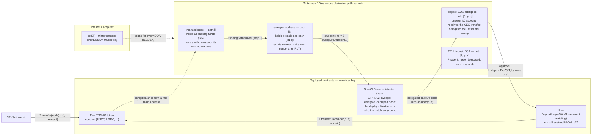
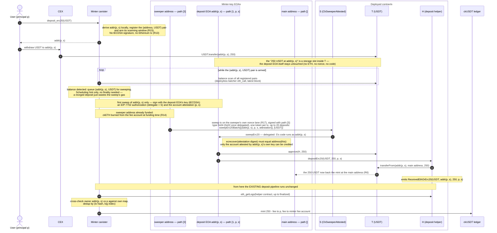
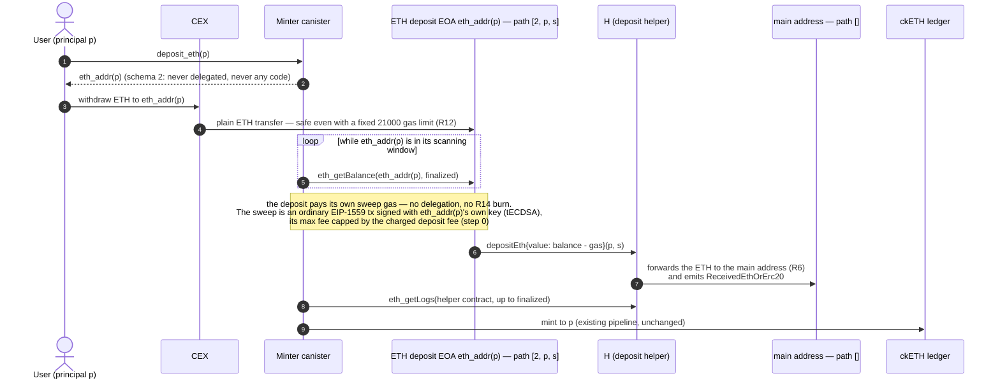
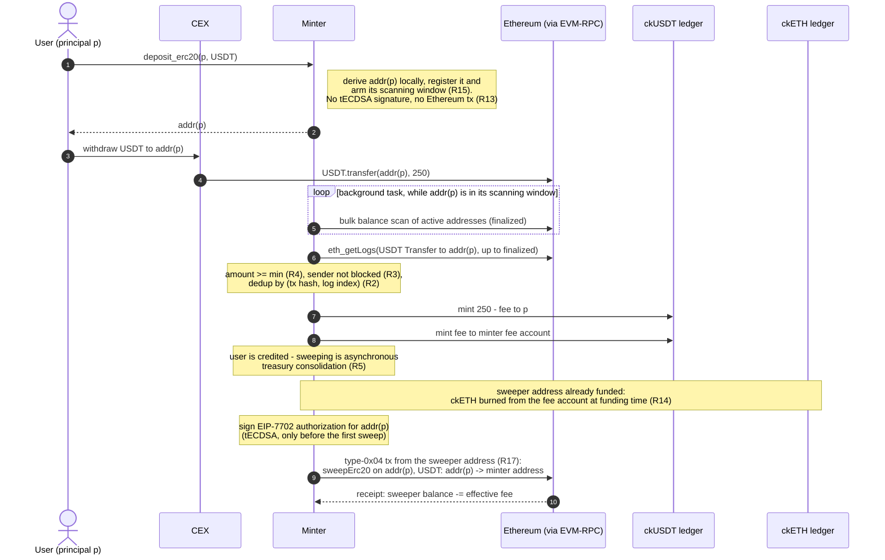

# Support deposit from CEX via per-account deposit addresses (EIP-7702 sweeping)

- [Motivation](#motivation)
- [Requirements](#requirements)
- [Non-goals](#non-goals)
- [Design](#design)
  - [Addresses and contracts](#addresses-and-contracts)
  - [End-to-end flows](#end-to-end-flows)
  - [Step 0: Fund the transaction fees](#step-0-fund-the-transaction-fees-without-touching-the-cketh-backing)
  - [Step 1: Retrieve the deposit address](#step-1-retrieve-the-deposit-address)
  - [Step 2: Withdraw from the CEX](#step-2-withdraw-from-the-cex-to-the-deposit-address)
  - [Step 3: Detect the deposit](#step-3-detect-the-deposit)
  - [Step 4: Credit the deposit (mint)](#step-4-credit-the-deposit-mint)
  - [Step 5: Sweep the funds to the minter](#step-5-sweep-the-funds-to-the-minter)
- [Implementation](#implementation)
  - [Constraints](#constraints)
  - [EIP-7702 primer](#eip-7702-primer-the-sweep-one-transaction-at-a-time)
  - [EIP-7702 transaction layer](#eip-7702-support-in-the-transaction-layer-srctxrs)
  - [Address derivation, signing, and nonces](#address-derivation-tree-signing-and-nonces)
  - [Sweeper delegate contract](#sweeper-delegate-contract)
  - [Test plan](#test-plan)
  - [Delivery / PR sequence](#delivery--pr-sequence)
- [Cost estimation](#cost-estimation)
- [Discussed Alternatives](#discussed-alternatives)

## Motivation

Today the only way to deposit ETH or ERC-20 tokens into ckETH/ckERC20 is to call the
helper smart contract (`DepositHelperWithSubaccount.sol`), which forwards the funds to
the minter's single tECDSA address and emits a `ReceivedEthOrErc20` event carrying the
beneficiary IC principal and subaccount. The minter discovers deposits exclusively by
scraping this event (`src/deposit.rs`, `src/eth_logs/`), i.e. attribution of funds to an
IC account relies entirely on the depositor *executing a contract call*.

A withdrawal from a centralized exchange (CEX) cannot fit through this path:

* A CEX only performs plain transfers: a bare ERC-20 `transfer(to, value)` (standard
  `Transfer` event, no principal) or a native ETH send (no log at all).
* The sender is the exchange's omnibus hot wallet, shared by all its customers, so
  sender-based attribution is impossible.
* Ethereum has no memo/data side-channel on plain transfers.

Consequently a user holding e.g. USDT or USDC on Coinbase/Binance cannot onramp into
ckUSDT/ckUSDC without first withdrawing to a self-custody wallet, funding it with ETH
for gas, and interacting with the helper contract — a prohibitive UX. Funds sent
directly to the minter address today are simply unaccounted, with no recovery path
(see the documentation of the `eth_balance` field of the `EthBalance` struct in
`src/state.rs`).

The only attribution channel a CEX supports is the **destination address**. This design
therefore gives each IC account a **unique, deterministic deposit address**, controlled
by the minter through threshold ECDSA (the ckBTC model), and uses **EIP-7702**
(live on Ethereum mainnet since the Pectra upgrade, May 2025) to sweep funds from these
addresses to the minter's main address **without pre-funding them with ETH for gas**:
the deposit EOA signs a one-time authorization delegating its code to a minimal sweeper
contract, and a minter-controlled, funded address submits the sweep transaction and
pays for gas.

Target UX: *"I have USDT on a CEX and I want ckUSDT: I paste my deposit address into
the exchange withdrawal form and the tokens automagically appear as ckUSDT."*

The design is delivered in two phases:

* **Phase 1 — ckERC20 only** (ckUSDC, ckUSDT, …): deposits are ERC-20 `Transfer`s,
  which always emit logs and never execute recipient code, making detection and
  crediting straightforward.
* **Phase 2 — ckETH**: native ETH transfers emit no logs and interact badly with
  EIP-7702 delegated code under fixed 21'000 gas limits; this phase has additional
  design constraints, described per step.

## Requirements

### Phase 1 (ckERC20)

_Requirements are grouped by phase, not numbered sequentially: `R11` and `R12` are defined under Phase 2 below._

* `R1`: For every IC account `(principal, subaccount)`, the minter returns a unique,
  deterministic Ethereum deposit address. Repeated calls return the same address. Two
  distinct accounts never share an address, and no deposit address ever equals the
  minter's main address or a helper contract address.
* `R2`: If a supported ERC-20 token is transferred to a registered deposit address, and
  the transfer is in a finalized block, and the amount is at least the per-token
  minimum deposit amount, then the minter mints `amount - deposit_fee` ckERC20 to the
  associated IC account, exactly once (deduplication by `(transaction hash, log
  index)`, as for helper-based deposits).
* `R3`: If the ERC-20 `Transfer` sender is on the blocklist, no mint occurs (the
  deposit is recorded as invalid) and the **minter never sweeps** the deposit
  address; release only via explicit manual or governance intervention. An address
  holding both blocked and clean un-swept deposits is frozen entirely: no sweep and
  no further mint for that address. The no-mint half is the hard guarantee; the
  sweep exclusion is *best-effort segregation*, not a security boundary — receipt
  of ERC-20 is not consentable on Ethereum, so tainted funds can always be pushed
  into the main pool directly (already the case today: a blocked sender using the
  helper contract lands its funds, unminted, commingled at the minter address), and
  under permissionless sweeping a third party can sweep a tainted deposit address.
* `R4`: Transfers below the per-token minimum deposit amount, and transfers of
  unsupported ERC-20 tokens, are not credited. No funds are ever burned or destroyed:
  they remain at a tECDSA-controlled address and remain recoverable by the minter.
* `R5`: Every credited deposit is eventually swept to the minter's main address. A
  sweep failure or delay never affects already-minted balances; sweeps are retried
  until confirmed.
* `R6`: A sweep transaction moves funds only to the minter's main address, regardless
  of who triggers it. No other destination is reachable through the sweeper delegate.
* `R7`: The per-token `deposit_fee` and minimum deposit amount are configurable
  (upgrade argument / NNS proposal) such that fees cover the amortized per-deposit cost
  the minter bears: detection cycles (balance scans and log queries, spent on every armed
  address whether or not a deposit arrives) as well as sweep gas, not sweep gas alone.
* `R8`: All new state transitions (address registration, accepted/invalid deposit,
  delegation, sweep sent/confirmed) are recorded as audit events, replayable on
  upgrade, consistent with the minter's event-sourcing architecture.
* `R9`: The minter dashboard and metrics expose: registered deposit addresses,
  credited-but-unswept balances per token, delegation status, sweep activity, and the
  sweeper address' gas balance (`R17`).
* `R10`: Withdrawals (ckERC20 → ERC-20 and ckETH → ETH) are unaffected: they continue
  to be served from the minter's main address and its existing nonce sequence.
* `R13`: Registering a deposit `(address, token)` pair (an unsponsored `deposit_erc20` call)
  triggers no threshold-ECDSA signature and no Ethereum transaction (a *sponsored*
  call may trigger both — compensated by the caller's ckETH fee). The minter only signs a
  delegation and sweeps an address after having observed there a balance of a
  supported token of at least the per-token minimum deposit amount. (Registrations
  are free for callers; anything the minter spends per registration is a DoS vector
  on its cycles and ETH.)
* `R14`: Sweeping never reduces the 1:1 backing of ckETH. Before any ETH is spent on
  a sweep transaction, the minter burns from its fee account on the ckETH ledger at
  least the maximum fee of that transaction; at all times, cumulative ckETH burned
  for sweeping ≥ cumulative ETH spent on sweeping. Burned-but-unspent amounts are
  never re-minted, and are not credited against subsequent burns either: like the
  unspent gas of a user withdrawal, the surplus simply stays with the minter as
  additional backing. If the fee account cannot cover a sweep, no sweep is
  submitted. (The burn happens ahead of time: funding the sweeper address is an
  ordinary ckETH withdrawal from the fee account, covering many sweeps — see step 0.)
* `R15`: A single user-visible step suffices: after one `deposit_erc20`
  call, a deposit of that token arriving at the address within the pair's *scanning
  window* is credited with no further canister call by the user or frontend.
  Re-calling `deposit_erc20` (idempotent, free of per-`(address, token)` spending
  per `R13`) re-arms the window; a deposit arriving on a dormant pair is credited
  once the pair is re-armed and is never lost in the meantime.
* `R16`: A withdrawal transaction is only submitted when the minter's main address
  holds a sufficient balance of the withdrawn asset: credited-but-unswept deposits
  count as *unavailable* liquidity. A withdrawal that cannot be covered yet is
  queued (never failed on-chain for insufficient balance) and served once sweeps
  have consolidated enough funds. (Under the decided crediting of step 4 this
  holds by construction: the mint follows the consolidation.)
* `R17`: A stuck (submitted but unmined) sweep transaction never delays a
  withdrawal. Sweeps are issued from a **dedicated sweeper address** with its own
  nonce sequence — never from the main address, whose nonce sequence serves
  withdrawals exclusively — so sweep and withdrawal transactions cannot
  head-of-line-block each other.

### Phase 2 (ckETH)

* `R11`: If the finalized ETH balance of a deposit address exceeds the sum of all
  previously credited (minus swept) amounts by at least the minimum ETH deposit
  amount, the minter mints the difference minus the deposit fee to the associated
  account, exactly once per balance observation (monotone accounting: total credited
  never exceeds total received).
* `R12`: A plain ETH transfer sent with a fixed 21'000 gas limit to a deposit address
  MUST NOT be permanently locked: it either succeeds (address has no code at transfer
  time) or fails on the sender side (funds never leave the exchange).

## Non-goals

* **Gasless deposits from self-custody wallets** (EIP-2612 `permit` / Permit2
  sponsoring): a related but different problem — and mainnet USDT does not implement
  EIP-2612. Deposit addresses incidentally also cover this use case (a
  self-custody wallet can simply `transfer` to the deposit address).
* **Deposits from L2s / other chains**: only Ethereum L1 withdrawals are in scope. A
  CEX withdrawal on Arbitrum/Base to the deposit address is out of scope (and must be
  documented as unsupported).
* **Replacing the helper-contract flow**: the existing flow remains the cheapest path
  for power users and is untouched.
* **Indefinite unattended scanning**: an address is actively scanned only within its
  scanning window (`R15`); scanning every registered address forever would hand an
  attacker an unbounded cycles bill (the registered set is inflatable for free,
  `R13`).
* **Automatic recovery of unsupported-token deposits**: funds remain recoverable
  (key-controlled address) but recovery tooling is future work.
* **Replenishing the sweep-gas fee account**: sweep gas is burned from the minter's
  ckETH fee account (`R14`), while deposit-fee revenue accrues per ckToken
  (ckUSDC, ckUSDT, …). Converting that revenue into ckETH to keep the fee account
  funded is a treasury/market operation outside this design; the design only
  requires that sweeping halts safely when the fee account is empty. (The
  caller-paid sweeps of step 0 provide an organic ckETH inflow into the fee
  account, shrinking the conversion need.)
* Accepted residual limitations:
  * A deposit arriving *after* the scanning window has expired is credited only once
    the address is re-armed (`R15`) — e.g. the user re-opens the frontend. Funds sit
    safely at a key-controlled address in the meantime.
  * A CEX that batches ETH withdrawals through a contract (internal transactions)
    provides no sender information without trace APIs; Phase 2 compliance screening is
    therefore weaker for ETH than for ERC-20 (see step 3).
  * An account's ETH deposit address (Phase 2) differs from its ERC-20 one, matching
    the per-asset deposit-address UX of exchanges; sending the wrong asset class to
    an address is not credited automatically, but funds always remain recoverable
    (key-controlled addresses, `R12` guarantees no loss on the sender side).

## Design

The flow: **(0)** fund the transaction fees (a background precondition), then per
deposit: **(1)** retrieve the deposit address, **(2)** withdraw from the CEX to it,
**(3)** detect the deposit, **(4)** credit (mint) the ckToken, **(5)** sweep the
funds to the minter. One section per step; each step states its decision in place,
and the alternatives that were weighed and discarded are collected in
[Discussed Alternatives](#discussed-alternatives) at the bottom of this document.

Two decisions shape everything below:

* **The sweep goes through the existing helper contract** ("variant B" of the
  original design): the sweeper delegate calls `depositErc20` on the
  already-deployed helper (`DepositHelperWithSubaccount.sol`), so every sweep
  emits the canonical `ReceivedEthOrErc20` event and the **existing**
  scrape→parse→dedup→mint pipeline credits the deposit unchanged (step 4). The
  discarded alternative — a direct sweep with its own detection→mint path,
  "variant A" — is at the bottom.
* **Sweeping is permissionless, guarded by a one-time self-attestation**: any
  caller may submit a sweep and only ever donates gas — a signature by the
  deposit address' own key, not the identity of the caller, fixes which IC
  account is credited, and funds only ever move through the helper to the
  minter's main address (`R6`, step 5).

### Addresses and contracts

Everything on the Ethereum side is one of two kinds. **Minter-key EOAs**:
addresses derived from the minter's single threshold-ECDSA key (one sibling
derivation path per role, see
[Address derivation](#address-derivation-tree-signing-and-nonces)); the minter
can sign for each of them, and funds there never depend on contract code.
**Deployed contracts**: ordinary contracts the minter holds no key for; the
helper and the delegate hold no funds, a token contract holds everyone's ERC-20
balances as storage slots.


```mermaid
flowchart LR
    CEX["CEX hot wallet"]
    subgraph IC["Internet Computer"]
        Minter["ckETH minter canister<br/>one tECDSA master key"]
    end
    subgraph EOA["Minter-key EOAs — one derivation path per role"]
        Main["main address — path []<br/>holds all backing funds (R6);<br/>sends withdrawals on its own nonce lane"]
        Sweeper["sweeper address — path [3]<br/>holds prepaid gas only (R14);<br/>sends sweeps on its own nonce lane (R17)"]
        Dep["deposit EOA addr(p, s) — path [1, p, s]<br/>one per IC account; receives the CEX transfer;<br/>delegated to S at its first sweep"]
        DepEth["ETH deposit EOA — path [2, p, s]<br/>Phase 2; never delegated, never any code"]
    end
    subgraph SC["Deployed contracts — no minter key"]
        S["S — CkSweeperAttested (new)<br/>EIP-7702 sweeper delegate, deployed once;<br/>the deployed instance is also the batch entry point"]
        H["H — DepositHelperWithSubaccount (existing)<br/>emits ReceivedEthOrErc20"]
        T["T — ERC-20 token contract (USDT, USDC, ...)"]
    end

    Minter -. "signs for every EOA (tECDSA)" .-> EOA
    CEX -- "T.transfer(addr(p, s), amount)" --> T
    Main -- "funding withdrawal (step 0)" --> Sweeper
    Sweeper -- "sweep tx, to = S:<br/>sweepErc20Batch(...)" --> S
    S -- "delegated call: S's code<br/>runs as addr(p, s)" --> Dep
    Dep -- "approve +<br/>H.depositErc20(T, balance, p, s)" --> H
    H -- "T.transferFrom(addr(p, s) → main)" --> T
    T -. "swept balance now at the main address" .-> Main
```

The separation between the three minter-key roles is deliberate and
load-bearing:

* **Main address** (path `[]`): the `R6` destination — all deposits, swept or
  helper-based, land here, and it alone backs the ck-token supply. Every
  withdrawal is sent from here on its own sequential nonce lane (`R10`). It
  never sends sweeps.
* **Sweeper address** (path `[3]`): holds nothing but prepaid gas (funded by
  ckETH withdrawals from the fee account, step 0, `R14`) and sends every sweep
  transaction on its own nonce lane, so a stuck sweep can never
  head-of-line-block a withdrawal and vice versa (`R17`). Swept funds never
  pass through it.
* **Deposit EOAs** (paths `[1, p, s]`, Phase 2 `[2, p, s]`): one per IC
  account, the only addresses a user ever sees. They hold deposits between the
  CEX transfer and the sweep and never need ETH for gas; because the minter
  holds their keys, funds there stay recoverable even without any contract.

### End-to-end flows

Deposit of USDT from a CEX. Every arrow into an Ethereum participant is
submitted (and every log read) through the EVM-RPC canister with multi-provider
consensus; the boxes separate the minter-key EOAs from the deployed contracts:


```mermaid
sequenceDiagram
    autonumber
    actor User as User (principal p)
    participant CEX
    participant Minter as Minter canister
    box Minter-key EOAs
        participant Sw as sweeper address — path [3]
        participant D as deposit EOA addr(p, s) — path [1, p, s]
        participant Main as main address — path []
    end
    box Deployed contracts
        participant S as S (CkSweeperAttested)
        participant T as T (USDT)
        participant H as H (deposit helper)
    end
    participant Ledger as ckUSDT ledger

    User->>Minter: deposit_erc20(USDT)
    Note right of Minter: derive addr(p, s) locally, register the (address, USDT) pair<br/>and arm its scanning window (R15).<br/>No tECDSA signature, no Ethereum tx (R13)
    Minter-->>User: addr(p, s)
    User->>CEX: withdraw USDT to addr(p, s)
    CEX->>T: USDT.transfer(addr(p, s), 250)
    Note over D,T: the "250 USDT at addr(p, s)" is a storage slot inside T —<br/>the deposit EOA itself stays untouched (no ETH, no nonce, no code)
    loop while the (addr(p, s), USDT) pair is armed
        Minter->>T: balance scan of all registered pairs<br/>(deployless batcher eth_call, latest block)
    end
    Note over Minter: balance detected: queue (addr(p, s), USDT) for sweeping.<br/>Scheduling hint only, no finality needed —<br/>a reorged deposit just wastes the sweep's gas
    Note over Minter,D: first sweep of addr(p, s) only — sign with the deposit EOA's key (tECDSA):<br/>an EIP-7702 authorization (delegate = S) and the account attestation (p, s)
    Note over Minter,Sw: sweeper address already funded:<br/>ckETH burned from the fee account at funding time (R14)
    Sw->>S: sweep tx on the sweeper's own nonce lane (R17), signed with path [3]:<br/>type 0x04 (0x02 once delegated), one token per tx, up to 20 deposits:<br/>sweepErc20Batch([(addr(p, s), p, s, attestation)], [USDT])
    S->>D: sweepErc20 — delegated: S's code runs as addr(p, s)
    Note right of D: ecrecover(attestation digest) must equal address(this):<br/>only the account attested by addr(p, s)'s own key can be credited
    D->>T: approve(H, 250)
    D->>H: depositErc20(USDT, 250, p, s)
    H->>T: transferFrom(addr(p, s), main address, 250)
    T-->>Main: the 250 USDT now back the mint at the main address (R6)
    Note over H: emits ReceivedEthOrErc20(USDT, addr(p, s), 250, p, s)
    Note over Minter,H: from here the EXISTING deposit pipeline runs unchanged
    Minter->>H: eth_getLogs(helper contract, up to finalized)
    Note over Minter: cross-check owner addr(p, s) vs p against own map,<br/>dedup by (tx hash, log index)
    Minter->>Ledger: mint 250 - fee to p, fee to minter fee account
```

Deposit of ETH from a CEX (**Phase 2**, dedicated never-delegated ETH deposit
address; the deposit pays its own sweep gas, no `R14` burn and no EIP-7702
involved):


```mermaid
sequenceDiagram
    autonumber
    actor User as User (principal p)
    participant CEX
    participant Minter as Minter canister
    participant DEth as ETH deposit EOA eth_addr(p) — path [2, p, s]
    participant H as H (deposit helper)
    participant Main as main address — path []
    participant Ledger as ckETH ledger

    User->>Minter: deposit_eth(p)
    Minter-->>User: eth_addr(p) (schema 2: never delegated, never any code)
    User->>CEX: withdraw ETH to eth_addr(p)
    CEX->>DEth: plain ETH transfer — safe even with a fixed 21000 gas limit (R12)
    loop while eth_addr(p) is in its scanning window
        Minter->>DEth: eth_getBalance(eth_addr(p), finalized)
    end
    Note over Minter,DEth: the deposit pays its own sweep gas — no delegation, no R14 burn.<br/>The sweep is an ordinary EIP-1559 tx signed with eth_addr(p)'s own key (tECDSA),<br/>its max fee capped by the charged deposit fee (step 0)
    DEth->>H: depositEth{value: balance - gas}(p, s)
    H->>Main: forwards the ETH to the main address (R6)<br/>and emits ReceivedEthOrErc20
    Minter->>H: eth_getLogs(helper contract, up to finalized)
    Minter->>Ledger: mint to p (existing pipeline, unchanged)
```

### Step 0: Fund the transaction fees without touching the ckETH backing

The sweeper address must hold prepaid gas before any sweep is submitted (`R14`,
burn-first); funding runs in the background, independently of any deposit.
**Decided: the sweeper address is distinct from the minter's main address**
(`R17`).

The ETH at the minter's main address backs ckETH 1:1: spending it on sweep gas
without a matching ckETH burn would leave ckETH under-backed. Sweeps are therefore
funded exclusively through the minter's **fee account (a minter subaccount) on the
ckETH ledger**. This account already exists on mainnet:
`owner = sv3dd-oaaaa-aaaar-qacoa-cai` (the ckETH minter),
`subaccount = 0x0000000000000000000000000000000000000000000000000000000000000fee`,
with an `icrc1_balance_of` of `1_762_128_000_000_000_000` wei ≈ 1.76 ckETH as of
2026-07-06 — the funding pipeline starts with capital already in place:

0. **Inflows into the fee account**: sponsored gas — a `deposit_erc20` call with
   the optional fee arguments (step 1) transfers the caller-specified ckETH amount
   into the fee account (`icrc2_transfer_from`, see the variants below) — plus
   treasury top-ups and converted `deposit_fee` revenue (see Non-goals).
1. **Daily funding task**: compare the sweeper address' prepaid gas against its
   low-water mark. The minter needs no chain read for this: it tracks a *lower
   bound* on that balance from its own recorded events, and if the bound is below
   the low-water mark it **withdraws ckETH from the fee account to the sweeper
   address** — an ordinary ckETH withdrawal through the existing pipeline (burn
   from the fee account, then send the ETH on the main address' nonce sequence).
   `R14` holds by construction, with no new burn path to audit; this pipeline is
   the *only* way ETH is spent on sweeps. Unlike sweeps (`R17`), this funding
   transaction rides the main address' nonce sequence — the withdrawal lane — so a
   stuck funding transaction can head-of-line-block withdrawals; acceptable because
   funding is infrequent (batched to cover many sweeps) and uses the same
   resubmission machinery as withdrawals.

* The sweeper address' balance is the `prepaid_sweep_gas` counter, and the minter
  tracks a lower bound on it from its own events — what finalized fundings
  delivered, less what accepted sweeps have provisioned, plus what finalized
  sweeps handed back — and may reconcile that bound against the chain whenever it
  chooses. A sweep provisions the most it can cost the moment it is accepted — its
  fee ceiling, which caps every resubmission, an ERC-20 sweep moving no ETH value of
  its own — and gets back what it did not need when it finalizes, so a sweep whose
  finalization is never observed leaves the bound too *low* rather than too high.
  ETH anyone else sends to the address only pushes the true balance further above
  it. The bound therefore errs low in the safe direction for both readers: a funding
  may be triggered earlier than strictly needed, never skipped; a sweep may be held
  back, never authorised against gas that is not there.
  Sweep gas draws it down; burned ckETH is
  **never re-minted**, so "cumulative burned ≥ cumulative spent" holds at every
  instant. Each funding round burns for its own transfer alone: the fee a previous
  funding provisioned but did not spend is left as backing rather than discounted
  from the next burn, which keeps funding accounted for exactly like a user
  withdrawal. In the same spirit, a funding whose transaction fails is not
  reimbursed: no ETH reaches the sweeper, the failed transaction still pays for its
  gas, and the burn minus that gas stays as backing. That is a plain-transfer send to
  an address derived from the minter's own key, so there is no code there to revert
  in; accepting the loss buys an accounting with no reimbursement path to audit.
* Fundings and per-sweep effective fees are audit events; the sweeper balance and
  the fee/cost ratio are exposed on the dashboard (`R8`, `R9`) to recalibrate
  `deposit_fee` via proposal.
* An empty ckETH fee account halts refunding and, once the sweeper balance is
  drained, sweeping — safely: crediting pauses with sweeping (the mint follows
  the sweep, step 4), and deposits keep accumulating at key-controlled
  addresses. Replenishing the fee account is out of scope (see Non-goals).
* **Phase 2 ETH sweeps involve no `R14` burn**: their gas is paid from the deposit
  itself, before the ETH reaches the (counted) backing at the main address. The
  sweep's `gas_limit × max_fee_per_gas` must be capped by the charged deposit
  fee — waiting out gas spikes if necessary — so the fee charged to the
  depositor always covers the gas taken out of the deposit. Fee-refund dust left
  at the address rolls into the next sweep.

**Variants — who fills the fee account for a given sweep:**

| Variant | Pros | Cons |
|---|---|---|
| **Minter-fronted** (default): the fee account fronts the gas, recovered via the `deposit_fee` deducted from the mint | Works for the primary persona — a CEX-only user owns no ckETH; preserves the single-step UX (`R15`) | The ckETH fee account must stay funded (treasury conversion of per-ckToken fee revenue, see Non-goals); `deposit_fee` is a flat overestimate, not market-priced |
| **Caller-paid (sponsored)**: `deposit_erc20(beneficiary_account, fee = {from_subaccount, max_fee})` — the step 1 endpoint with its optional fee arguments — callable by *any* third party: a frontend, a relayer, or the beneficiary themselves. The minter **transfers the fee in ckETH from the caller's account (owner = caller's principal, with the given subaccount) into its fee account** (via `icrc2_transfer_from`, mirroring how `withdraw_erc20` charges the caller for withdrawal gas), then schedules the sweep through the single pipeline above; the beneficiary — not necessarily the caller — is credited the **full** deposited amount, no `deposit_fee` deducted | An *organic* ckETH inflow into the fee account, shrinking the treasury-replenishment need; `R14` remains one single burn path (the sponsor's payment and the burn are decoupled in time — pay at call time, burn at batched funding time — with the fee account absorbing the difference); enables fee *sponsorship* (e.g. OISY paying for its users) and self-sponsoring by repeat users holding ckETH from earlier deposits; doubles as an on-demand consolidation trigger — synergy with `R16`: a user whose withdrawal waits for liquidity can sponsor the sweep that unblocks it | The caller must own ckETH, so it cannot be the *only* path (bootstrap: the first-ever CEX deposit of a fresh user has none); one more endpoint with fee estimation and insufficient-fee rejection; overpaid sponsorship is not reimbursed (consistent with withdrawals today) |

Both coexist: sponsored when a caller offers to pay (and then the deposit is
credited in full), minter-fronted otherwise — same pipeline either way.

### Step 1: Retrieve the deposit address

Attribution is by **destination address** — the only channel a CEX supports (the
sender is a shared hot wallet, plain transfers carry no memo). Each IC account gets a
unique, deterministic deposit address, derived from the minter's threshold-ECDSA key:

* Derivation path for account `(p, s)`: `[SCHEMA, p.as_slice(), s]` where `SCHEMA`
  is a 1-byte tag (`[1u8]` for ERC-20 deposit addresses, `[2u8]` for Phase 2 ETH
  deposit addresses) and `s` is the 32-byte subaccount (all-zero for the default
  subaccount). Non-empty by construction, hence distinct from the main address' empty
  path (`MAIN_DERIVATION_PATH`).
* The child *public key* (and hence the address) is computed locally from the cached
  master public key using non-hardened derivation (`ic-secp256k1`'s
  `derive_subkey` / `DerivationPath`, as ckBTC does) — no management-canister call
  and no signature is needed to *create* an address. **The minter holds the key**:
  funds at a deposit address never depend on contract code — even without
  EIP-7702, any balance is recoverable by funding the address with gas and signing
  a normal transfer.
* Endpoint `deposit_erc20({ erc20_contract_address, mode }) -> { address, status }`
  (returned address EIP-55 checksummed). The depositing account is the caller principal plus
  the optional subaccount carried in `mode` (a future `Sponsored` `mode` variant adds the fee
  arguments). The `erc20_contract_address` is the Ethereum ERC-20 contract to deposit, parsed
  to an `Address` and required to be a minter-supported ckERC20 — mirroring the CEX UX: pick
  the token, the network is always Ethereum, then show the (shared) deposit address.
  **Decided: the endpoint is ERC-20-specific** — mirroring the existing
  `withdraw_eth`/`withdraw_erc20` split. **Decided: the deposit address stays
  shared across a caller's ERC-20 tokens** (still the schema-1 address, unchanged);
  the token is now named explicitly in the call, so registration and scanning are
  per `(address, token)` rather than per address. Phase 2 adds `deposit_eth` for
  the schema-2 address. An **update
  call** (an action, not a getter) because it has side effects: it registers the
  `(account, token)` pair in state (`deposit_addresses: Account ↔ Address` bimap —
  the address is shared across the account's tokens — plus per-`(account, token)`
  bookkeeping: `registered_at_block`, last-observed block, scan count, delegation
  status, credited/swept counters, scanning-window expiry), arms the scanning
  window (`R15`) for that pair and emits a
  `DepositAddressRegistered` audit event. Without the optional `fee` argument,
  nothing else happens — no tECDSA signature, no Ethereum transaction (`R13`):
  registrations are free for callers, so any per-registration spending is a DoS
  vector. With `fee = {from_subaccount, max_fee}`, the call is *sponsored*: the
  caller pays the sweep gas in ckETH and detection/sweep/crediting run on demand
  (step 0). Repeated calls are cheap lookups that re-arm the window.
* The response carries the address plus a **status** so a caller can follow the
  (multi-minute) detection progress of the named `(address, token)` pair:
  `Scanning { valid_until, last_scanned_block, scan_count }` while the pair is armed
  and no balance at or above the per-token minimum has been seen yet, or
  `AwaitingSweep({ token, scanned_balance, detected_at_block })` — the single
  detected deposit (one token per registration) — once a balance has been detected
  and queued for sweeping. The `Scanning`/`AwaitingSweep` distinction and the
  **not re-armed until swept** latch are per `(address, token)` pair: a caller who
  registered USDC and USDT tracks two independent statuses, and funding one does not
  affect the other. Once a pair is detected, it is **not re-armed** by further
  `deposit_erc20` calls for that token (they return the same `AwaitingSweep`) until
  it is swept (DEFI-2924); the status is designed to extend with `Sweeping`/`Swept`
  then.

**Decided: per-asset addresses**, introduced with Phase 2 — the ERC-20 address
(schema 1) is delegated once, permanently, while the ETH address (schema 2)
never carries code, so a fixed-21'000-gas CEX withdrawal always works (`R12`)
and ETH sweeps need no EIP-7702 at all. The cost — two addresses per account,
and the user must use the right one per asset — matches the per-asset
deposit-address UX of exchanges (wrong-asset deposits stay recoverable, see
Non-goals). The single-shared-address layouts are in
[Discussed Alternatives](#discussed-alternatives).

**Mainnet data point (2026-09-04,
[#11449](https://github.com/dfinity/ic/pull/11449)):** with an empty payable
`receive()` on the delegate (kept minimal to fit the 2'300-gas
`transfer`/`send` stipend) plus attested `sweepEth`/`sweepEthBatch` entry
points, real ETH withdrawals from **Binance**
([before delegation](https://etherscan.io/tx/0xaa13310032da7fc310f451f23d013e4b9e69c24bd201ac5cc57b54b15b0afbf2),
[after](https://etherscan.io/tx/0x59cbb83ac893da16789b15d0494b7c3e5f382e1254f259d9c6fbcef5e45747c1))
and **Kraken**
([after](https://etherscan.io/tx/0x3b1dbd6c29b5f56d71c0ce1baae931f8e519852775be199fe62575ba6361b864))
reached the delegated deposit EOA
[`0x5e5402ed…`](https://etherscan.io/address/0x5e5402edfe155b5116f1f84d0b97b9e74f5ebc85),
delegated to the sweeper
[`0x3983baa1…`](https://etherscan.io/address/0x3983baa1703f69e76669768164c822918e843a25)
— top-level sends with gas limits of 207'128 (flat) and 31'830
(estimate-based) respectively, 21'055 gas used in both cases, matching the
anvil measurement exactly. The funds were swept back permissionlessly through
a private helper deployment
[`0x3fc2640f…`](https://etherscan.io/address/0x3fc2640f8529cfafc5bf47ca2bcd05eb51d94c7b)
to the EOA standing in for the minter,
[`0x91eba053…`](https://etherscan.io/address/0x91eba053fc03bcac1328de38925f0a1ab9dba586):
[delegation + first sweep](https://etherscan.io/tx/0x909cab5a08442b7ede39752cb25b497c72d5992cd0fc8c6ee9ac888eb9ff6c98)
(type-4),
[second Binance sweep](https://etherscan.io/tx/0xc8e7df2413212215ef2dd27b603d92b99a04ef180b8fa87eebdf6787d4cb715a)
and
[Kraken sweep](https://etherscan.io/tx/0x8e7f014001124afe3294f709971ed2de67f7e89f8f338724044af7a75acad8f2).
Neither exchange hardcodes a 21'000 gas limit or refuses an address carrying a
delegation designator, so the third variant's "ETH deposits are impossible"
did not materialize for these two exchanges. The per-asset split stays the
decided default (exchange behavior is heterogeneous and contract-batched
withdrawal paths, where the 2'300-gas stipend could still bite, remain
untested), but the shared permanently-delegated address is a viable Phase 2
candidate.

### Step 2: Withdraw from the CEX to the deposit address

The user pastes the deposit address into the exchange withdrawal form; the CEX
performs a plain ERC-20 `transfer` (or a native ETH send, Phase 2) from its hot
wallet. The design must absorb:

* The transfer may come from any address (shared hot wallet), possibly via an
  internal transaction (contract-batched withdrawal) for ETH.
* ERC-20 transfers always emit a `Transfer` log and never execute recipient code, so
  a delegated ERC-20 deposit address is harmless to the sender. Native ETH sends
  execute recipient code — hence the per-asset address layout of step 1.
* Amounts below the per-token minimum, and unsupported ERC-20 tokens, are not
  credited (`R4`) — the minimum is both fee economics and the anti-DoS bound
  against forced unprofitable sweeps. Nothing is lost: funds sit at a
  key-controlled address.

No variants: the CEX side is not under our control.

### Step 3: Detect the deposit

After `deposit_erc20`, no further user or frontend action is required
(`R15`): a two-step flow (retrieve, then claim) is not reliably implementable by a
frontend (the browser may close between the steps), and today's helper-based
deposits are single-step too.

Detection runs as a **minter background task over "active" addresses**:

* When `deposit_erc20` is called, the minter records the address together with the
  then-current **last observed block number** (the latest finalized block) — the
  scan floor: history before registration is never scanned.
* The number of addresses tracked in parallel is **capped** (configurable). When
  the active set is full, an unsponsored call still registers and returns the
  address but signals that scanning is saturated; a *sponsored* call bypasses the
  cap (the caller pays). Beyond this global active-address cap, each account may
  have at most **5 concurrently armed tokens** (`MAX_TOKENS_PER_ACCOUNT`), which
  bounds an account's scan cost; a 6th arming is rejected.
* Each active address carries a **cycles budget**, decremented by its share of
  every scan tick's outcalls. When the budget is exhausted the minter gives up:
  the address goes dormant and costs nothing until re-armed by another
  `deposit_erc20` call (which resets the budget). This is the *scanning window* of
  `R15`, bounded by cost rather than wall time. Cap and budget together bound the
  DoS surface (`R13`): the cap bounds per-tick cost, the budget bounds any
  address' lifetime cost.
* The **minimum deposit amount per token** is a configurable list (`R4`, `R7`).

Scanning itself is a two-filter funnel, cheap-first:

**Filter 1 — balances.** One create-style `eth_call` (`to` omitted) runs a
**deployless balance batcher**: a fixed ~165-byte init-code program with one
`(token, holder)` pair per registered `(address, token)` appended as calldata — the
watchlist is the set of registered pairs, not the active-address ×
all-supported-tokens cross-product. The node executes it as init code and returns its `RETURN` without
deploying anything or touching state — a pure read. The program `STATICCALL`s
`balanceOf` for each pair and returns the balances as a flat `uint256[]` (32 bytes
each). The token list is a trusted whitelist, so a sub-call that reverts or does
not return exactly 32 bytes (e.g. a non-contract address) is treated as an anomaly
rather than "no balance": the whole call reverts, surfacing as an `eth_call` error
that fails the tick loudly (the affected addresses are retried, not silently
recorded as empty). One HTTPS outcall per provider; later a plain
JSON-RPC batch once the EVM-RPC canister supports `eth_batch`,
[dfinity/evm-rpc-canister#561](https://github.com/dfinity/evm-rpc-canister/pull/561).
This deployless batcher was chosen over a
[Multicall3](https://www.multicall3.com/) `aggregate3` call: Multicall3's
`(bool, bytes)[]` return wraps each 32-byte balance in ~160 bytes of ABI framing
(≈5× the response size, and a fiddly nested-offset decode), whereas the batcher's
flat `uint256[]` is 32 bytes per result with a trivial fixed-width decode, needs no
deployed contract, and — validated against Ethereum mainnet — is honored with
byte-identical results by all four providers the minter uses, and forwarded
unchanged by the EVM-RPC canister (which omits an absent `to`). A `(address, token)` pair whose
balance is at or above the per-token minimum is moved out of the registered-pair
watchlist into a **balance-sweep queue** (one entry per funded `(account, token)`
key) handed to the sweeper, and is no longer re-scanned; the pair's siblings —
other tokens at the same address — keep scanning, and the rest cost nothing
further this tick. A balance is only ever a trigger, never a source of truth (see
the screening discussion below). For native ETH (Phase 2), the batcher reads the
address' ETH balance in the same call and the finalized balance delta *is* the
observation (`R11`) — there are no logs to confirm against.

**Filter 2 — logs and screening.** For the filter-1 candidates, a single `eth_getLogs` from
the **minimum of the candidates' last observed block numbers** over at most 500
blocks; each address' last observed block advances to the range end. One request
(not a JSON-RPC batch) covers many deposit addresses across all supported tokens at
once, because both the `address` field (the emitting contracts, i.e. the token
contracts) and each topic position accept OR-lists:

```json
{
  "fromBlock": "<min(last observed of candidates) + 1>",
  "toBlock": "<min(fromBlock + 500, finalized)>",
  "address": ["<USDC>", "<USDT>", "<LINK>", "..."],
  "topics": [
    "<keccak256(Transfer(address,address,uint256))>",
    null,
    ["<pad32(D1)>", "<pad32(D2)>", "...", "<pad32(Dn)>"]
  ]
}
```

`topics[2]` is the recipient (`to`) position of the `Transfer` event, holding the
active deposit addresses left-padded to 32 bytes; `null` at `topics[1]` matches any
sender. One such request per scan tick returns every transfer of any supported
token to any active deposit address, and every check runs per log: the amount
against the per-token minimum (`R4`), the sender against the blocklist (`R3`, see
below) and `(tx hash, log index)` against already-processed deposits (`R2`). The minter
already builds such disjunctions (`Topic::Multiple` in `src/eth_logs/scraping.rs`,
used for the token-address position of the helper event); this adds the recipient
position. Practical limits:

* Block ranges are chunked by the existing 500-block spread / halve-on-too-large
  logic; re-fetched logs are harmless since crediting dedups by
  `(tx hash, log index)`.
* Providers cap topic OR-list sizes and response log counts: chunk the candidate
  set beyond a few hundred addresses.
* Each padded address adds ≈ 70 bytes of JSON to the request, and outcall request
  bytes cost cycles too — another reason to chunk.

**Blocklist screening** happens here, against the same compiled-in blocklist used
for helper deposits today (`src/blocklist.rs`, checked like
`register_deposit_events` in `src/deposit.rs`): the screened address is the
`Transfer` log's `from` — for a CEX deposit, the exchange hot wallet. **Balance
scans are only a trigger, never a source of truth**: a standard ERC-20 balance only
changes through `transfer`/`transferFrom`/mint, all emitting a `Transfer` log, so
every balance increase has a corresponding log in the batched query above, carrying
the sender — including transfers initiated by contracts (internal transactions). No
crediting, screening decision, or sweep is based on a balance observation alone.
**The log query is mandatory before scheduling any sweep** (the sweep's helper
event carries the deposit EOA as `owner`, not the real sender, so screening
cannot be left to the pipeline; the owner↔principal cross-check remains as
belt-and-braces).

A blocked sender means: no mint, the deposit is recorded as invalid, and the
minter never sweeps the address — the funds stay segregated at the key-controlled
deposit address until manual/governance release (`R3`), an improvement over today,
where blocked helper-deposit funds land commingled at the minter address. This
segregation is best-effort, not a security boundary: the blocklist controls what is
*minted*, never what the pool *receives* (direct transfers to the main address are
unpreventable), and third-party sweeps — where permitted — collapse the segregation
back to the status quo without new risk. Since a sweep moves an address' whole
balance, an address mixing blocked and clean un-swept transfers is frozen entirely
(no sweep, no further mint): no partial "clean" sweeps out of an address holding
sanctioned funds — per-`(address, token)` detection does not change this
whole-address freeze semantics, per-token segregation remaining DEFI-2924's concern.

For native ETH (Phase 2) a balance delta has no log and carries no sender:
screening is limited to address-level checks plus optional caller-supplied
withdrawal transaction hashes — an accepted weakening to review with compliance
before Phase 2 ships (see Non-goals). Example of ETH moved by a contract being
invisible to plain JSON-RPC: in mainnet tx
[`0x939e3c86…cf3e`](https://etherscan.io/tx/0x939e3c86551a25f90da40b546da308dc3616306e0e46c19108f146e4c2e1cf3e)
a batching contract (Disperse) forwarded ≈ 0.0575 ETH to each of four recipients;
`eth_getTransactionByHash` shows only `to = the contract` and `value = the total`,
and `eth_getTransactionReceipt` shows `logs: []` — the per-recipient transfers exist
only in the execution trace (Etherscan's "Internal Txns" tab re-executes the
transaction with a tracer to display them).

An optional `notify_deposit(account)` endpoint (guarded per account, like ckBTC's
`update_balance`) serves as accelerator and re-arming mechanism for dormant
addresses; nothing *requires* it. A *sponsored* `deposit_erc20` call (optional
fee arguments, step 0) subsumes it: the caller pays the sweep fee in ckETH, so
detection, sweep and crediting happen on demand. A tx-hash-based `claim_deposit(account, tx_hash)`
(table below) complements it as a manual recovery path — e.g. crediting a deposit
on a dormant address without waiting for a re-armed scan — and doubles as the
optional sender-screening enrichment for native ETH.

**Decided: registration-armed scanning** — the two-filter background scan
above, over a capped active set with per-address cycles budgets. It is the only
trigger that keeps the single-step UX (`R15`) — no second call to lose — at a
bounded, attacker-resistant cost (`R13`); its price is that a deposit landing
after budget exhaustion waits for re-arming. The discarded triggers
(claim-only endpoint, user-supplied transaction hash, unbounded continuous
scraping) are in [Discussed Alternatives](#discussed-alternatives).

### Step 4: Credit the deposit (mint)

The deposited amount is minted in full: `amount - deposit_fee` to the depositor's
account, and `deposit_fee` to a minter-controlled fee account **on the same ckToken
ledger** — the full deposited amount is swept, so minting it in full keeps supply
exactly equal to backing and makes fee revenue explicit and auditable (`R7`). When a
sweep is *sponsored* (a caller pays the gas in ckETH, see step 0), no `deposit_fee`
is deducted: the full amount goes to the beneficiary. Fees are flat and
proposal-configurable rather than oracle-priced. Deduplication is by `(transaction hash, log index)` (`R2`), memo and
quarantine-on-panic machinery as in today's `mint()` path.

*Where* the mint comes from: **decided — the sweep's own finalized helper
event, through the existing pipeline**. The battle-tested
scrape→parse→dedup→mint pipeline is reused **unchanged** — detection (step 3)
is demoted from correctness-critical to a mere scheduling hint — and there is
no liquidity window: the mint is triggered by the consolidation itself, so
minted supply is always covered by the main address (today's helper-flow
invariant; `R16` holds by construction). The price is that crediting halts if
sweeping halts (empty `R14` fee account) and latency is tied to sweep
scheduling — mitigated by sweeping on `latest`-block observations without
waiting for deposit finality (a reorged deposit only wastes the sweep's gas:
the delegate sweeps a zero balance, and a reorged sweep tx is absorbed by the
existing nonce-tracking/resubmission machinery) and by enqueuing the sweep the
moment the balance scan sees the funds (step 5), keeping end-to-end latency
comparable to today's helper flow. The discarded alternative — minting on the
finalized deposit through a new detection→mint path — is in
[Discussed Alternatives](#discussed-alternatives).

### Step 5: Sweep the funds to the minter

Each ERC-20 deposit EOA signs (threshold ECDSA) **one** EIP-7702
authorization — lazily, together with its first sweep, never at registration
(`R13`) — delegating its code to `S`, a single immutable, storage-less sweeper
delegate (`CkSweeperAttested`, [below](#sweeper-delegate-contract)). Sweep
transactions are sent from the **dedicated sweeper address** (tECDSA-derived
with derivation path `[3u8]` — its own schema tag, no account components),
whose nonce sequence is independent of the main address' so that a stuck sweep
can never delay a withdrawal (`R17`); the sweeper address holds only gas money
(funded by ckETH withdrawals from the fee account, step 0) while swept funds
always land at the main address (`R6`). No deposit address ever needs an ETH
balance for gas.

**Decided: sweeping is permissionless, guarded by a one-time
self-attestation** rather than by gating the delegate on `msg.sender`: every
sweep carries a signature, by the deposit address' own derived key, binding the
address to its IC account. Whoever submits a sweep only donates gas — the
attestation, not the caller, fixes which account is credited, and funds only
ever move through the helper to the main address. The price is forfeiting the
best-effort `R3` sweep exclusion (a third party can sweep a tainted address —
status quo, no new risk). The discarded direct-sweep delegate and the
caller-gating / on-chain re-derivation guards are in
[Discussed Alternatives](#discussed-alternatives).

Sweeping is two background tasks feeding one transaction pipeline:

* The **enqueue task** turns the balance-sweep queue of step 3 into sweep
  requests as soon as it fires — a detected deposit never waits for an economic
  threshold; the per-token minimum deposit amount is the economic gate (`R4`,
  `R7`). The queue is grouped **per token**: one sweep transaction moves one
  token, because the delegate's batch entry point runs its whole token list
  against every deposit address it touches, so a mixed batch would pay a
  `balanceOf` on every `(address, token)` cross-product pair — most of them
  holding nothing. Up to 20 deposits ride one transaction
  (`MAX_DEPOSITS_PER_SWEEP`, gas-bound). Per deposit the task signs the account
  attestation, plus the EIP-7702 authorization if the address is not yet
  delegated — a sweep that still installs delegations is a type-`0x04`
  transaction, any other a plain type-`0x02` — and the transaction's `to` is
  always the deployed delegate instance `S`, whose batch entry point fans out
  to every deposit address in the batch.
* The **send task** drives the sweeper pipeline through the same
  create → sign → send → resubmit → finalize state machine as user withdrawals,
  but signs with the sweeper derivation path `[3u8]` and tracks the sweeper
  address' own transaction count (`R17`). A freshly enqueued sweep kicks it
  immediately rather than waiting for its next tick: the mint follows the sweep
  (step 4), so every interval spent waiting is crediting latency a user sees.
  Confirmation is via transaction receipt, like withdrawals, emitting audit
  events (`R5`, `R8`).

For Phase 2 ETH addresses no delegation is involved at all: the sweep is a
`depositEth{value}` helper call of `balance - fee`, signed with the address' own
derived key, gas paid from the swept balance itself — see step 0 for the fee cap
this requires.

#### The one-time self-attestation in detail

The attestation is a plain secp256k1 signature by the *deposit address' own
derived key* over a domain-separated digest binding the address to its IC account:

```
digest = keccak256("ck-deposit-owner" ‖ chain_id ‖ helper_address
                   ‖ principal_bytes32 ‖ subaccount_bytes32)
```

* All fields are fixed-length (no encoding ambiguity). `chain_id` prevents
  cross-chain replay; `helper_address` binds the attestation to one helper
  deployment (a new helper requires new attestations). The ASCII prefix (first
  byte `0x63`) cannot collide with any other signed preimage domain: typed
  transactions start `0x00`–`0x04`, EIP-7702 authorizations `0x05`, EIP-191/712
  `0x19`, legacy-transaction RLP `≥ 0xc0`.
* **Lifecycle**: signed via `sign_with_ecdsa` (same derivation path as the
  address) when the sweep is enqueued — an address' first sweep signs twice
  (attestation plus EIP-7702 authorization), a later sweep only the
  attestation, and registration signs nothing (`R13`). It consumes no account
  nonce (neither a transaction nor an authorization), is recorded as an audit
  event (`R8`) and exposed publicly (it is a fact, not a secret): anyone
  holding it can sweep.
* **Verification** in the delegate (≈ 3k gas + 65 bytes of calldata per sweep;
  the attestation rides as its `(r, s, v)` components):

```solidity
function sweepErc20(
    address[] calldata tokens,
    bytes32 principal,
    bytes32 subaccount,
    bytes32 r,
    bytes32 s,
    uint8 v
) external {
    bytes32 digest = keccak256(abi.encodePacked(
        "ck-deposit-owner", block.chainid, HELPER, principal, subaccount));
    require(ecrecover(digest, v, r, s) == address(this), "invalid attestation");
    // for each token: balanceOf, approve,
    // HELPER.depositErc20(token, balance, principal, subaccount) ...
}
```

  Running as a delegate, `address(this)` is the deposit EOA, so only the account
  signed by *that* address' key passes — an arbitrary caller supplying their own
  principal fails the `ecrecover` check. Replay is harmless by design: the
  attestation authorizes nothing but crediting the attested account through the
  helper, and re-using it for later deposits is exactly the intent.
* **Batching**: `sweepErc20Batch` takes a `SweepItem[]` — deposit address,
  attested account, and the attestation's `(r, s, v)`; grouping the parallel
  arrays into a struct keeps the batch loop within the EVM stack limit. Since
  no caller gating exists, even an external batcher like Multicall3 would work,
  though the sweep task always enters through the deployed instance itself.
* **The one real risk**: the delegate accepts *any* valid signature by the
  address' key, and there is no on-chain revocation — if the minter ever signed a
  second, conflicting attestation for the same address, whoever holds it could
  route that address' deposits to the wrong account forever. The mitigation is
  making a conflicting signature impossible rather than recoverable: the signing
  input is derived deterministically from the registration map (one account per
  address, `R1`), and the attestation is only ever signed over that entry.
* **Phase 2 ETH addresses need no attestation**: their sweeps are transactions
  signed by the deposit key itself, so the binding is asserted directly in the
  signed `depositEth(principal, subaccount)` call.

## Implementation

### Constraints

* The minter's transaction layer supports only EIP-1559 (type `0x02`) transactions
  (`src/tx.rs`, `EIP1559_TX_ID`); EIP-7702 requires adding the type `0x04`
  (`SetCode`) transaction and authorization-tuple signing.
* The minter's main address uses the *empty* ECDSA derivation path
  (`MAIN_DERIVATION_PATH` in `src/lib.rs`); any per-account path must be non-empty and
  collision-free with it. Withdrawals assume a single sequential nonce for the main
  address (`src/state/transactions`); a stuck transaction in that sequence blocks
  everything behind it, which is why sweeps must not share it (`R17`) and are issued
  from a dedicated sweeper address instead.
* All Ethereum interaction goes through the EVM-RPC canister with multi-provider
  threshold consensus (`src/eth_rpc_client/`); every new call (`eth_getLogs` per
  deposit address, `eth_getBalance`, `eth_getTransactionCount` for deposit EOAs) must
  use the same reduction strategies.
* Each EVM-RPC call today is one HTTPS outcall *per provider* and each outcall burns
  cycles. The bulk balance scans of step 3 collapse to a single create-style
  `eth_call` via the deployless balance batcher, and the log scan is a single OR-list
  `eth_getLogs`, so no JSON-RPC batching is required for correctness. **JSON-RPC batch
  support in the EVM-RPC canister** (`eth_batch`,
  [dfinity/evm-rpc-canister#561](https://github.com/dfinity/evm-rpc-canister/pull/561),
  in progress) is a later cycles optimization — it would bundle multi-window log
  chunks (and, if ever needed, multiple balance-batch chunks) into one outcall.
* The minter is event-sourced (`src/state/audit.rs`, `src/state/event.rs`): all new
  state must be reconstructible from persisted events (`R8`).
* Deposits are only credited at *finalized* blocks, as today.

### EIP-7702 primer: the sweep, one transaction at a time

[EIP-7702](https://eips.ethereum.org/EIPS/eip-7702) (Pectra, May 2025) lets an EOA
install code at its own address: a type-`0x04` transaction is an ordinary EIP-1559
transaction plus an `authorization_list` of tuples `(chain_id, delegate, nonce, y,
r, s)`, each signed by the *authority* (the EOA whose code changes) over
`keccak256(0x05 || rlp([chain_id, delegate, nonce]))`. The authority and
the transaction sender are independent keys: the authority signs a small tuple
offline for free, and *anyone* can embed it in a transaction and pay the gas —
protocol-level gas sponsorship, which the sweep exploits. Applying
a tuple writes the 23-byte *delegation designator* `0xef0100 || delegate_address`
as the authority's code (the `0xef` prefix cannot collide with deployable code per
EIP-3541) and increments the authority's nonce. The walkthrough below uses six
named actors. Three are minter-key EOAs — in particular the two minter
addresses must not be conflated: `SweeperAddress` (the dedicated sweeper
address of `R17`, funded per step 0, which sends and pays for every sweep
transaction but never holds anything beyond gas money), `MainAddress` (the
minter's main address, where every swept deposit lands and which ultimately
controls the funds, `R6`) and `Deposit` (a deposit EOA — the minter holds its
key too). Three are deployed contracts: `SweeperContract` (the delegate
instance, `CkSweeperAttested`, see
[Sweeper delegate contract](#sweeper-delegate-contract)), `Helper` (the
existing helper contract) and `Token` (a USDT-like ERC-20 contract). Gas
numbers are measured by the runnable demo, which approximates `SweeperAddress`
by a single funded EOA.

**State 0.** `Deposit` is computed by pure key derivation and does not exist on
chain: no nonce, no balance, no code, no state-trie entry (`R13`).

**Transaction 1 — the CEX withdrawal (type `0x02`, sent by the exchange).**
`to = Token`, `data = transfer(Deposit, 250e6)`. Execution flips two slots inside
`Token`'s storage and emits `Transfer(hot_wallet, Deposit, 250e6)`. `Deposit`
itself is untouched as an account — its "250 USDT" is a storage slot inside
`Token`. This is why `Deposit` cannot move the tokens itself: that requires a
transaction *from* `Deposit`, and `Deposit` has no ETH for gas.

**Between transactions — one signature, zero on-chain effect.** The minter
canister signs (`sign_with_ecdsa`, `Deposit`'s derivation path) the authorization
tuple `(chain_id, SweeperContract, nonce = 0)`. The nonce is `Deposit`'s *account* nonce:
authorizations and transactions share the same nonce sequence, which makes a
tuple single-use (its application consumes the pinned nonce) and revocable
(consuming the nonce any other way invalidates an outstanding signed tuple). The
signature is not a transaction — nothing on chain changes.

**Transaction 2 — first sweep (type `0x04`, sent and paid by `SweeperAddress`).**
`to = Deposit`, `data = sweepErc20([Token], principal, subaccount, attestation)`,
`authorization_list = [tuple]`. Three phases:

1. *Upfront gas*, charged to `SweeperAddress`: 21'000 base + calldata + 25'000
   per tuple (`PER_EMPTY_ACCOUNT_COST`; the 12'500 refund does not apply since
   `Deposit`, holding only token balances, is not in the state trie).
2. *Tuple processing, before any code runs*: recover signer = `Deposit`, check
   code empty, check nonce 0 — then write `0xef0100‖SweeperContract` as
   `Deposit`'s code and bump `Deposit`'s nonce to 1. `Deposit` springs into
   existence in the state trie without ever having sent a transaction.
3. *Execution*: `SweeperAddress`' call to `Deposit` finds the designator, loads
   `SweeperContract`'s bytecode and runs it **in `Deposit`'s context**:
   `address(this) = Deposit`, `msg.sender = SweeperAddress`, storage and balance
   are `Deposit`'s. The delegate verifies the attestation, reads
   `Token.balanceOf(address(this))` = `Deposit`'s 250 USDT, approves `Helper`
   for exactly that amount and calls
   `Helper.depositErc20(Token, 250e6, principal, subaccount)`, which
   `transferFrom`s the balance to `MainAddress` (`R6`) and emits
   `ReceivedEthOrErc20` — the token contract sees both the approval and the spend
   coming from `Deposit`, and the unchanged deposit pipeline mints from the
   event. `SweeperAddress` paid the gas, but the funds land at — and only ever
   at — `MainAddress`.

Measured: 82'207 gas before the ≈ 3k attestation check, all paid by
`SweeperAddress`; `Deposit` still holds 0 ETH. An invalid tuple would be
*skipped silently* by the protocol (the transaction itself stays valid); a plain
ETH transfer to the now-delegated `Deposit` reverts at the sender, since
`SweeperContract` has no `receive()` (`R12`).

**Transaction 3 — later sweeps need no authorization (type `0x02`).** The
designator persists, so subsequent deposits are swept by an ordinary EIP-1559
transaction
`to = Deposit, data = sweepErc20([Token], principal, subaccount, attestation)` —
cheaper (no tuple cost). Anyone may send it, only donating gas: the attested
account fixes where the deposit is credited and funds only move through `Helper`
to `MainAddress` (`R6`).

**Transaction 4 — batched sweep (type `0x04`, `to = SweeperContract`).** For
fresh `Deposit₁ Deposit₂ Deposit₃`, each bound to its own IC account `(pᵢ, sᵢ)`
with attestation `attᵢ`:
`data = sweepErc20Batch([(Deposit₁,p₁,s₁,att₁), (Deposit₂,p₂,s₂,att₂), (Deposit₃,p₃,s₃,att₃)], [Token])`
with three tuples in the authorization list. This is the entry point the
production sweep task always uses — even for a single deposit, and never mixing
tokens in one batch (step 5). All designators are installed in phase 2, then
`SweeperContract` executes wearing **two hats** in the same transaction:

* *As a plain contract* (the outer call): `address(this) = SweeperContract`,
  `msg.sender = SweeperAddress`; the batch function just loops
  `CkSweeperAttested(Depositᵢ).sweepErc20([Token], pᵢ, sᵢ, attᵢ)`.
* *As a delegate* (each inner call): `address(this) = Depositᵢ`,
  **`msg.sender = SweeperContract`**, storage and balance are `Depositᵢ`'s.

This dual role is safe only because the contract keeps its configuration in
**immutables, never storage**: immutables are baked into the bytecode and travel
with the delegate, whereas storage reads at `Depositᵢ` would hit `Depositᵢ`'s
(empty) storage — a `HELPER` kept in storage would resolve to `address(0)`.

Measured: 164'746 gas for a batch re-delegating three deposit EOAs and sweeping
two of them through the helper; the minter's per-token batches land at
≈ 62'350 gas per first-sweep deposit (10 deposits of one token measured at
623'360 gas). Batching pays once for the 21'000 base, the cold accesses to
`Token` and the first (zero→nonzero) write to `MainAddress`' token balance slot,
while each extra address adds only its 25'000 authorization, a warm inner call
and a transfer that earns the slot-clearing refund. Operational notes: a
tuple skipped by the protocol (e.g. stale nonce) makes the corresponding inner
call hit a code-less address, which reverts the *whole* batch (atomic, funds
safe, gas wasted — retry); mixed batches are fine (tuples only for
not-yet-delegated addresses, already-delegated ones ride along without tuples);
batch size is bounded only by gas (`N ≈ 20` per the sweeping policy in step 5).

Delegation cannot be scoped to a single transaction: the original EIP-7702 draft
was ephemeral but the final spec is persistent, tuples are all applied *before*
the call phase (so set-and-clear cannot be interleaved within one transaction),
and the delegate cannot remove its own designator (only a new authorization can).
A later authorization with `Deposit`'s then-current nonce can re-delegate (as the
demo does when re-delegating an already delegated deposit EOA) or
clear the code by delegating to `address(0)` — the key always retains full
control, which is the recovery story of step 1.

### EIP-7702 support in the transaction layer (`src/tx.rs`)

* New `Eip7702TransactionRequest` with `SET_CODE_TX_ID: u8 = 4`, payload
  `0x04 || rlp([chain_id, nonce, max_priority_fee_per_gas, max_fee_per_gas, gas_limit,
  to, value, data, access_list, authorization_list, y_parity, r, s])`.
* `AuthorizationTuple { chain_id, delegate, nonce, y_parity, r, s }`, signed over
  `keccak256(0x05 || rlp([chain_id, delegate, nonce]))` with `sign_with_ecdsa` using
  the deposit address' derivation path; `chain_id` is set explicitly (never 0) to
  prevent cross-chain replay; recovery-id determination reuses the existing
  `Eip1559Signature` machinery.
* Deposit-EOA nonces: fetched via `eth_getTransactionCount` (finalized) with the usual
  consensus strategy at authorization-signing time; an applied authorization increments
  the EOA nonce, tracked in state to avoid re-fetching. Deposit EOAs never send
  transactions themselves (Phase 1), so races are limited to re-delegation.
* Resubmission with fee bumping mirrors the existing `Resubmittable` logic.

### Address derivation tree, signing, and nonces

Every address the minter controls is a non-hardened BIP32/SLIP-10 subkey of its
single master threshold-ECDSA key (the cached master public key plus the root chain
code): the address is `ecdsa_public_key_to_address(derive_subkey(master, path))`, and
the minter can `sign_with_ecdsa` for it under the same `path`. The paths are
**siblings, never nested**:

```
master key (+ root chain code)
├── []          → minter main address        (MAIN_DERIVATION_PATH; withdrawals, R6 destination)
├── [1, p, s]   → ckERC20 deposit EOA addr(p, s)
├── [2, p, s]   → ckETH   deposit EOA addr(p, s)   (Phase 2)
└── [3]         → dedicated sweeper address   (R17; its own schema tag, no account components)
```

A deposit EOA is **not** derived beneath the sweeper. Tree position carries no
authority here: the minter holds the master key, so it can sign for every sibling
independently, and a parent public key confers nothing that the master does not
already confer. The 1-byte schema tag as the first path element is only there to keep
the four families disjoint (and disjoint from the empty main path). Nesting the
deposit paths under `[3]` would change none of the properties below and is therefore
not done.

**Who signs what.** A first sweep uses three independent signatures on two
unrelated sibling paths, alongside the unchanged withdrawal path:

| Signature | Signed with derivation path | Purpose |
|---|---|---|
| EIP-7702 authorization tuple `(chain_id, S, nonce)` over `keccak256(0x05 ‖ rlp(...))` | the deposit EOA, `[1\|2, p, s]` | `ecrecover` must yield `addr(p, s)`, so the delegation designator installs on the deposit EOA (first sweep only) |
| account attestation over `keccak256("ck-deposit-owner" ‖ ...)` (step 5) | the deposit EOA, `[1\|2, p, s]` | `ecrecover` in the delegate must yield `addr(p, s)`, so only the attested IC account can be credited |
| type-`0x04`/`0x02` sweep transaction (sender / gas payer) | the sweeper address, `[3]` | `R17`: sweeps are issued from the dedicated sweeper address |
| type-`0x02` withdrawal transaction (sender) | the main address, `[]` | unchanged; withdrawals are sent from the main address |

EIP-7702 requires no relationship between the authorization key and the
transaction-sender key — the authority and the sender are independent by design —
which is exactly why the transaction layer takes the signing derivation path as a
parameter rather than hard-coding one.

**Nonces are per-address and independent of the tree.** An Ethereum nonce belongs to
the on-chain account, not to key derivation, so each sibling has its own lane:

* **Main address** — one nonce sequence, advanced by each withdrawal.
* **Sweeper address (`[3]`)** — one nonce sequence for *all* sweeps, deliberately
  separate from the main address' so that a stuck sweep can never delay a withdrawal
  (`R17`).
* **Each deposit EOA (`[1|2, p, s]`)** — its own nonce, starting at 0. Incoming CEX
  transfers never touch it (they move only the token contract's storage); it advances
  by 1 only when one of *its own* authorizations is applied, since EIP-7702 bumps the
  authority's nonce. That nonce is fetched via `eth_getTransactionCount` and tracked in
  state; because the delegation designator persists, later sweeps of the same address
  need no new authorization and consume no further nonce.

### Sweeper delegate contract

A single immutable Solidity contract, deployed once per network, with **no storage**
(EIP-7702 delegates share the EOA's storage; using none avoids collision hazards
entirely and leaves nothing behind on re-delegation) and its configuration held in
`immutable`s (immutables live in the code, so they travel with the delegation).
After the attestation check, sweeping one token is three steps, all executing
*as* the deposit EOA — under delegation, `address(this)` **is** the deposit
address:

1. **Get the balance**: `balanceOf(address(this))`. The whole current balance is
   swept; there is no partial sweep.
2. **Approve the balance**: approve the helper for exactly that balance, through a
   USDT-tolerant `_safeApprove` (USDT's `approve` returns no value and reverts
   unless the current allowance is zero — guaranteed here, because step 3 always
   consumes the allowance in full).
3. **Transfer the whole balance**: call the existing helper's
   `depositErc20(token, balance, principal, subaccount)`, which `transferFrom`s
   the balance from the deposit EOA to the minter's main address (`R6`) and emits
   the canonical `ReceivedEthOrErc20` event that the unchanged deposit pipeline
   mints from (step 4).

```solidity
/// One deposit address to sweep, with its attested IC account and the (r, s, v)
/// attestation signature. Grouping the parallel arrays into a struct array keeps
/// the batch loop within the EVM stack limit.
struct SweepItem {
    address deposit;
    bytes32 principal;
    bytes32 subaccount;
    bytes32 r;
    bytes32 s;
    uint8 v;
}

contract CkSweeperAttested {
    address private immutable HELPER; // DepositHelperWithSubaccount (CkDeposit)

    constructor(address helper) {
        HELPER = helper;
    }

    /// The attestation digest: keccak256 over a fixed-length, domain-separated
    /// preimage (see "The one-time self-attestation in detail", step 5).
    function _attestationDigest(bytes32 principal, bytes32 subaccount) private view returns (bytes32) {
        return keccak256(abi.encodePacked("ck-deposit-owner", block.chainid, HELPER, principal, subaccount));
    }

    function sweepErc20(
        address[] calldata tokens,
        bytes32 principal,
        bytes32 subaccount,
        bytes32 r,
        bytes32 s,
        uint8 v
    ) external {
        require(
            ecrecover(_attestationDigest(principal, subaccount), v, r, s) == address(this),
            "invalid attestation"
        );
        for (uint256 i = 0; i < tokens.length; ++i) {
            // 1) get balance
            uint256 balance = IErc20Balance(tokens[i]).balanceOf(address(this));
            if (balance > 0) {
                // 2) approve balance
                _safeApprove(tokens[i], HELPER, balance);
                // 3) transfer whole balance (helper transferFroms + emits the event)
                ICkDeposit(HELPER).depositErc20(tokens[i], balance, principal, subaccount);
            }
        }
    }

    /// Permissionless batch entry point on the deployed instance: one transaction
    /// sweeps many delegated deposit EOAs, each towards its own attested IC account.
    function sweepErc20Batch(SweepItem[] calldata items, address[] calldata tokens) external {
        for (uint256 i = 0; i < items.length; ++i) {
            SweepItem calldata item = items[i];
            CkSweeperAttested(item.deposit).sweepErc20(
                tokens, item.principal, item.subaccount, item.r, item.s, item.v
            );
        }
    }

    /// Tolerates non-standard ERC-20s such as USDT whose approve returns no value.
    function _safeApprove(address token, address spender, uint256 value) private {
        (bool ok, bytes memory data) =
            token.call(abi.encodeWithSignature("approve(address,uint256)", spender, value));
        require(ok && (data.length == 0 || abi.decode(data, (bool))), "approve failed");
    }
}
```

Notes:

* The batch entry point is deliberately unguarded: each inner `sweepErc20`
  verifies its own attestation, which is the only authority that matters —
  a caller can never do more than pay for a sweep that credits the attested
  account.
* The approval is for exactly `balance` and is consumed in full within the same
  call — no standing allowance toward the helper ever survives a sweep.
* The delegate carries an empty payable `receive()` — guarded to revert on the
  implementation address itself, where no attestation can ever recover and ETH
  would be locked — plus attested `sweepEth`/`sweepEthBatch` entry points that
  forward the balance through the helper's `depositEth`
  ([#11449](https://github.com/dfinity/ic/pull/11449)). This keeps the
  single-shared-address variant open for Phase 2 (see the mainnet data point in
  step 1); under the decided per-asset layout the schema-2 ETH addresses are
  never delegated and sweep via a key-signed `depositEth` call (step 5), and a
  plain ETH send to a delegated ERC-20 address is accepted as a recoverable
  wrong-asset deposit (see Non-goals) rather than bounced.
* Reentrancy is moot: no storage, and funds can only move through the helper
  toward the minter's main address.
* Supported tokens are assumed standard: non-fee-on-transfer and non-rebasing, so
  `balanceOf(address(this))` equals the amount `depositErc20` transfers. This is the
  same assumption as today's helper-contract deposit flow.
* The integration harness deploys exactly this contract,
  [`CkSweeperAttested.sol`](../minter/tests/deposit_from_cex_demo/CkSweeperAttested.sol).

### Test plan

A runnable end-to-end demonstration of the sweep mechanism (unfunded deposit EOAs,
plain USDT-style transfers, single and batched type-`0x04` sweep transactions with gas
paid by the minter, gas assertions) against a local dev node (any post-Pectra
version) is available in
[`deposit_from_cex_demo/`](../minter/tests/deposit_from_cex_demo/).
It exercises the attested delegate against the *real*
`DepositHelperWithSubaccount.sol` bytecode, asserting the emitted
`ReceivedEthOrErc20` events carry the right principals, re-delegation of already
delegated deposit EOAs, and the rejection of a sweep whose attestation does not
match the supplied account.

Unit tests (in `tests.rs` files per module, helpers in `test_fixtures.rs`):

* Address derivation: determinism, uniqueness across principals/subaccounts and
  schema tags, non-collision with the main address, EIP-55 encoding (`R1`).
* Type-`0x04` transaction and authorization encoding/signing against EIP-7702
  published test vectors; authorization hash `0x05 || rlp(...)`; recovery-id
  round-trip (`R5`, `R6` plumbing).
* `Transfer`-log parsing, minimum/fee arithmetic incl. `amount ≤ fee` rejection
  (`R2`, `R4`), blocklist screening incl. sweep exclusion (`R3`), dedup by
  `(tx_hash, log_index)` (`R2`).
* Scanning-window state machine: arming, expiry, re-arming, bounded active set
  (`R13`, `R15`).
* Balance-delta crediting monotonicity across sweep interleavings (`R11`).
* `R14` funding accounting: the burn at sweeper funding covers the transferred
  amount plus the funding fee, the sweeper balance reconciles on-chain, and the
  surplus is neither re-minted nor offset against the next funding's burn.
* Event replay: state reconstructed from audit events equals live state (`R8`).

Integration tests (state-machine tests in `rs/ethereum/cketh/minter/tests` with the
mocked EVM-RPC canister, extending the existing fixtures):

* End-to-end Phase 1 happy path: retrieve address → mock `Transfer` log → background
  scan → mint − fee → sweeper funding (`R14` burn) → sweep tx submitted with expected
  `0x04` payload → receipt → swept (`R2`, `R5`, `R7`, `R14`, `R15`).
* Concurrent scans/notifies produce a single mint (`R2`); blocked sender: no mint,
  no sweep (`R3`); below-minimum and unsupported token (`R4`); sweep failure then
  retry with fee bump, mint unaffected (`R5`); empty fee account halts sweeping only
  (`R14`); a stuck sweep transaction delays no withdrawal (`R17`); withdrawal flow
  regression (`R10`); dashboard rendering (`R9`).
* Solidity: tests for the delegate (a permissionless sweep only ever credits the
  attested account and funds only reach the minter, USDT-style token,
  delegated-EOA execution against a Prague-enabled local node) (`R6`, `R12`).

Verification commands: `bazel test //rs/ethereum/cketh/minter:lib_unit_tests
//rs/ethereum/cketh/minter/tests:...` (exact targets per PR); the delegate is
exercised by the anvil-backed integration tests.

### Delivery / PR sequence

1. **EIP-7702 transaction support** in `src/tx.rs` + authorization signing in
   `src/management` — pure library code, no behavior change. AC: encoding/signing unit
   tests vs. EIP test vectors.
2. **Deposit address derivation, registration state, `deposit_erc20`,
   scanning-window state** + audit events + dashboard section. AC: `R1`, `R8`, `R9`
   (addresses only), `R13`, `R15` (state machine only).
3. **ckERC20 deposit detection and crediting** (background scans, log queries, fees,
   minimums, blocklist incl. sweep exclusion). AC: `R2`, `R3`, `R4`, `R7`, `R8`,
   `R15`.
4. **Sweeper delegate contract** (Solidity, audited) + **sweeping task** (dedicated
   sweeper address, delegation, attestation, per-token batching, receipts,
   `R14` burn accounting, sponsored-fee handling, metrics).
   AC: `R5`, `R6`, `R7`, `R9`, `R10`, `R14`, `R16`, `R17`.
5. **Phase 1 launch on Sepolia**, then mainnet via NNS upgrade proposal; frontend
   (OISY) integration of `deposit_erc20` (single call — no polling
   required, `R15`).
6. **Phase 2: ckETH** (schema-2 addresses, balance-delta crediting, key-signed
   sweeps with fee cap, compliance sign-off). AC: `R11`, `R12`.

## Cost estimation

Each credited deposit costs the minter along three axes: threshold-ECDSA signatures
and HTTPS outcalls (both paid in cycles on the IC) and Ethereum gas (paid in ETH from
the sweeper address, backed by the fee account per `R14`). The scenarios below size a
**single ERC-20 deposit to a fresh address, first sweep, under the decided
helper-based sweep with one-time self-attestation**, for the two batch extremes
and two latencies.

**Unit costs** — from the
[IC cycle-cost reference](https://docs.internetcomputer.org/references/cycle-costs/),
34-node fiduciary subnet; `1T cycles = 1 XDR = $1.3664` (May 2026):

| Resource | Cost | ≈ USD |
|---|---|---|
| Threshold-ECDSA signature (`sign_with_ecdsa`) | 26'153'846'153 cycles | **$0.0357** |
| HTTPS outcall, base | 171'360'000 cycles | $0.000234 |
| HTTPS outcall, per request byte / reserved response byte | 13'600 / 27'200 cycles | — |

Assumptions: each logical EVM-RPC call fans out to **≈ 3 providers** (raw outcalls =
logical × 3, each charged fully); reserved `max_response_bytes` ≈ 2 KB for small calls,
≈ 1 KB for a 20-address balance batch (the deployless batcher returns 32 bytes/result,
~5× less than a Multicall3 `aggregate3`), ≈ 16 KB for `eth_getLogs` — so a small logical call
≈ $0.00084 and an `eth_getLogs` ≈ $0.0027 (the base dominates until responses grow). ETH
at $2'500 and the measured sweep-gas figures (≈ 85'500 gas for a single attested
first sweep — 82'207 before the ≈ 3k attestation check — and ≈ 62'350 gas per
first-sweep deposit in a per-token batch: 10 deposits of one token measured at
623'360 gas).

**Detection schedule** — per armed `(address, token)` pair (each pair is one
`balanceOf` sub-call), backing off over the 24h scanning window of
`R15`; the basis for the outcall counts below. The per-account cap (≤ 5 armed
tokens) bounds an account's contribution to this schedule. Scheduling is
**block-based, not wall-clock**:
elapsed time is measured as `elapsed_blocks × SECS_PER_BLOCK` (≈ 12 s/block) against a
33-entry gap table (`SCAN_GAP_SECS` in `automatic_deposits/mod.rs::scan_targets_iter`).
The scan task itself fires on a fixed **30 s** timer (`BALANCE_SCAN_INTERVAL`), which quantizes
each address' due time to that cadence:

| Phase | Cadence | Scans |
|---|---|---|
| Initial | immediate on registration | 1 |
| Burst | 30s, 30s, 1m, 2m, 2m, 4m (→ 10 min) | 6 |
| Ramp | every 5 min (10 → 30 min) | 4 |
| Tail | hourly (30 min → 23.5h) | 23 |
| **Total** | | **34** |

The initial scan runs immediately; the remaining 33 are gated by the 33 `SCAN_GAP_SECS` gaps
(all of them used — the first backoff gap is `SCAN_GAP_SECS[0]` = 30 s). Each scan is one
**shared** deployless-batcher `eth_call` over all registered `(address, token)` pairs
(filter 1), so its cost divides across the batch; a deposit landing in the first 10 min is
seen within 30s–4 min, and after 30 min within the hour.

**Scenarios** (`B` = number of `(address, token)` pairs sharing this pair's balance
scan, and of addresses sharing its sweep):

| Scenario | tECDSA sigs | Outcalls | IC subtotal (gas-independent) | Eth gas @1 gwei | Total @1 gwei |
|---|---|---|---|---|---|
| **B=1, swept ≤5 min** | 3 → $0.107 | ≈ $0.011 | **$0.118** | $0.21 | **$0.33** |
| **B=1, swept ≤24h** | 3 → $0.107 | ≈ $0.037 | **$0.144** | $0.21 | **$0.36** |
| **B=20, swept ≤5 min** | 2.05 → $0.073 | ≈ $0.0016 | **$0.075** | $0.16 | **$0.23** |
| **B=20, swept ≤24h** | 2.05 → $0.073 | ≈ $0.0042 | **$0.077** | $0.16 | **$0.23** |

Signatures: one EIP-7702 authorization and one account attestation (both by the
deposit key) plus one outer sweep-transaction signature (the sweeper key, shared
÷`B`). The `≤24h` rows assume the address is scanned across the full 34-tick
window before detection; the sweep itself is enqueued as soon as the balance is
seen (step 5), so latency only moves outcall cost. Ethereum gas is unchanged by
latency and scales linearly with the gas price (B=1: $0.021 / $0.21 / $2.14 at
0.1 / 1 / 10 gwei; B=20 ≈ 25% less).

**Takeaways:**

* The IC-side cost is dominated by the **tECDSA signatures** (two by the deposit
  key — authorization and attestation — ≈ $0.071 per deposit); outcalls stay
  sub-cent even for a full-day solo scan.
* **Ethereum gas is the swing factor**, with a crossover near **≈ 0.5 gwei**: below it
  the signatures set the floor, above it gas dominates.
* **Batching trims gas by ≈ 25% and shares the outer signature**; the big win is
  outcalls, collapsed ≈ 7×.
* **Fee floor (`R7`):** to break even excluding gas, `deposit_fee` must cover ≈ $0.08
  (batched) to ≈ $0.14 (solo, full-window scan) of IC resources plus the prevailing
  sweep gas — so at low gas the signatures, not the gas, set the floor. The estimate is
  sensitive to the reserved `max_response_bytes` for `eth_getLogs`/the balance batcher and to the
  XDR→USD and ETH/gas market inputs.

## Discussed Alternatives

Everything below was weighed and **not** chosen. It is kept — tables and
diagrams included — so the trade-offs are not relitigated; nothing here
describes the shipped design.

### Variant A — direct sweep with its own crediting path (steps 4–5)

The original design carried two variants across steps 0 and 3–5:

* **Variant A — direct sweep** (discarded): the sweeper delegate (`CkSweeper`)
  transfers funds straight to the minter's main address; crediting happens
  through a *new* detection→mint path, independent of sweeping.
* **Variant B — sweep through the existing helper contract** (decided, the
  design above): every sweep emits the canonical `ReceivedEthOrErc20` event
  and the existing pipeline credits the deposit unchanged.

End-to-end flow under variant A (mint on the finalized deposit, sweep as
asynchronous treasury consolidation):


```mermaid
sequenceDiagram
    autonumber
    actor User as User (principal p)
    participant CEX
    participant Minter
    participant Eth as Ethereum (via EVM-RPC)
    participant CkUsdtLedger as ckUSDT ledger
    participant CkEthLedger as ckETH ledger

    User->>Minter: deposit_erc20(p, USDT)
    Note right of Minter: derive addr(p) locally, register it and<br/>arm its scanning window (R15).<br/>No tECDSA signature, no Ethereum tx (R13)
    Minter-->>User: addr(p)
    User->>CEX: withdraw USDT to addr(p)
    CEX->>Eth: USDT.transfer(addr(p), 250)
    loop background task, while addr(p) is in its scanning window
        Minter->>Eth: bulk balance scan of active addresses (finalized)
    end
    Minter->>Eth: eth_getLogs(USDT Transfer to addr(p), up to finalized)
    Note over Minter: amount >= min (R4), sender not blocked (R3),<br/>dedup by (tx hash, log index) (R2)
    Minter->>CkUsdtLedger: mint 250 - fee to p
    Minter->>CkUsdtLedger: mint fee to minter fee account
    Note over Minter: user is credited - sweeping is asynchronous<br/>treasury consolidation (R5)
    Note over Minter,CkEthLedger: sweeper address already funded:<br/>ckETH burned from the fee account at funding time (R14)
    Note over Minter: sign EIP-7702 authorization for addr(p)<br/>(tECDSA, only before the first sweep)
    Minter->>Eth: type-0x04 tx from the sweeper address (R17):<br/>sweepErc20 on addr(p), USDT: addr(p) -> minter address
    Eth-->>Minter: receipt: sweeper balance -= effective fee
```

*Where* the mint comes from (step 4) was the crux of the decision:

| Variant | Pros | Cons |
|---|---|---|
| **A — mint on the finalized deposit** (new detection→mint path) | Lowest, sweep-independent crediting latency; crediting keeps working even when sweeping halts (e.g. empty `R14` fee account); permissionless-safe sweeps (step 5) | A second correctness-critical crediting path in the minter: new event types, dedup, audit trail — the highest-risk part of the feature. Opens a **liquidity window**: supply is minted while the backing still sits at deposit addresses, so a withdrawal in that window could exceed the main address' balance — not a solvency issue (backing is minter-controlled throughout) but withdrawals must treat credited-but-unswept amounts as unavailable and queue accordingly (`R16`), and sweeps should be prioritized by withdrawal demand |
| **B — mint via the existing pipeline, on the sweep's own finalized helper event** | The battle-tested scrape→parse→dedup→mint pipeline is reused **unchanged** — detection (step 3) is demoted from correctness-critical to a mere scheduling hint; much smaller minter change. No liquidity window: the mint is triggered by the consolidation itself, so minted supply is always covered by the main address — today's helper-flow invariant, and `R16` is satisfied trivially | Mint follows the sweep: crediting halts if sweeping halts (empty fee account); latency tied to sweep scheduling — mitigated by sweeping on `latest`-block observations without waiting for deposit finality (a reorged deposit only wastes the sweep's gas: the delegate sweeps a zero balance, and a reorged sweep tx is absorbed by the existing nonce-tracking/resubmission machinery), making end-to-end latency comparable to today's helper flow |

And the sweep destination (step 5):

| Variant | Pros | Cons |
|---|---|---|
| **A — direct sweep** (`CkSweeper`): delegate transfers straight to the minter's main address | Permissionless-safe: destination hardcoded (`R6`), any caller only donates gas → no access control in the delegate (with the `R3` caveat that a third party may sweep a tainted address — no worse than today); cheapest — measured 66'854 gas for a first single-address sweep incl. authorization, ≈ 26k marginal per additional address in a batch | Requires the new crediting path of step 4 variant A |
| **B — sweep through the helper**: delegate approves + calls `depositErc20(token, balance, principal, subaccount)` on the existing helper | Sweep emits the canonical `ReceivedEthOrErc20` event → step 4 variant B's pipeline reuse; native ETH works symmetrically via `depositEth` | The principal is a sweep argument → it must be protected against spoofing (an arbitrary caller crediting a deposit to their own principal) by caller-gating or a one-time attestation — see below; more gas — measured 82'207 single (+15'353), 164'746 for a batch re-delegating three EOAs and sweeping two |

Variant A's measurements remain the cleanest view of the raw batching
economics: 118'876 gas for a batch sweeping 3 fresh addresses vs 3 × 66'854
separately — ≈ 26k marginal per additional address (the helper-based sweep
adds +15'353 gas per deposit for the approve + `depositErc20` + event). Under
variant A, the Phase 2 ETH sweep would first mint `balance − fee` on the
finalized balance delta (`R11`) and then send a key-signed plain transfer to
the main address; an empty `R14` fee account would halt only sweeping, with
credited balances unaffected — the flip side being the liquidity window that
`R16` exists for, and sweeps prioritized by withdrawal demand.

### Sweep-authorization guards (step 5)

Decided: **one-time self-attestation** — sweeping is permissionless, see step 5.
The weighed alternatives to prevent principal spoofing:

| Sub-variant | Pros | Cons |
|---|---|---|
| **Caller-gating**: `require(msg.sender ∈ {SWEEPER, SELF})` via immutables (`SWEEPER` = the dedicated sweeper address of `R17`, `SELF` = the deployed instance's address captured at construction, so the batch entry point still works; funds still go to the main address per `R6`) | Simplest delegate, zero extra signatures; as a side effect preserves the best-effort sweep exclusion of `R3` (nobody but the minter can sweep a tainted address) | Only the minter can sweep; Multicall3 unusable as batcher (inner `msg.sender` would be Multicall3) |
| **One-time self-attestation** (chosen): the minter signs, with the *deposit address' own derived key*, a domain-separated message `keccak("ck-deposit-owner" ‖ chain_id ‖ helper ‖ principal ‖ subaccount)`; the delegate checks `ecrecover(message, sig) == address(this)` (≈ 3k gas), the attestation riding in the sweep calldata | Sweeping is permissionless with the address↔principal binding *cryptographically enforced* — the attestation is a public fact, replayable harmlessly (funds still only move through `depositErc20` with the attested principal); one extra tECDSA signature per sweep, consuming no account nonce | Forfeits the best-effort `R3` sweep exclusion (a third party can sweep a tainted address — status quo, no new risk); slightly larger delegate and calldata |
| **On-chain re-derivation**: the delegate recomputes `derive(master_pubkey, principal, subaccount)` and compares with `address(this)` | No extra signature at all — the binding is verified from first principles | Uneconomical: the IC's generalized BIP-32 derivation needs one HMAC-SHA512 per path element, and the EVM has no SHA-512 precompile — several hundred thousand gas per sweep in pure Solidity (only the elliptic-curve step is cheap: `ecrecover(−t·rₓ mod n, v, rₓ, rₓ)` returns `address(P + t·G)` for ≈ 3k gas). Rejected |

A caller-gated delegate would have needed a `SELF` immutable
(`SELF = address(this)` captured at construction — inside a delegated EOA
`address(this)` is the EOA, so the batch gate cannot be written as
`msg.sender == address(this)`), and Multicall3 could not have batched (the
inner `msg.sender` would be Multicall3). The demo's
[`CkSweeperViaHelper.sol`](../minter/tests/deposit_from_cex_demo/CkSweeperViaHelper.sol)
implements this caller-gated variant and is kept for comparison.

### Address layout across asset classes (step 1)

Decided: per-asset addresses, introduced with Phase 2.

| Variant | Pros | Cons |
|---|---|---|
| **Per-asset addresses** (chosen): ERC-20 address (schema 1, delegated once, permanently) + ETH address (schema 2, never delegated) | ETH address never has code → fixed-21'000-gas CEX withdrawals always work (`R12`), no failure window; ETH sweeps need no EIP-7702 at all (deposit pays its own gas, 21'000 gas, cheapest possible); ERC-20 delegation stays one-signature-ever | Two addresses per account to register/scan; user must use the right address per asset (matches CEX per-asset UX; wrong-asset deposits recoverable, see Non-goals) |
| **Single shared address** with *set-and-clear* delegation (install delegate, sweep, re-delegate to `address(0)`) | One address per account | Two tECDSA signatures + ≈ 2 × 12'500–25'000 gas per sweep cycle; short window in which fixed-gas ETH transfers fail at the sender; more complex delegation lifecycle |
| **Single shared address** with permanent delegation | One address, one authorization ever | Breaks ETH deposits entirely: plain sends to a delegated address without `receive()` revert — funds bounce at the CEX (`R12` holds, but ETH deposits are impossible) |

### What triggers detection (step 3)

Decided: registration-armed scanning; `notify_deposit` kept only as an optional
accelerator.

| Variant | Pros | Cons |
|---|---|---|
| **Registration-armed scanning** (chosen): two-filter background scan (deployless-batcher balances, then batched `eth_getLogs`) over a capped active set with per-address cycles budgets | Single-step UX (`R15`) — no second call to lose; bounded, attacker-resistant cost (capped set, per-address budget); re-armed for free by `deposit_erc20`; both filters batch natively | Deposits after budget exhaustion wait for re-arming; filter 1 relies on providers honoring a create-style `eth_call` (validated across all four) |
| **Claim endpoint only** (`notify_deposit`, ckBTC's `update_balance` model) | Cheapest possible: minter does nothing unprompted; precise targeting | Two-step flow breaks the target UX — a frontend cannot reliably guarantee the second call (browser closed after the CEX withdrawal); kept only as optional accelerator |
| **User supplies the transaction ID** (`claim_deposit(account, tx_hash)`: the minter fetches the receipt, verifies a finalized `Transfer` to the caller's deposit address, credits from its logs) | Cheapest and most precise of all: one targeted receipt query per claim, O(1) in the registered-set size, no scanning state, no `eth_batch` dependency; no window expiry; sender screening comes directly from the receipt logs | Worst UX of all: the tx hash is only known to the CEX/user (not derivable by a frontend, unlike `notify_deposit`), so the second step is genuinely *manual* — many users cannot find the hash in their exchange UI; does not even fully work for native ETH (a contract-batched CEX withdrawal moves ETH in an *internal* transaction: the receipt shows no value transfer and no log — verification would need trace APIs) |
| **Continuous scraping of all registered addresses forever** | Best possible UX, no windows | Same batched-`eth_getLogs` mechanism as the chosen variant — the rejection is about the *unbounded* set, not the mechanism: cost grows without bound with the (attacker-inflatable, free) registered set, a standing cycles drain (`R13`); still misses native ETH |

### Whole-design alternatives

* **CREATE2 counterfactual forwarder contracts** (the classic exchange pattern): a
  factory computes `CREATE2(factory, salt = hash(account), forwarder_init_code)`
  addresses; sweeping deploys the forwarder, which pushes funds to the minter and
  `selfdestruct`s in the same transaction (still permitted post-EIP-6780), leaving the
  address codeless. Pros: decade of production use by exchanges, no dependency on
  EIP-7702 or a new transaction type, native-ETH-safe by construction. Rejected as
  the primary design because funds at deposit addresses would be controlled *by code
  alone* — a factory/forwarder bug strands funds with no recovery — whereas tECDSA
  EOAs keep key-based recovery independent of any contract; CREATE2 also costs more
  gas per sweep (redeployment every cycle) and inherits residual `selfdestruct`
  protocol risk. It remains the documented fallback if EIP-7702 adoption in the
  transaction layer is reconsidered.
* **ERC-4337 smart accounts + paymaster**: counterfactual 4337 accounts as deposit
  addresses with sponsored sweeps. Rejected: the minter is already its own transaction
  submitter with multi-provider consensus, so EntryPoint/bundler/paymaster
  infrastructure adds ≈100k+ gas per operation, an external-bundler dependency, and a
  large audit surface for zero benefit over EIP-7702 here.
* **EIP-2612 permit / Permit2 sponsored helper deposits**: gasless `depositWithPermit`
  relayed by the minter. Does not address CEX at all (a hot wallet signs no custom
  message) and mainnet USDT lacks EIP-2612; noted as possible future work for
  self-custody UX only.
* **Attribution hacks on the single minter address**: sender-address registration
  (CEX hot wallets are shared/unpredictable), exact-amount matching (collisions,
  fee-adjusted amounts, griefable by front-running), or per-exchange integration of
  the helper contract (business-development dependency, not a protocol design). All
  rejected as unsound.
* **Pre-funding deposit EOAs with ETH for gas** (no EIP-7702): requires one extra
  funding transaction per sweep (≈21k gas + transfer latency), doubles the transaction
  count, leaves ETH dust stranded on every deposit address, and complicates fee
  accounting. Kept only as the implicit *recovery* path that key-controlled addresses
  always allow (and, for native ETH, as the *chosen* mechanism in inverted form: the
  deposit itself is the gas, see step 5).
