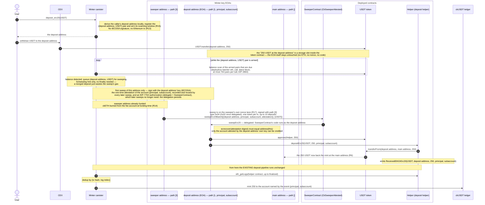
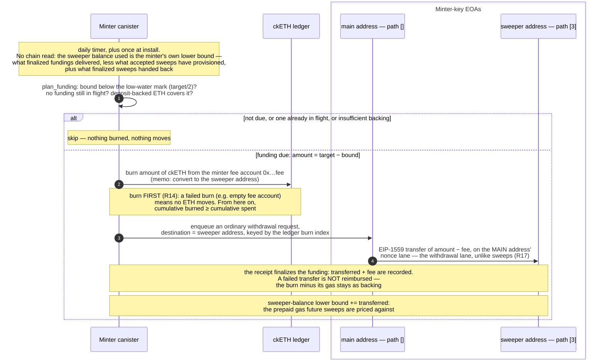
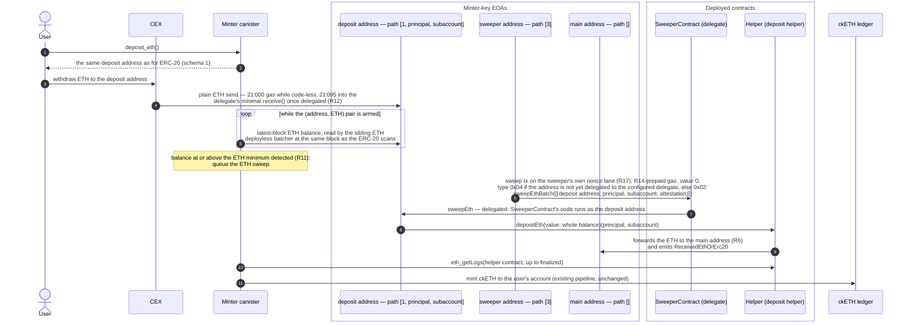
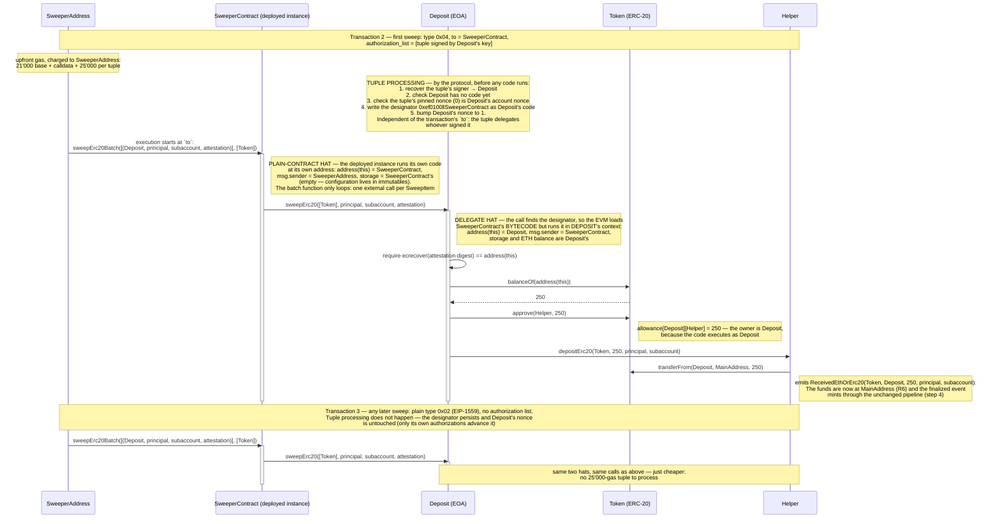
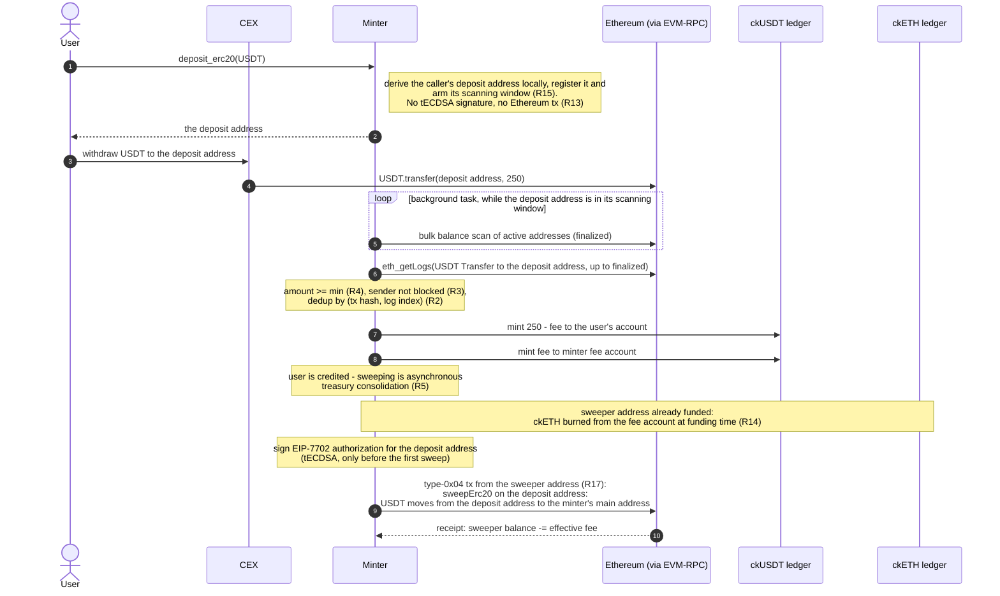

# Support deposit from CEX via per-account deposit addresses (EIP-7702 sweeping)

- [Motivation](#motivation)
- [Requirements](#requirements)
- [Non-goals](#non-goals)
- [Design](#design)
  - [Addresses and contracts](#addresses-and-contracts)
  - [The ERC-20 deposit flow](#the-erc-20-deposit-flow)
    - [Step 0: Fund the transaction fees](#step-0-fund-the-transaction-fees-without-touching-the-cketh-backing)
    - [Step 1: Retrieve the deposit address](#step-1-retrieve-the-deposit-address)
    - [Step 2: Withdraw from the CEX](#step-2-withdraw-from-the-cex-to-the-deposit-address)
    - [Step 3: Detect the deposit](#step-3-detect-the-deposit)
    - [Step 4: Credit the deposit (mint)](#step-4-credit-the-deposit-mint)
    - [Step 5: Sweep the funds to the minter](#step-5-sweep-the-funds-to-the-minter)
  - [The ETH deposit flow](#the-eth-deposit-flow)
- [Implementation](#implementation)
  - [Constraints](#constraints)
  - [EIP-7702 primer](#eip-7702-primer-the-sweep-one-transaction-at-a-time)
  - [EIP-7702 transaction layer](#eip-7702-support-in-the-transaction-layer-srctx)
  - [Address derivation, signing, and nonces](#address-derivation-tree-signing-and-nonces)
  - [Sweeper delegate contract](#sweeper-delegate-contract)
  - [Changing the sweeper delegate](#changing-the-sweeper-delegate-delegate-rotation)
  - [Test plan](#test-plan)
  - [Delivery / PR sequence](#delivery--pr-sequence)
  - [Observability](#observability)
- [Future work](#future-work)
- [Cost estimation](#cost-estimation)
- [Discussed Alternatives](#discussed-alternatives)

## Motivation

Today the only way to deposit ETH or ERC-20 tokens into ckETH/ckERC20 is to call the
helper smart contract (`DepositHelperWithSubaccount.sol`), which forwards the funds to
the minter's single tECDSA address and emits a `ReceivedEthOrErc20` event carrying the
beneficiary IC principal and subaccount. The minter discovers deposits exclusively by
scraping this event (`src/deposit.rs`, `src/eth_logs/`), i.e. attribution of funds to an
IC account relies entirely on the depositor *executing a contract call*.

A withdrawal from a centralized exchange (CEX) cannot fit through this path:

* A CEX only performs plain transfers: a bare ERC-20 `transfer(to, value)` (standard
  `Transfer` event, no principal) or a native ETH send (no log at all).
* The sender is the exchange's omnibus hot wallet, shared by all its customers, so
  sender-based attribution is impossible.
* Ethereum has no memo/data side-channel on plain transfers.

Consequently a user holding e.g. USDT or USDC on Coinbase/Binance cannot onramp into
ckUSDT/ckUSDC without first withdrawing to a self-custody wallet, funding it with ETH
for gas, and interacting with the helper contract — a prohibitive UX. Funds sent
directly to the minter address today are simply unaccounted, with no recovery path
(see the documentation of the `eth_balance` field of the `EthBalance` struct in
`src/state.rs`).

The only attribution channel a CEX supports is the **destination address**. This design
therefore gives each IC account a **unique, deterministic deposit address**, controlled
by the minter through threshold ECDSA (the ckBTC model), and uses **EIP-7702**
(live on Ethereum mainnet since the Pectra upgrade, May 2025) to sweep funds from these
addresses to the minter's main address **without pre-funding them with ETH for gas**:
the deposit EOA signs a one-time authorization delegating its code to a minimal sweeper
contract, and a minter-controlled, funded address submits the sweep transaction and
pays for gas.

Target UX: *"I have USDT on a CEX and I want ckUSDT: I paste my deposit address into
the exchange withdrawal form and the tokens automagically appear as ckUSDT."*

The design is delivered in two phases:

* **Phase 1 — ckERC20 only** (ckUSDC, ckUSDT, …): deposits are ERC-20 `Transfer`s,
  which always emit logs and never execute recipient code, making detection and
  crediting straightforward.
* **Phase 2 — ckETH**: native ETH transfers emit no logs and, unlike ERC-20
  transfers, *execute* recipient code. ETH is deposited to the **same** address
  as the account's ERC-20 tokens — Ethereum users expect one address per
  person, not one per (person, token), and a per-asset split would have users
  send tokens to the wrong address — which the delegate's minimal `receive()`
  makes possible (validated on mainnet against real exchanges, step 1). What
  changes per step is described in [The ETH deposit flow](#the-eth-deposit-flow).

## Requirements

### Phase 1 (ckERC20)

_Requirements are grouped by phase, not numbered sequentially: `R11` and `R12` are defined under Phase 2 below._

* `R1`: For every IC account `(principal, subaccount)`, the minter returns a unique,
  deterministic Ethereum deposit address. Repeated calls return the same address. Two
  distinct accounts never share an address, and no deposit address ever equals the
  minter's main address or a helper contract address.
* `R2`: If a supported ERC-20 token is transferred to a deposit address whose
  `(address, token)` pair is armed, and the address' balance of that token reaches
  the per-token minimum deposit amount, then the minter sweeps the whole balance
  and mints the swept amount to the associated IC account, exactly once
  (deduplication by the `(transaction hash, log index)` of the sweep's finalized
  helper event, as for helper-based deposits). A `deposit_fee` deducted from the
  mint is [future work](#deposit-fee).
* `R3`: **Not yet implemented** — screening the ERC-20 `Transfer` sender against
  the blocklist (no mint, no sweep of a tainted address) is
  [future work](#sender-screening-the-transfer-log-filter). As shipped, the
  blocklist only sees the sweep's helper event, whose sender is the deposit
  address itself.
* `R4`: A balance below the per-token minimum deposit amount, and any balance of an
  unsupported ERC-20 token, is neither swept nor credited. No funds are ever burned or destroyed:
  they remain at a tECDSA-controlled address and remain recoverable by the minter.
* `R5`: Every credited deposit is eventually swept to the minter's main address. A
  sweep failure or delay never affects already-minted balances; a sweep that does
  not mine is resubmitted with a fee bump until it does. A sweep that mines and
  *reverts* is the exception: its deposits leave the queue instead of being
  retried, and are swept when their pair is next armed (`R15`); the funds stay at
  the deposit address throughout (`R12`).
* `R6`: A sweep transaction moves funds only to the minter's main address, regardless
  of who triggers it. No other destination is reachable through the sweeper delegate.
* `R7`: Every supported asset has a minimum deposit amount, the economic gate that
  keeps a sweep worth its cost. As shipped the minimums are compile-time tables
  (`MIN_DEPOSITS` per ERC-20 token, `MIN_ETH_DEPOSIT` = 0.005 ETH), exposed by
  `get_minter_info` and in every `deposit_erc20`/`deposit_eth` response; a token
  without an entry cannot be detected. A per-token `deposit_fee` covering the
  amortized per-deposit cost (detection cycles as well as sweep gas), and minimums
  configurable without a code change, are
  [future work](#deposit-fee).
* `R8`: All new state transitions (detected deposit, attestation, authorization,
  sweep accepted/created/signed/replaced/finalized, sweeper funding) are recorded
  as audit events, replayable on upgrade, consistent with the minter's
  event-sourcing architecture. Registrations are the exception: they change
  nothing on chain and cost nothing to redo, so the armed pairs are recorded as
  one snapshot event at `pre_upgrade` (`RegisteredDepositAddresses`) rather than
  one event per call.
* `R9`: The minter exposes through metrics the armed and queued deposits, the
  stored attestations and authorizations, the delegated deposit addresses, balance
  scan and sweep activity, and the sweeper funding accounting; the dashboard shows
  the sweeper contract and the sweeper funding section (see
  [Observability](#observability)). Listing deposit addresses, queued balances and
  sweep transactions on the dashboard is [future work](#dashboard).
* `R10`: Withdrawals (ckERC20 → ERC-20 and ckETH → ETH) are unaffected: they continue
  to be served from the minter's main address and its existing nonce sequence.
* `R13`: Registering a deposit `(address, asset)` pair (a `deposit_erc20` or
  `deposit_eth` call) triggers no threshold-ECDSA signature and no Ethereum
  transaction (a [sponsored](#sponsored-deposits) call, future work, may trigger
  both — compensated by the caller's ckETH fee). The minter only signs a
  delegation and sweeps an address after having observed there a balance of a
  supported token of at least the per-token minimum deposit amount. (Registrations
  are free for callers; anything the minter spends per registration is a DoS vector
  on its cycles and ETH.)
* `R14`: Sweeping never reduces the 1:1 backing of ckETH. Before any ETH is spent on
  a sweep transaction, the minter burns from its fee account on the ckETH ledger at
  least the maximum fee of that transaction; at all times, cumulative ckETH burned
  for sweeping ≥ cumulative ETH spent on sweeping. Burned-but-unspent amounts are
  never re-minted, and are not credited against subsequent burns either: like the
  unspent gas of a user withdrawal, the surplus simply stays with the minter as
  additional backing. If the fee account cannot cover a sweep, no sweep is
  submitted. (The burn happens ahead of time: funding the sweeper address is an
  ordinary ckETH withdrawal from the fee account, covering many sweeps — see step 0.)
* `R15`: A single user-visible step suffices: after one `deposit_erc20`
  call, a deposit of that token arriving at the address within the pair's *scanning
  window* is credited with no further canister call by the user or frontend.
  The window is 24 hours. Re-calling `deposit_erc20` (idempotent, free of
  per-`(address, token)` spending per `R13`) while the pair is still armed
  returns its status and leaves the window as it is; once the window has lapsed,
  the call arms a new one. A deposit arriving on a dormant pair is credited
  once the pair is re-armed and is never lost in the meantime.
* `R16`: A withdrawal transaction is only submitted when the minter's main address
  holds a sufficient balance of the withdrawn asset: credited-but-unswept deposits
  count as *unavailable* liquidity. A withdrawal that cannot be covered yet is
  queued (never failed on-chain for insufficient balance) and served once sweeps
  have consolidated enough funds. (Under the decided crediting of step 4 this
  holds by construction: the mint follows the consolidation.)
* `R17`: A stuck (submitted but unmined) sweep transaction never delays a
  withdrawal. Sweeps are issued from a **dedicated sweeper address** with its own
  nonce sequence — never from the main address, whose nonce sequence serves
  withdrawals exclusively — so sweep and withdrawal transactions cannot
  head-of-line-block each other.

### Phase 2 (ckETH)

* `R11`: Once the ETH balance of a deposit address is detected at or above the
  minimum ETH deposit amount, the entire balance is swept and the swept amount
  is credited to the associated account, exactly once per
  sweep (dedup by the sweep's helper event; monotone accounting: total credited
  never exceeds total received).
* `R12`: A plain ETH transfer sent with a fixed 21'000 gas limit to a deposit address
  MUST NOT be permanently locked: it either succeeds (a code-less address takes
  21'000 gas; the delegate's minimal `receive()` takes 21'095, so it lands given any
  higher or estimated limit) or fails on the sender side (funds never leave the
  exchange).

### Operations (both phases)

* `R18`: The sweeper delegate can be **replaced** (a new deployment per network)
  without stranding funds and without changing any deposit address: a deposit
  address already delegated to a previous delegate is re-delegated by its next
  sweep, in the same transaction and before the sweep's call runs, so the call
  executes on the current delegate (the races in which the re-delegation lands
  one sweep late are listed with the design; they cost gas, never funds).
  Sweeping keeps working across a mixed population (some
  addresses on the previous delegate, some on the current one) for every entry
  point both delegates share. Replacing the delegate alone needs no new
  attestation (the attestation names the helper, not the delegate); replacing
  the **helper** — which also replaces the delegate wired to it — additionally
  re-attests each address, lazily, at its next sweep.

## Non-goals

* **Gasless deposits from self-custody wallets** (EIP-2612 `permit` / Permit2
  sponsoring): a related but different problem — and mainnet USDT does not implement
  EIP-2612. Deposit addresses incidentally also cover this use case (a
  self-custody wallet can simply `transfer` to the deposit address).
* **Deposits from L2s / other chains**: only Ethereum L1 withdrawals are in scope. A
  CEX withdrawal on Arbitrum/Base to the deposit address is out of scope (and must be
  documented as unsupported).
* **Replacing the helper-contract flow**: the existing flow remains the cheapest path
  for power users and is untouched.
* **Indefinite unattended scanning**: an address is actively scanned only within its
  scanning window (`R15`); scanning every registered address forever would hand an
  attacker an unbounded cycles bill (the registered set is inflatable for free,
  `R13`).
* **Automatic recovery of unsupported-token deposits**: funds remain recoverable
  (key-controlled address) but recovery tooling is future work.
* **Replenishing the sweep-gas fee account**: sweep gas is burned from the minter's
  ckETH fee account (`R14`), while deposit-fee revenue accrues per ckToken
  (ckUSDC, ckUSDT, …). Converting that revenue into ckETH to keep the fee account
  funded is a treasury/market operation outside this design; the design only
  requires that sweeping halts safely when the fee account is empty.
  ([Sponsored deposits](#sponsored-deposits), future work, would provide an
  organic ckETH inflow into the fee account, shrinking the conversion need.)
* Accepted residual limitations:
  * A deposit arriving *after* the scanning window has expired is credited only once
    the address is re-armed (`R15`) — e.g. the user re-opens the frontend. Funds sit
    safely at a key-controlled address in the meantime.
  * A CEX that batches ETH withdrawals through a contract (internal transactions)
    provides no sender information without trace APIs; compliance screening is
    therefore weaker for ETH than for ERC-20 (see
    [Sender screening](#sender-screening-the-transfer-log-filter)).
  * An account's ETH deposits (Phase 2) reuse its ERC-20 deposit address, so there
    is no wrong-address case between the two asset classes; an *unsupported* ERC-20
    token sent there is not credited automatically, but funds always remain
    recoverable at the key-controlled address (`R4`).

## Design

The flow: **(0)** fund the transaction fees (a background precondition), then per
deposit: **(1)** retrieve the deposit address, **(2)** withdraw from the CEX to it,
**(3)** detect the deposit, **(4)** credit (mint) the ckToken, **(5)** sweep the
funds to the minter. [The ERC-20 deposit flow](#the-erc-20-deposit-flow) walks
these steps one subsection each, with each step's decision stated in place;
[The ETH deposit flow](#the-eth-deposit-flow) then lists only what Phase 2
changes. The alternatives that were weighed and discarded are collected in
[Discussed Alternatives](#discussed-alternatives) at the bottom of this document.

Two decisions shape everything below:

* **The sweep goes through the existing helper contract** ("variant B" of the
  original design): the sweeper delegate calls `depositErc20` on the
  already-deployed helper (`DepositHelperWithSubaccount.sol`), so every sweep
  emits the canonical `ReceivedEthOrErc20` event and the **existing**
  scrape→parse→dedup→mint pipeline credits the deposit unchanged (step 4). The
  discarded alternative — a direct sweep with its own detection→mint path,
  "variant A" — is at the bottom.
* **Sweeping is permissionless, guarded by a one-time self-attestation**: any
  caller may submit a sweep and only ever donates gas — a signature by the
  deposit address' own key, not the identity of the caller, fixes which IC
  account is credited, and funds only ever move through the helper to the
  minter's main address (`R6`, step 5).

### Addresses and contracts

Everything on the Ethereum side is one of two kinds. **Minter-key EOAs**:
addresses derived from the minter's single threshold-ECDSA key (one sibling
derivation path per role, see
[Address derivation](#address-derivation-tree-signing-and-nonces)); the minter
can sign for each of them, and funds there never depend on contract code.
**Deployed contracts**: ordinary contracts the minter holds no key for; the
helper and the delegate hold no funds, a token contract holds everyone's ERC-20
balances as storage slots.

The separation between the three minter-key roles is deliberate and
load-bearing:

* **Main address** (path `[]`): the `R6` destination — all deposits, swept or
  helper-based, land here, and it alone backs the ck-token supply. Every
  withdrawal is sent from here on its own sequential nonce lane (`R10`). It
  never sends sweeps.
* **Sweeper address** (path `[3]`): funded by the minter with nothing but
  prepaid gas (ckETH withdrawals from the fee account, step 0, `R14`); it
  sends every sweep
  transaction on its own nonce lane, so a stuck sweep can never
  head-of-line-block a withdrawal and vice versa (`R17`). Swept funds never
  pass through it.
* **Deposit EOAs** (path `[1, principal, subaccount]`): one per IC account,
  shared across assets (ERC-20 and, Phase 2, plain ETH), the only addresses a
  user ever sees. They hold deposits between the
  CEX transfer and the sweep and are never pre-funded with ETH for gas — sweep
  gas, ERC-20 and ETH alike, is paid by the sweeper address; because the minter
  holds their keys, funds there stay recoverable even without any contract.

Two contracts are needed, only one of them new:

* **Sweeper contract** (`CkSweeperAttested.sol`, **new**): a single immutable
  contract, deployed once per network. It is the EIP-7702 delegate every
  deposit address points its code at — under delegation its code runs *as* the
  deposit address — and the deployed instance doubles as the permissionless
  batch entry point (`sweepErc20Batch`, `sweepEthBatch`) the minter's sweep
  transactions target. Details in
  [Sweeper delegate contract](#sweeper-delegate-contract).
* **Deposit helper** (`DepositHelperWithSubaccount.sol`, **already deployed**):
  the existing helper every sweep goes through. It moves the funds to the main
  address and emits the canonical `ReceivedEthOrErc20` event, which is what
  lets the existing scrape→parse→dedup→mint pipeline credit swept deposits
  unchanged (step 4).

(Token contracts — USDT, USDC, … — are third parties' deployments; they only
matter as the place ERC-20 balances live and `Transfer` logs come from.)

### The ERC-20 deposit flow

Deposit of USDT from a CEX, end to end; each step is detailed in its own
subsection below. Every transaction the minter submits (and every log
or balance it reads) goes through the EVM-RPC canister with multi-provider
consensus — the CEX submits its own transfer directly; the boxes separate the
minter-key EOAs from the deployed contracts:


```mermaid
sequenceDiagram
    autonumber
    actor User
    participant CEX
    participant Minter as Minter canister
    box Minter-key EOAs
        participant Sw as sweeper address — path [3]
        participant D as deposit address (EOA) — path [1, principal, subaccount]
        participant Main as main address — path []
    end
    box Deployed contracts
        participant S as SweeperContract (CkSweeperAttested)
        participant T as USDT token
        participant H as Helper (deposit helper)
    end
    participant Ledger as ckUSDT ledger

    User->>Minter: deposit_erc20(USDT)
    Note right of Minter: derive the caller's deposit address locally, register the<br/>(deposit address, USDT) pair and arm its scanning window (R15).<br/>No tECDSA signature, no Ethereum tx (R13)
    Minter-->>User: the deposit address
    User->>CEX: withdraw USDT to the deposit address
    CEX->>T: USDT.transfer(deposit address, 250)
    Note over D,T: the "250 USDT at the deposit address" is a storage slot inside the<br/>token contract — the EOA itself stays untouched (no ETH, no nonce, no code)
    loop while the (deposit address, USDT) pair is armed
        Minter->>T: balance scan of the armed pairs that are due<br/>(deployless batcher eth_call, latest block,<br/>at most 764 pairs per call, EIP-3860)
    end
    Note over Minter: balance detected: queue (deposit address, USDT) for sweeping.<br/>Scheduling hint only, no finality needed —<br/>a reorged deposit just wastes the sweep's gas
    Note over Minter,D: first sweep of this address only — sign with the deposit address' key (tECDSA):<br/>the one-time attestation of the account (principal, subaccount), recorded and reused by<br/>every later sweep, and an EIP-7702 authorization (delegate = SweeperContract),<br/>which later sweeps no longer need: the delegation persists
    Note over Minter,Sw: sweeper address already funded:<br/>ckETH burned from the fee account at funding time (R14)
    Sw->>S: sweep tx on the sweeper's own nonce lane (R17), signed with path [3]:<br/>type 0x04 (0x02 once delegated), one token per tx, up to 10 deposits:<br/>sweepErc20Batch([(deposit address, principal, subaccount, attestation)], [USDT])
    S->>D: sweepErc20 — delegated: SweeperContract's code runs as the deposit address
    Note right of D: ecrecover(attestation digest) must equal address(this):<br/>only the account attested by the deposit address' own key can be credited
    D->>T: approve(Helper, 250)
    D->>H: depositErc20(USDT, 250, principal, subaccount)
    H->>T: transferFrom(deposit address, main address, 250)
    T-->>Main: the 250 USDT now back the mint at the main address (R6)
    Note over H: emits ReceivedEthOrErc20(USDT, deposit address, 250, principal, subaccount)
    Note over Minter,H: from here the EXISTING deposit pipeline runs unchanged
    Minter->>H: eth_getLogs(helper contract, up to finalized)
    Note over Minter: dedup by (tx hash, log index)
    Minter->>Ledger: mint 250 to the account named by the event (principal, subaccount)
```

#### Step 0: Fund the transaction fees without touching the ckETH backing

The sweeper address must hold prepaid gas before any sweep is submitted (`R14`,
burn-first); funding runs in the background, independently of any deposit.
**Decided: the sweeper address is distinct from the minter's main address**
(`R17`).

The ETH at the minter's main address backs ckETH 1:1: spending it on sweep gas
without a matching ckETH burn would leave ckETH under-backed. Sweeps are therefore
funded exclusively through the minter's **fee account (a minter subaccount) on the
ckETH ledger**. This account already exists on mainnet:
`owner = sv3dd-oaaaa-aaaar-qacoa-cai` (the ckETH minter),
`subaccount = 0x0000000000000000000000000000000000000000000000000000000000000fee`,
with an `icrc1_balance_of` of `1_762_128_000_000_000_000` wei ≈ 1.76 ckETH as of
2026-07-06 — the funding pipeline starts with capital already in place:

0. **Inflows into the fee account**: treasury top-ups (see Non-goals).
   Sponsored gas and converted `deposit_fee` revenue are
   [future work](#future-work).
1. **Daily funding task**: once a day (and once at install, right after the
   ECDSA key is cached), decide from the minter's **own records** whether the
   sweeper address needs a top-up. No chain read: the balance used is a *lower
   bound* — what finalized fundings delivered, less what accepted sweeps have
   provisioned, plus what finalized sweeps handed back — so erring low can
   only over-provision gas, never spend against gas that is not there. If the
   bound is below the **low-water mark**
   (half the target; the target is 10 × the ckETH minimum withdrawal amount,
   ≈ 0.3 ETH against mainnet's 0.03, provisional until calibrated on Sepolia),
   **withdraw ckETH from the fee account to the sweeper address**, topping the
   bound up to the target — an ordinary ckETH withdrawal through the existing
   pipeline (burn from the fee account first, then send the ETH on the main
   address' nonce sequence). One funding at a time: none is started while a
   previous one is still in flight, or when the minter's deposit-backed ETH
   does not cover the amount. `R14` holds by construction, with no new burn
   path to audit; this pipeline is the *only* way ETH is spent on sweeps.
   Unlike sweeps (`R17`), the funding transaction rides the main address'
   nonce sequence — the withdrawal lane — so a stuck funding transaction can
   head-of-line-block withdrawals (and, one at a time, later fundings);
   acceptable because funding is infrequent (batched to cover many sweeps) and
   uses the same resubmission machinery as withdrawals.

The funding flow end-to-end — note that the decision reads nothing but the
minter's own accounting, and that the burn strictly precedes any ETH movement:


```mermaid
sequenceDiagram
    autonumber
    participant Minter as Minter canister
    participant Ledger as ckETH ledger
    box Minter-key EOAs
        participant Main as main address — path []
        participant Sw as sweeper address — path [3]
    end

    Note over Minter: daily timer, plus once at install.<br/>No chain read: the sweeper balance used is the minter's own lower bound —<br/>what finalized fundings delivered, less what accepted sweeps have provisioned,<br/>plus what finalized sweeps handed back
    Minter->>Minter: plan_funding: bound below the low-water mark (target/2)?<br/>no funding still in flight? deposit-backed ETH covers it?
    alt not due, or one already in flight, or insufficient backing
        Note over Minter: skip — nothing burned, nothing moves
    else funding due: amount = target − bound
        Minter->>Ledger: burn amount of ckETH from the minter fee account 0x…fee<br/>(memo: convert to the sweeper address)
        Note over Minter,Ledger: burn FIRST (R14): a failed burn (e.g. empty fee account)<br/>means no ETH moves. From here on,<br/>cumulative burned ≥ cumulative spent
        Minter->>Main: enqueue an ordinary withdrawal request,<br/>destination = sweeper address, keyed by the ledger burn index
        Main->>Sw: EIP-1559 transfer of amount − fee, on the MAIN address'<br/>nonce lane — the withdrawal lane, unlike sweeps (R17)
        Note over Minter,Sw: the receipt finalizes the funding: transferred + fee are recorded.<br/>A failed transfer is NOT reimbursed —<br/>the burn minus its gas stays as backing
        Note over Minter,Sw: sweeper-balance lower bound += transferred:<br/>the prepaid gas future sweeps are priced against
    end
```

* The sweeper address' balance is the prepaid sweep gas, and the minter
  tracks a lower bound on it from its own events (`sweeper_balance_lower_bound`) —
  what finalized fundings delivered, less what accepted sweeps have provisioned,
  plus what finalized sweeps handed back — and never reads the balance from the
  chain. A sweep provisions the most it can cost the moment it is accepted — its
  fee ceiling, which caps every resubmission; a sweep, ERC-20 or ETH, sends no ETH
  value of its own (a swept ETH deposit leaves the deposit address, not the
  sweeper's) — and gets back what it did not need when it finalizes, so a sweep whose
  finalization is never observed leaves the bound too *low* rather than too high.
  ETH anyone else sends to the address only pushes the true balance further above
  it. The bound therefore errs low in the safe direction for both readers: a funding
  may be triggered earlier than strictly needed, never skipped; a sweep may be held
  back, never authorised against gas that is not there.
  Sweep gas draws it down; burned ckETH is
  **never re-minted**, so "cumulative burned ≥ cumulative spent" holds at every
  instant. Each funding round burns for its own transfer alone: the fee a previous
  funding provisioned but did not spend is left as backing rather than discounted
  from the next burn, which keeps funding accounted for exactly like a user
  withdrawal. In the same spirit, a funding whose transaction fails is not
  reimbursed: no ETH reaches the sweeper, the failed transaction still pays for its
  gas, and the burn minus that gas stays as backing. That is a plain-transfer send to
  an address derived from the minter's own key, so there is no code there to revert
  in; accepting the loss buys an accounting with no reimbursement path to audit.
* Fundings and per-sweep effective fees are audit events; the dashboard's
  "Sweeper fee funding" section shows the sweeper address, the balance lower
  bound, the low-water mark and target, the ckETH burned, the ETH spent, the
  funding in flight and the burned-not-yet-spent surplus, and the same figures
  are exported as `cketh_minter_sweeper_funding_*` metrics (`R8`, `R9`).
* An empty ckETH fee account halts refunding and, once the sweeper balance is
  drained, sweeping — safely: crediting pauses with sweeping (the mint follows
  the sweep, step 4), and deposits keep accumulating at key-controlled
  addresses. Replenishing the fee account is out of scope (see Non-goals).
* **Phase 2 ETH sweeps use the same `R14`-prepaid sweeper gas as ERC-20
  sweeps**: the whole deposited balance reaches the main address and nothing is
  deducted on-chain.

**Decided: the gas is minter-fronted.** The fee account fronts the gas of every
sweep. This works for the primary persona — a CEX-only user owns no ckETH — and
preserves the single-step UX (`R15`); its price is that the ckETH fee account
must stay funded (see Non-goals). The caller-paid alternative, where a sponsor
pays the sweep gas in ckETH, is [future work](#sponsored-deposits), as is
recovering the fronted gas through a [`deposit_fee`](#deposit-fee).

#### Step 1: Retrieve the deposit address

Attribution is by **destination address** — the only channel a CEX supports (the
sender is a shared hot wallet, plain transfers carry no memo). Each IC account gets a
unique, deterministic deposit address, derived from the minter's threshold-ECDSA key:

* Derivation path for account `(principal, subaccount)`:
  `[SCHEMA, principal.as_slice(), subaccount]` where `SCHEMA` is the 1-byte tag
  `[1u8]` — one deposit address per account, shared by its ERC-20 and (Phase 2)
  ETH deposits — and `subaccount` is the 32-byte subaccount (all-zero for the
  default subaccount). Non-empty by construction, hence distinct from the main address' empty
  path (`MAIN_DERIVATION_PATH`).
* The child *public key* (and hence the address) is computed locally from the cached
  master public key and chain code using non-hardened derivation (`ic-secp256k1`'s
  `derive_subkey_with_chain_code` / `DerivationPath`, as ckBTC does) — no management-canister call
  and no signature is needed to *create* an address. **The minter holds the key**:
  funds at a deposit address never depend on contract code — even without
  EIP-7702, any balance is recoverable by funding the address with gas and signing
  a normal transfer.
* Endpoint `deposit_erc20({ erc20_contract_address, mode }) -> { address, minimum_deposit_amount, status }`
  (returned address EIP-55 checksummed; `minimum_deposit_amount` is the token's
  minimum of `R7`, in the token's own units). The depositing account is the caller principal plus
  the optional subaccount carried in `mode`, whose only variant is
  `Unsponsored { subaccount }` (a `Sponsored` variant carrying fee arguments is
  [future work](#sponsored-deposits)). The `erc20_contract_address` is the Ethereum ERC-20 contract to deposit, parsed
  to an `Address` and required to be a minter-supported ckERC20 — mirroring the CEX UX: pick
  the token, the network is always Ethereum, then show the (shared) deposit address.
  **Decided: the endpoint is ERC-20-specific** — mirroring the existing
  `withdraw_eth`/`withdraw_erc20` split. **Decided: the deposit address stays
  shared across a caller's ERC-20 tokens** (still the schema-1 address, unchanged);
  the token is now named explicitly in the call, so registration and scanning are
  per `(address, token)` rather than per address. Phase 2 adds `deposit_eth`,
  registering the `(account, ETH)` pair on the same address. An **update
  call** (an action, not a getter) because it has side effects: it arms the
  `(account, token)` pair, i.e. adds it to the *watchlist* of armed pairs — keyed
  by `(account, asset)`, each entry holding the deposit address, the last scanned
  block, the scan count and the scanning-window expiry (`R15`). The
  account ↔ address mapping itself is not stored: the address is re-derived from
  the cached public key whenever it is needed. Nothing else happens — no tECDSA
  signature, no Ethereum transaction (`R13`): registrations are free for callers,
  so any per-registration spending is a DoS vector — and no audit event either:
  the watchlist is snapshotted at `pre_upgrade` (`RegisteredDepositAddresses`,
  `R8`). A repeated call on a still-armed pair is a cheap lookup that returns its
  status and leaves the window as it is; on a pair whose window has lapsed it
  arms a new one. The call is refused with `TokenNotSupported`,
  `TooManyTokensForAccount` or `TooManyActiveDeposits` (the caps of step 3).
* Phase 2 adds the ETH counterpart,
  `deposit_eth({ mode }) -> { address, minimum_deposit_amount, status }`:
  the same schema-1 address, registering the `(account, ETH)` pair — ETH is one
  more *asset* of the account, counted against the same per-account cap as its
  ERC-20 tokens (`MAX_ASSETS_PER_ACCOUNT`, step 3) and armed, scanned, queued and
  swept per pair exactly like a token, with its own minimum deposit amount
  (`R4`, `R7`). Internally the pair's asset is `Asset::Eth | Asset::Erc20(contract)` rather
  than a bare contract address, so the ETH pair can never be confused with a
  token whose contract address is zero.
* The response carries the address plus a **status** so a caller can follow the
  (multi-minute) detection progress of the named `(address, token)` pair:
  `Scanning { valid_until, last_scanned_block, scan_count }` while the pair is armed
  and no balance at or above the per-token minimum has been seen yet, or
  `AwaitingSweep({ erc20_contract_address, scanned_balance, detected_at_block })` — the single
  detected deposit (one token per registration) — once a balance has been detected
  and queued for sweeping (`deposit_eth` returns its own `DepositEthStatus`, the
  same two variants without the token field). The `Scanning`/`AwaitingSweep` distinction and the
  **not re-armed until swept** latch are per `(address, token)` pair: a caller who
  registered USDC and USDT tracks two independent statuses, and funding one does not
  affect the other. Once a pair is detected, it is **not re-armed** by further
  `deposit_erc20` calls for that token (they return the same `AwaitingSweep`) until
  its sweep is finalized; the pair then leaves the queue — whether the sweep
  succeeded or reverted — and the next call arms it again. The status is designed
  to extend with `Sweeping`/`Swept`.

**Decided: one shared, permanently delegated address across assets** — the
schema-1 address takes ERC-20 transfers and (Phase 2) plain ETH alike. The
driver is UX: Ethereum users expect **one address per person**, not one per
(person, asset) — every wallet and exchange shows a single receiving address
per chain — so a per-asset split would have users paste the "wrong" address
(ETH to the ERC-20 address or vice versa) and turn a routine deposit into a
recovery case. What makes it possible is the delegate accepting ETH in its
minimal payable `receive()` and sweeping it through the same attested batch
entry points (see [The ETH deposit flow](#the-eth-deposit-flow)). One address
per account to register, scan, delegate and attest; the user pastes the same
address whatever the asset. The residual risk — an exchange that sends ETH with
a hard-coded 21'000 gas limit fails against an already-delegated address
(safely, at the sender, `R12`) — did not materialize at either exchange tested
on mainnet (below); the per-asset split remains in
[Discussed Alternatives](#discussed-alternatives) as the fallback should such
an exchange surface.

**Mainnet data point (2026-09-04,
[#11449](https://github.com/dfinity/ic/pull/11449)):** with a payable
`receive()` on the delegate (kept minimal to fit the 2'300-gas
`transfer`/`send` stipend) plus attested `sweepEth`/`sweepEthBatch` entry
points, real ETH withdrawals from **Binance**
([before delegation](https://etherscan.io/tx/0xaa13310032da7fc310f451f23d013e4b9e69c24bd201ac5cc57b54b15b0afbf2),
[after](https://etherscan.io/tx/0x59cbb83ac893da16789b15d0494b7c3e5f382e1254f259d9c6fbcef5e45747c1))
and **Kraken**
([after](https://etherscan.io/tx/0x3b1dbd6c29b5f56d71c0ce1baae931f8e519852775be199fe62575ba6361b864))
reached the delegated deposit EOA
[`0x5e5402ed…`](https://etherscan.io/address/0x5e5402edfe155b5116f1f84d0b97b9e74f5ebc85),
delegated to the sweeper
[`0x3983baa1…`](https://etherscan.io/address/0x3983baa1703f69e76669768164c822918e843a25)
— top-level sends with gas limits of 207'128 (flat) and 31'830
(estimate-based) respectively, 21'055 gas used in both cases, matching the
anvil measurement of the deployed bytecode exactly (that experiment ran a
guard-less `receive()`; the finalized delegate adds the implementation guard
and measures 21'095 on anvil). The funds were swept back permissionlessly through
a private helper deployment
[`0x3fc2640f…`](https://etherscan.io/address/0x3fc2640f8529cfafc5bf47ca2bcd05eb51d94c7b)
to the EOA standing in for the minter,
[`0x91eba053…`](https://etherscan.io/address/0x91eba053fc03bcac1328de38925f0a1ab9dba586):
[delegation + first sweep](https://etherscan.io/tx/0x909cab5a08442b7ede39752cb25b497c72d5992cd0fc8c6ee9ac888eb9ff6c98)
(type-4),
[second Binance sweep](https://etherscan.io/tx/0xc8e7df2413212215ef2dd27b603d92b99a04ef180b8fa87eebdf6787d4cb715a)
and
[Kraken sweep](https://etherscan.io/tx/0x8e7f014001124afe3294f709971ed2de67f7e89f8f338724044af7a75acad8f2).
Neither exchange hardcodes a 21'000 gas limit or refuses an address carrying a
delegation designator, so the feared "ETH deposits are impossible" failure of a
permanently delegated address did not materialize. This is the evidence behind
the shared-address decision above. Exchange behavior stays heterogeneous —
contract-batched withdrawal paths, where only the 2'300-gas stipend is
forwarded, fit the minimal `receive()` by construction but were not exercised on
mainnet — hence the per-asset fallback kept in
[Discussed Alternatives](#discussed-alternatives).

#### Step 2: Withdraw from the CEX to the deposit address

The user pastes the deposit address into the exchange withdrawal form; the CEX
performs a plain ERC-20 `transfer` (or a native ETH send, Phase 2) from its hot
wallet. The design must absorb:

* The transfer may come from any address (shared hot wallet), possibly via an
  internal transaction (contract-batched withdrawal) for ETH.
* ERC-20 transfers always emit a `Transfer` log and never execute recipient code, so
  a delegated ERC-20 deposit address is harmless to the sender. Native ETH sends
  execute recipient code — hence the delegate's minimal `receive()` and the
  fixed-21'000-gas caveat (`R12`).
* Amounts below the per-token minimum, and unsupported ERC-20 tokens, are not
  credited (`R4`) — the minimum is both fee economics and the anti-DoS bound
  against forced unprofitable sweeps. Nothing is lost: funds sit at a
  key-controlled address.

No variants: the CEX side is not under our control.

#### Step 3: Detect the deposit

After `deposit_erc20`, no further user or frontend action is required
(`R15`): a two-step flow (retrieve, then claim) is not reliably implementable by a
frontend (the browser may close between the steps), and today's helper-based
deposits are single-step too.

Detection runs as a **minter background task over the armed `(address, asset)`
pairs**:

* Arming records no block: the scan reads the address' *whole current balance*,
  so there is no scan floor, and funds that reached the address before the call
  are detected like any other. The first scan of a freshly armed pair is due
  immediately.
* The number of pairs armed in parallel is **capped** at 7'000
  (`MAX_ACTIVE_DEPOSITS`, a compile-time constant: roughly one transaction per
  block to a minter-controlled address over a day). When the watchlist is full,
  the call fails with `TooManyActiveDeposits` and arms nothing. Beyond this
  global cap, each account may have at most **5 concurrently armed assets**
  (`MAX_ASSETS_PER_ACCOUNT`, ETH and ERC-20 tokens together), which bounds an
  account's scan cost; a 6th arming is rejected with `TooManyTokensForAccount`.
* Each armed pair is scanned on a **finite backoff schedule inside a 24-hour
  window** (`DEPOSIT_ADDRESS_SCAN_WINDOW`): 34 scans, bursting right after the
  call and settling to hourly (the table is in
  [Cost estimation](#cost-estimation)). Once the window lapses the pair goes
  dormant and costs nothing until another `deposit_erc20` call arms it again.
  This is the *scanning window* of `R15`. Cap and schedule together bound the
  DoS surface (`R13`): the cap bounds per-tick cost, the schedule bounds any
  pair's lifetime cost.
* The **minimum deposit amount per asset** is a compile-time table (`R4`, `R7`).

Scanning is a single filter today:

**Filter 1 — balances.** One create-style `eth_call` (`to` omitted) runs a
**deployless balance batcher**: a fixed ~165-byte init-code program with one
`(token, holder)` pair per armed `(address, token)` that is due appended as calldata — the
watchlist is the set of armed pairs, not the active-address ×
all-supported-tokens cross-product. The node executes it as init code and returns its `RETURN` without
deploying anything or touching state — a pure read. The program `STATICCALL`s
`balanceOf` for each pair and returns the balances as a flat `uint256[]` (32 bytes
each). The token list is a trusted whitelist, so a sub-call that reverts or does
not return exactly 32 bytes (e.g. a non-contract address) is treated as an anomaly
rather than "no balance": the whole call reverts, surfacing as an `eth_call` error
that fails the tick loudly (the affected addresses are retried, not silently
recorded as empty). **At most 764 pairs fit in one such call**:
[EIP-3860](https://eips.ethereum.org/EIPS/eip-3860) (Shanghai) caps init code at
49'152 bytes, and the encoding spends 165 bytes on the program, 32 on the length
word and 64 on each pair. The returned blob is bounded too:
[EIP-170](https://eips.ethereum.org/EIPS/eip-170) caps deployed code — which is
what a create-style call returns — at 24'576 bytes, i.e. 768 pairs at one 32-byte
balance word each. The cap is *derived* from the encoding as the smaller of the
two bounds rather than hard-coded, so it follows the batcher if its program or
encoding ever changes; today the initcode side binds, by four pairs (measured
against anvil: 764 pairs execute, 765 are rejected with
`max initcode size exceeded`).
Gas is the looser bound: at ≈19'000 gas for the priciest `balanceOf` shape (a
proxied stablecoin) a full 764-pair batch costs ≈14.5M gas, well inside the 50M
`eth_call` gas cap providers commonly apply. A larger watchlist is therefore split
into several such calls per tick — each chunk advances all-or-nothing, and a chunk
whose call fails is retried whole on the next tick, so a chunk is never partially
observed. The call is pinned to the latest block height the minter last
observed, so every provider answers for the same block, and any one provider's
answer is accepted (`AnyOf`): a balance is only a trigger, and a wrong one costs
at most a wasted sweep. One HTTPS outcall per provider per chunk; later a plain
JSON-RPC batch once the EVM-RPC canister supports `eth_batch`,
[dfinity/evm-rpc-canister#561](https://github.com/dfinity/evm-rpc-canister/pull/561).
This deployless batcher was chosen over a
[Multicall3](https://www.multicall3.com/) `aggregate3` call: Multicall3's
`(bool, bytes)[]` return wraps each 32-byte balance in ~160 bytes of ABI framing
(≈5× the response size, and a fiddly nested-offset decode), whereas the batcher's
flat `uint256[]` is 32 bytes per result with a trivial fixed-width decode, needs no
deployed contract, and — validated against Ethereum mainnet — is honored with
byte-identical results by all four providers the minter uses, and forwarded
unchanged by the EVM-RPC canister (which omits an absent `to`). A `(address, token)` pair whose
balance is at or above the per-token minimum is moved out of the registered-pair
watchlist into a **balance-sweep queue** (one entry per funded `(account, token)`
key) handed to the sweeper, and is no longer re-scanned; the pair's siblings —
other tokens at the same address — keep scanning, and the rest cost nothing
further this tick. A balance is only ever a trigger, never a source of truth: the
mint follows the sweep's finalized helper event (step 4). For native ETH (Phase 2), the ETH balances are
read by a **sibling program**: a separate, much smaller (78-byte) init-code blob
run by its own create-style `eth_call`, pinned to the same latest block as the
ERC-20 one. Its calldata carries one holder word per `(address, ETH)` pair — no
token word — and it reads each balance with the `BALANCE` opcode, so it makes no
sub-calls and has no failure path at all. It returns the same flat
32-bytes-per-entry blob, so the decoder is shared, as is the per-call cap (derived
from the tighter ERC-20 encoding, which the ETH program stays far below).
Overloading the ERC-20 program instead — the zero address in the token slot
standing for native ETH — was rejected: a zero token word is today an impossible
value that reverts the whole call loudly, and giving it a meaning would turn that
alarm into a valid instruction; keeping the two programs apart also leaves the
ERC-20 init-code bytes, validated byte-identical across all four providers,
untouched. The balance delta is only the sweep trigger (`R11`) —
there are no logs to confirm against, and the mint follows the sweep's
finalized helper event like any other deposit (step 4).

**There is no second filter yet.** A detected balance goes straight to the sweep
queue: the `Transfer`-log query that would recover each deposit's sender, and
the blocklist screening built on it (`R3`), are
[future work](#sender-screening-the-transfer-log-filter), as are the optional
[`notify_deposit` / `claim_deposit`](#on-demand-triggers) endpoints.

**Decided: registration-armed scanning** — the background balance scan
above, over a capped watchlist with a finite scan schedule per pair. It is the only
trigger that keeps the single-step UX (`R15`) — no second call to lose — at a
bounded, attacker-resistant cost (`R13`); its price is that a deposit landing
after the window has lapsed waits for re-arming. The discarded triggers
(claim-only endpoint, user-supplied transaction hash, unbounded continuous
scraping) are in [Discussed Alternatives](#discussed-alternatives).

#### Step 4: Credit the deposit (mint)

The swept amount is minted in full to the account the sweep's helper event
names — the full deposited amount is swept, so minting it in full keeps supply
exactly equal to backing. No fee is deducted today; a `deposit_fee` split
between the depositor and a minter fee account is [future work](#deposit-fee).
Deduplication is by `(transaction hash, log index)` (`R2`), memo and
quarantine-on-panic machinery as in today's `mint()` path. The mint pipeline does
not look the event's sender (the deposit address) up in the minter's own state:
the delegate's attestation check (step 5) is what binds a deposit address to the
account credited.

*Where* the mint comes from: **decided — the sweep's own finalized helper
event, through the existing pipeline**. The battle-tested
scrape→parse→dedup→mint pipeline is reused **unchanged** — detection (step 3)
is demoted from correctness-critical to a mere scheduling hint — and there is
no liquidity window: the mint is triggered by the consolidation itself, so
minted supply is always covered by the main address (today's helper-flow
invariant; `R16` holds by construction). The price is that crediting halts if
sweeping halts (empty `R14` fee account) and latency is tied to sweep
scheduling — mitigated by sweeping on `latest`-block observations without
waiting for deposit finality (a reorged deposit only wastes the sweep's gas:
the delegate sweeps a zero balance, and a reorged sweep tx is absorbed by the
existing nonce-tracking/resubmission machinery) and by enqueuing the sweep the
moment the balance scan sees the funds (step 5), keeping end-to-end latency
comparable to today's helper flow. The discarded alternative — minting on the
finalized deposit through a new detection→mint path — is in
[Discussed Alternatives](#discussed-alternatives).

#### Step 5: Sweep the funds to the minter

Each deposit EOA signs (threshold ECDSA) an EIP-7702
authorization — lazily, together with its first sweep, never at registration
(`R13`), and again only if the configured delegate later changes (`R18`) —
delegating its code to `SweeperContract`, a single immutable,
storage-less sweeper delegate (`CkSweeperAttested`,
[below](#sweeper-delegate-contract)). Sweep
transactions are sent from the **dedicated sweeper address** (tECDSA-derived
with derivation path `[3u8]` — its own schema tag, no account components),
whose nonce sequence is independent of the main address' so that a stuck sweep
can never delay a withdrawal (`R17`); the sweeper address is funded by the
minter with only gas money (ckETH withdrawals from the fee account, step 0)
while swept funds
always land at the main address (`R6`). No deposit address is ever pre-funded
for gas: every sweep — ERC-20 or, Phase 2, ETH — is paid for by the sweeper
address, and an ETH deposit is forwarded in full, nothing deducted.

**Decided: sweeping is permissionless, guarded by a one-time
self-attestation** rather than by gating the delegate on `msg.sender`: every
sweep carries a signature, by the deposit address' own derived key, binding the
address to its IC account. Whoever submits a sweep only donates gas — the
attestation, not the caller, fixes which account is credited, and funds only
ever move through the helper to the main address. The price is forfeiting the
best-effort `R3` sweep exclusion (a third party can sweep a tainted address —
status quo, no new risk). The discarded direct-sweep delegate and the
caller-gating / on-chain re-derivation guards are in
[Discussed Alternatives](#discussed-alternatives).

Sweeping is two background tasks feeding one transaction pipeline:

* The **enqueue task** turns the balance-sweep queue of step 3 into sweep
  requests as soon as it fires — a detected deposit never waits for an economic
  threshold; the per-token minimum deposit amount is the economic gate (`R4`,
  `R7`). The queue is grouped **per token**: one sweep transaction moves one
  token, because the delegate's batch entry point runs its whole token list
  against every deposit address it touches, so a mixed batch would pay a
  `balanceOf` on every `(address, token)` cross-product pair — most of them
  holding nothing. Up to 10 deposits ride one transaction
  (`MAX_DEPOSITS_PER_SWEEP`, gas-bound). Before building a sweep the task reads
  the on-chain delegation of every candidate address (see
  [Changing the sweeper delegate](#changing-the-sweeper-delegate-delegate-rotation)).
  Per deposit it then signs the account attestation — once per address, recorded
  and reused by every later sweep — and, only when the address is not already
  delegated to the configured delegate, an EIP-7702 authorization, recorded as
  well. An address already delegated to the configured delegate carries no
  authorization at all.
  A sweep in which at least one item carries an authorization is a type-`0x04`
  transaction, any other a plain type-`0x02` — and the transaction's `to` is
  always the deployed delegate instance `SweeperContract`, whose batch entry
  point fans out to every deposit address in the batch. The gas limit is budgeted
  from constants — a base, a per-deposit cost (higher for an ERC-20 transfer than
  for an ETH deposit) and a per-authorization cost charged only for the items
  that carry one. The task holds back, leaving the deposits queued for its next
  tick, when no sweeper contract or no helper is configured, when the delegation
  read of an address failed, when the configured delegate changed between the
  read and the enqueue, or when the sweep's fee ceiling exceeds the sweeper
  balance lower bound (step 0).
* The **send task** drives the sweeper pipeline through the same
  create → sign → send → resubmit → finalize state machine as user withdrawals,
  but signs with the sweeper derivation path `[3u8]` and tracks the sweeper
  address' own transaction count (`R17`). A freshly enqueued sweep should kick
  the pipeline immediately rather than wait for its next tick: the mint follows
  the sweep (step 4), so every interval spent waiting is crediting latency a
  user sees. **Not yet implemented** ([future work](#kicking-the-sweeper-pipeline-at-enqueue)):
  the shipped tasks run on independent
  timers — enqueue every minute, the pipeline every six minutes, or every three
  while sweeps are pending (`SWEEP_ENQUEUE_INTERVAL`,
  `PROCESS_SWEEPER_TRANSACTIONS_INTERVAL`,
  `PROCESS_SWEEPER_TRANSACTIONS_RETRY_INTERVAL`) — so a sweep accepted while the
  pipeline is idle waits out the pipeline interval.
  Confirmation is via transaction receipt, like withdrawals, emitting audit
  events (`R5`, `R8`).

Phase 2 ETH sweeps ride the same machinery: the enqueue task queues the
`(address, ETH)` pair like a token's, the transaction targets the deployed
delegate's `sweepEthBatch`, and the delegate forwards the whole balance through
the helper's `depositEth{value}` under the same attestation check — the digest
binds only the account, no asset, so the recorded attestation and delegation
are shared with the address' ERC-20 sweeps
(see [The ETH deposit flow](#the-eth-deposit-flow)).

##### The one-time self-attestation in detail

The attestation is a plain secp256k1 signature by the *deposit address' own
derived key* over a domain-separated digest binding the address to its IC account:

```
digest = keccak256("ck-deposit-owner" ‖ chain_id ‖ helper_address
                   ‖ principal_bytes32 ‖ subaccount_bytes32)
```

* All fields are fixed-length (no encoding ambiguity). `chain_id` prevents
  cross-chain replay; `helper_address` binds the attestation to one helper
  deployment (a new helper requires new attestations). The ASCII prefix (first
  byte `0x63`) cannot collide with any other signed preimage domain: typed
  transactions start `0x00`–`0x04`, EIP-7702 authorizations `0x05`, EIP-191/712
  `0x19`, legacy-transaction RLP `≥ 0xc0`.
* **Lifecycle**: signed via `sign_with_ecdsa` (same derivation path as the
  address) the first time a sweep of the address is enqueued, and recorded so
  every later sweep reuses it — an address' first sweep signs twice
  (attestation plus EIP-7702 authorization, recorded alike), a later sweep signs
  nothing new unless the configured delegate or helper changed (`R18`), and
  registration signs nothing (`R13`). It consumes no account
  nonce (neither a transaction nor an authorization), is recorded as an audit
  event (`AttestedDepositAddress`, `R8`) and thereby exposed publicly through
  `get_events` (it is a fact, not a secret): anyone holding it can sweep.
* **Verification** in the delegate (≈ 3k gas + 65 bytes of calldata per sweep;
  the attestation rides as its `(r, s, v)` components):

```solidity
function sweepErc20(
    address[] calldata tokens,
    bytes32 principal,
    bytes32 subaccount,
    bytes32 r,
    bytes32 s,
    uint8 v
) external {
    bytes32 digest = keccak256(abi.encodePacked(
        "ck-deposit-owner", block.chainid, HELPER, principal, subaccount));
    require(ecrecover(digest, v, r, s) == address(this), "invalid attestation");
    // for each token: balanceOf, approve,
    // HELPER.depositErc20(token, balance, principal, subaccount) ...
}
```

  Running as a delegate, `address(this)` is the deposit EOA, so only the account
  signed by *that* address' key passes — an arbitrary caller supplying their own
  principal fails the `ecrecover` check. Replay is harmless by design: the
  attestation authorizes nothing but crediting the attested account through the
  helper, and re-using it for later deposits is exactly the intent.
* **Batching**: `sweepErc20Batch` takes a `SweepItem[]` — deposit address,
  attested account, and the attestation's `(r, s, v)`; grouping the parallel
  arrays into a struct keeps the batch loop within the EVM stack limit. Since
  no caller gating exists, even an external batcher like Multicall3 would work,
  though the sweep task always enters through the deployed instance itself.
* **The one real risk**: the delegate accepts *any* valid signature by the
  address' key, and there is no on-chain revocation — if the minter ever signed a
  second, conflicting attestation for the same address, whoever holds it could
  route that address' deposits to the wrong account forever. The mitigation is
  making a conflicting signature impossible rather than recoverable: the signing
  input and the signing key are both derived deterministically from the same
  account (one account per address, `R1`), so the attestation is only ever
  signed over the account the address was derived from.
* **One attestation covers every asset**: the digest names the account and the
  helper, never an asset, so the signature that authorizes an address' ERC-20
  sweeps authorizes its Phase 2 ETH sweeps unchanged.

### The ETH deposit flow

**Decided
([#11449](https://github.com/dfinity/ic/pull/11449), validated on mainnet — see
the data point in step 1): Phase 2 ETH deposits reuse the account's ERC-20
deposit address and the same batch sweeper contract.** Everything from the
ERC-20 flow above carries over unchanged — the address and its one delegation
and attestation, the funding and enqueue machinery, the sweeper address' nonce
lane and `R14`-prepaid gas, the helper event and the mint pipeline. Only three
things differ:

* **The deposit is a plain ETH send, not a token transfer.** The delegate
  carries a minimal payable `receive()` (nothing but the guard rejecting sends
  to the implementation itself), so the send lands whether or not the
  address is already delegated: a code-less address takes the usual 21'000 gas,
  a delegated one 21'095 on anvil (the mainnet experiment confirmed 21'055
  with its guard-less bytecode), within
  the 2'300-gas `transfer`/`send` stipend of contract-batched CEX withdrawals.
  A send with a *fixed* 21'000 limit to an already-delegated address fails on
  the sender side — funds never leave the exchange (`R12`).
* **Detection is by balance delta, not logs.** A plain ETH send emits no
  `Transfer` log, so the latest-block balance delta is what triggers the sweep
  (`R11`) — the mint still follows the sweep's finalized helper event like any
  other (step 4) — and there is no log to screen the sender from (see
  [Sender screening](#sender-screening-the-transfer-log-filter)).
* **The sweep enters through `sweepEth`/`sweepEthBatch`**, which forward the
  address' whole ETH balance through the helper's `depositEth` — under the same
  attestation check: the digest binds only the account, no asset, so the one
  recorded attestation covers ERC-20 and ETH sweeps alike, and nothing is ever
  deducted from the deposit itself. The sweep transaction itself sends no ETH
  value: the balance leaves the deposit address, inside the delegated call. The
  entry points were added to the delegate source by
  [#11449](https://github.com/dfinity/ic/pull/11449): an address delegated to an
  instance without them is re-delegated by the authorization its sweep carries,
  in the same transaction and before the call runs — see
  [Changing the sweeper delegate](#changing-the-sweeper-delegate-delegate-rotation).


```mermaid
sequenceDiagram
    autonumber
    actor User
    participant CEX
    participant Minter as Minter canister
    box Minter-key EOAs
        participant D as deposit address — path [1, principal, subaccount]
        participant Sw as sweeper address — path [3]
        participant Main as main address — path []
    end
    box Deployed contracts
        participant S as SweeperContract (delegate)
        participant H as Helper (deposit helper)
    end
    participant Ledger as ckETH ledger

    User->>Minter: deposit_eth()
    Minter-->>User: the same deposit address as for ERC-20 (schema 1)
    User->>CEX: withdraw ETH to the deposit address
    CEX->>D: plain ETH send — 21'000 gas while code-less, 21'095 into the<br/>delegate's minimal receive() once delegated (R12)
    loop while the (address, ETH) pair is armed
        Minter->>D: latest-block ETH balance, read by the sibling ETH<br/>deployless batcher at the same block as the ERC-20 scans
    end
    Note over Minter: balance at or above the ETH minimum detected (R11):<br/>queue the ETH sweep
    Sw->>S: sweep tx on the sweeper's own nonce lane (R17), R14-prepaid gas, value 0:<br/>type 0x04 if the address is not yet delegated to the configured delegate, else 0x02:<br/>sweepEthBatch([(deposit address, principal, subaccount, attestation)])
    S->>D: sweepEth — delegated: SweeperContract's code runs as the deposit address
    D->>H: depositEth{value: whole balance}(principal, subaccount)
    H->>Main: forwards the ETH to the main address (R6)<br/>and emits ReceivedEthOrErc20
    Minter->>H: eth_getLogs(helper contract, up to finalized)
    Minter->>Ledger: mint ckETH to the user's account (existing pipeline, unchanged)
```

## Implementation

### Constraints

* The minter's transaction layer supported only EIP-1559 (type `0x02`) transactions
  (`src/tx/eip_1559.rs`); EIP-7702 required adding the type `0x04`
  (`SetCode`) transaction and authorization signing (`src/tx/eip_7702.rs`).
* The minter's main address uses the *empty* ECDSA derivation path
  (`MAIN_DERIVATION_PATH` in `src/lib.rs`); any per-account path must be non-empty and
  collision-free with it. Withdrawals assume a single sequential nonce for the main
  address (`src/state/transactions`); a stuck transaction in that sequence blocks
  everything behind it, which is why sweeps must not share it (`R17`) and are issued
  from a dedicated sweeper address instead.
* All Ethereum interaction goes through the EVM-RPC canister with multi-provider
  threshold consensus (`src/eth_rpc_client/`); the new calls (the batched balance
  and delegation `eth_call`s) each pick the reduction strategy that fits what the
  answer is used for: `AnyOf` for the balance scan, a mere trigger, and
  `NoReduction` — every provider must agree — for the delegation read, which
  decides what gets signed.
* Each EVM-RPC call today is one HTTPS outcall *per provider* and each outcall burns
  cycles. The bulk balance scans of step 3 collapse to one create-style
  `eth_call` per 764-pair chunk via the deployless balance batcher,
  so no JSON-RPC batching is required for correctness. **JSON-RPC batch
  support in the EVM-RPC canister** (`eth_batch`,
  [dfinity/evm-rpc-canister#561](https://github.com/dfinity/evm-rpc-canister/pull/561),
  in progress) is a later cycles optimization — it would bundle multiple
  balance-batch chunks into one outcall.
* The minter is event-sourced (`src/state/audit.rs`, `src/state/event.rs`): all new
  state must be reconstructible from persisted events (`R8`).
* Deposits are only credited at *finalized* blocks, as today.

### EIP-7702 primer: the sweep, one transaction at a time

[EIP-7702](https://eips.ethereum.org/EIPS/eip-7702) (Pectra, May 2025) lets an EOA
install code at its own address: a type-`0x04` transaction is an ordinary EIP-1559
transaction plus an `authorization_list` of tuples `(chain_id, delegate, nonce, y,
r, s)`, each signed by the *authority* (the EOA whose code changes) over
`keccak256(0x05 || rlp([chain_id, delegate, nonce]))`. The authority and
the transaction sender are independent keys: the authority signs a small tuple
offline for free, and *anyone* can embed it in a transaction and pay the gas —
protocol-level gas sponsorship, which the sweep exploits. Applying
a tuple writes the 23-byte *delegation designator* `0xef0100 || delegate_address`
as the authority's code (the `0xef` prefix cannot collide with deployable code per
EIP-3541) and increments the authority's nonce. The walkthrough below uses six
named actors. Three are minter-key EOAs — in particular the two minter
addresses must not be conflated: `SweeperAddress` (the dedicated sweeper
address of `R17`, funded per step 0, which sends and pays for every sweep
transaction and which the minter never funds with more than gas money), `MainAddress` (the
minter's main address, where every swept deposit lands and which ultimately
controls the funds, `R6`) and `Deposit` (a deposit EOA — the minter holds its
key too). Three are deployed contracts: `SweeperContract` (the delegate
instance, `CkSweeperAttested`, see
[Sweeper delegate contract](#sweeper-delegate-contract)), `Helper` (the
existing helper contract) and `Token` (a USDT-like ERC-20 contract). Gas
numbers are measured by the runnable demo, which approximates `SweeperAddress`
by a single funded EOA.

**State 0.** `Deposit` is computed by pure key derivation and does not exist on
chain: no nonce, no balance, no code, no state-trie entry (`R13`).

**Transaction 1 — the CEX withdrawal (type `0x02`, sent by the exchange).**
`to = Token`, `data = transfer(Deposit, 250e6)`. Execution flips two slots inside
`Token`'s storage and emits `Transfer(hot_wallet, Deposit, 250e6)`. `Deposit`
itself is untouched as an account — its "250 USDT" is a storage slot inside
`Token`. This is why `Deposit` cannot move the tokens itself: that requires a
transaction *from* `Deposit`, and `Deposit` has no ETH for gas.

**Between transactions — one signature, zero on-chain effect.** The minter
canister signs (`sign_with_ecdsa`, `Deposit`'s derivation path) the authorization
tuple `(chain_id, SweeperContract, nonce = 0)`. The nonce is `Deposit`'s *account* nonce:
authorizations and transactions share the same nonce sequence, which makes a
tuple single-use (its application consumes the pinned nonce) and revocable
(consuming the nonce any other way invalidates an outstanding signed tuple). The
signature is not a transaction — nothing on chain changes.

The two sweep transactions that follow, side by side — the only difference
between an EOA's first sweep (Transaction 2) and every later one
(Transaction 3) is the authorization list:


```mermaid
sequenceDiagram
    participant Sw as SweeperAddress
    participant S as SweeperContract (deployed instance)
    participant D as Deposit (EOA)
    participant T as Token (ERC-20)
    participant H as Helper

    Note over Sw,H: Transaction 2 — first sweep: type 0x04, to = SweeperContract,<br/>authorization_list = [tuple signed by Deposit's key]
    Note over Sw: upfront gas, charged to SweeperAddress:<br/>21'000 base + calldata + 25'000 per tuple
    Note over D: TUPLE PROCESSING — by the protocol, before any code runs:<br/>1. recover the tuple's signer → Deposit<br/>2. check Deposit has no code yet<br/>3. check the tuple's pinned nonce (0) is Deposit's account nonce<br/>4. write the designator 0xef0100‖SweeperContract as Deposit's code<br/>5. bump Deposit's nonce to 1.<br/>Independent of the transaction's `to`: the tuple delegates<br/>whoever signed it
    Sw->>S: execution starts at `to`:<br/>sweepErc20Batch([(Deposit, principal, subaccount, attestation)], [Token])
    activate S
    Note right of S: PLAIN-CONTRACT HAT — the deployed instance runs its own code<br/>at its own address: address(this) = SweeperContract,<br/>msg.sender = SweeperAddress, storage = SweeperContract's<br/>(empty — configuration lives in immutables).<br/>The batch function only loops: one external call per SweepItem
    S->>D: sweepErc20([Token], principal, subaccount, attestation)
    activate D
    Note right of D: DELEGATE HAT — the call finds the designator, so the EVM loads<br/>SweeperContract's BYTECODE but runs it in DEPOSIT's context:<br/>address(this) = Deposit, msg.sender = SweeperContract,<br/>storage and ETH balance are Deposit's
    D->>D: require ecrecover(attestation digest) == address(this)
    D->>T: balanceOf(address(this))
    T-->>D: 250
    D->>T: approve(Helper, 250)
    Note right of T: allowance[Deposit][Helper] = 250 — the owner is Deposit,<br/>because the code executes as Deposit
    D->>H: depositErc20(Token, 250, principal, subaccount)
    H->>T: transferFrom(Deposit, MainAddress, 250)
    Note right of H: emits ReceivedEthOrErc20(Token, Deposit, 250, principal, subaccount).<br/>The funds are now at MainAddress (R6) and the finalized event<br/>mints through the unchanged pipeline (step 4)
    deactivate D
    deactivate S

    Note over Sw,H: Transaction 3 — any later sweep: plain type 0x02 (EIP-1559), no authorization list.<br/>Tuple processing does not happen — the designator persists and Deposit's nonce<br/>is untouched (only its own authorizations advance it)
    Sw->>S: sweepErc20Batch([(Deposit, principal, subaccount, attestation)], [Token])
    activate S
    S->>D: sweepErc20([Token], principal, subaccount, attestation)
    activate D
    Note over D,H: same two hats, same calls as above — just cheaper:<br/>no 25'000-gas tuple to process
    deactivate D
    deactivate S
```

**Transaction 2 — first sweep (type `0x04`, sent and paid by `SweeperAddress`,
`to = SweeperContract`).** This is the transaction the minter actually sends:
the sweep is *never* addressed to the deposit EOA — every sweep, including a
single-deposit one, enters through the deployed instance's batch entry point:
`to = SweeperContract`,
`data = sweepErc20Batch([(Deposit, principal, subaccount, attestation)], [Token])`,
`authorization_list = [tuple]`. Three phases:

1. *Upfront gas*, charged to `SweeperAddress`: 21'000 base + calldata + 25'000
   per tuple (`PER_EMPTY_ACCOUNT_COST`; the 12'500 refund does not apply since
   `Deposit`, holding only token balances, is not in the state trie).
2. *Tuple processing, before any code runs*: recover signer = `Deposit`, check
   code empty, check nonce 0 — then write `0xef0100‖SweeperContract` as
   `Deposit`'s code and bump `Deposit`'s nonce to 1. `Deposit` springs into
   existence in the state trie without ever having sent a transaction. Note
   that the authorization list and the call destination are independent:
   tuples install code on whichever EOAs signed them, regardless of the
   transaction's `to` — which is why pointing the transaction at
   `SweeperContract` still delegates `Deposit`.
3. *Execution*, where `SweeperContract` wears **two hats** in the same
   transaction:
   * *As a plain contract* (the outer call): execution starts at the deployed
     instance — `address(this) = SweeperContract`,
     `msg.sender = SweeperAddress` — and the batch function just loops
     `CkSweeperAttested(Deposit).sweepErc20([Token], principal, subaccount, attestation)`.
   * *As a delegate* (the inner call): the call to `Deposit` finds the
     designator installed in phase 2, loads `SweeperContract`'s bytecode and
     runs it **in `Deposit`'s context**: `address(this) = Deposit`,
     **`msg.sender = SweeperContract`**, storage and balance are `Deposit`'s.
     The delegate verifies the attestation, reads
     `Token.balanceOf(address(this))` = `Deposit`'s 250 USDT, approves `Helper`
     for exactly that amount and calls
     `Helper.depositErc20(Token, 250e6, principal, subaccount)`, which
     `transferFrom`s the balance to `MainAddress` (`R6`) and emits
     `ReceivedEthOrErc20` — the token contract sees both the approval and the
     spend coming from `Deposit`, and the unchanged deposit pipeline mints from
     the event. `SweeperAddress` paid the gas, but the funds land at — and only
     ever at — `MainAddress`.

The dual role is safe only because the contract keeps its configuration in
**immutables, never storage**: immutables are baked into the bytecode and travel
with the delegate, whereas storage reads at `Deposit` would hit `Deposit`'s
(empty) storage — a `HELPER` kept in storage would resolve to `address(0)`.

`Deposit` still holds 0 ETH afterwards. The demo measures 98'075 gas for this
one-deposit batch (66'395 once delegated, Transaction 3); the batch wrapper's
outer call and struct calldata are fixed costs that Transaction 4 shows
amortizing across a batch. A plain ETH transfer to the now-delegated `Deposit`
lands in the delegate's minimal payable `receive()` (21'095 gas) — that is what
lets Phase 2 accept ETH at the same address; only a sender that hard-codes the
21'000 limit fails, on its own side (`R12`).

**Transaction 3 — later sweeps need no authorization (type `0x02`).** The
designator persists, so a subsequent deposit is swept by an ordinary EIP-1559
transaction — same `to = SweeperContract`, same `sweepErc20Batch` data, just no
authorization list — cheaper (no authorization cost). The minter sends such a sweep
when it reads, right before enqueueing, a designator naming the configured
delegate at every address of the batch (row 2 of
[Changing the sweeper delegate](#changing-the-sweeper-delegate-delegate-rotation)). And since sweeping is
permissionless, *anyone* may sweep a delegated EOA (through the batch entry
point or by calling `sweepErc20` on `Deposit` directly), only donating gas: the
attested account fixes where the deposit is credited and funds only move
through `Helper` to `MainAddress` (`R6`).

**Transaction 4 — the batch at scale (type `0x04`, `to = SweeperContract`).**
For fresh `Deposit₁ Deposit₂ Deposit₃`, each bound to its own IC account
`(pᵢ, sᵢ)` with attestation `attᵢ`:
`data = sweepErc20Batch([(Deposit₁,p₁,s₁,att₁), (Deposit₂,p₂,s₂,att₂), (Deposit₃,p₃,s₃,att₃)], [Token])`
with three tuples in the authorization list — Transaction 2 with more items:
all three designators are installed in phase 2, then the batch loop runs each
inner sweep in its own `Depositᵢ` context. One batch never mixes tokens
(step 5).

Measured on the minter's per-token batches: 609'750 gas for ten first-sweep
deposits of one token (60'975 each) and 1'193'491 for twenty (59'674 each),
against 98'075 for a batch of one. Batching pays once for the 21'000 base, the cold accesses to
`Token` and the first (zero→nonzero) write to `MainAddress`' token balance slot,
while each extra address adds only its 25'000 authorization, a warm inner call
and a transfer that earns the slot-clearing refund. Operational notes: an
authorization skipped by the protocol (stale nonce) is the exception, since the
minter signs at the nonce it tracks for the address; it takes one of the races of
[Changing the sweeper delegate](#changing-the-sweeper-delegate-delegate-rotation)
(a delegation the `latest` read saw before its sweep finalized, a delegate
switched while a sweep was in flight, an authorization a stranger applied). The
address is then *already delegated*, to the configured delegate or to the
previous one: the inner call runs the code that is there, which is harmless for
an entry point both versions implement identically and a revert for one the
older version lacks. Only a *cleared* delegation leaves the inner call hitting
a code-less address, which reverts as well. Either revert takes the *whole* batch with it — atomic, funds
safe, gas wasted; the minter does not retry a reverted sweep but drops its
deposits from the queue, and they are picked up again once their pair is
re-armed (step 5); mixed batches are fine (authorizations only for
addresses not yet on the configured delegate, the others ride along without one);
batch size is bounded by gas, and the sweeping policy caps it at `N = 10`
(`MAX_DEPOSITS_PER_SWEEP`, step 5), comfortably under that bound.

Delegation cannot be scoped to a single transaction: the original EIP-7702 draft
was ephemeral but the final spec is persistent, tuples are all applied *before*
the call phase (so set-and-clear cannot be interleaved within one transaction),
and the delegate cannot remove its own designator (only a new authorization can).
A later authorization with `Deposit`'s then-current nonce can re-delegate (as the
demo does when re-delegating an already delegated deposit EOA) or
clear the code by delegating to `address(0)` — the key always retains full
control, which is the recovery story of step 1.

### EIP-7702 support in the transaction layer (`src/tx/`)

* `Eip7702TransactionRequest` (`src/tx/eip_7702.rs`) with `SET_CODE_TX_ID: u8 = 4`, payload
  `0x04 || rlp([chain_id, nonce, max_priority_fee_per_gas, max_fee_per_gas, gas_limit,
  to, value, data, access_list, authorization_list, y_parity, r, s])`.
* `SignedAuthorization { chain_id, delegate, nonce, y_parity, r, s }` — an
  `Authorization { chain_id, delegate, nonce }` signed over
  `keccak256(0x05 || rlp([chain_id, delegate, nonce]))` with `sign_with_ecdsa` using
  the deposit address' derivation path; `chain_id` is set explicitly (never 0) to
  prevent cross-chain replay; recovery-id determination reuses the
  `TransactionSignature` machinery of ordinary transactions. What was signed is
  recorded under its `AuthorizationRequest { account, chain_id, delegate, nonce }`.
* `SweepTransaction` (`src/tx/sweep.rs`) is either of the two types: type `0x04`
  when its authorization list is non-empty, type `0x02` otherwise — EIP-7702
  forbids an empty list, so a sweep without authorizations cannot be a `0x04`.
* Deposit-EOA nonces: never read from the chain. Which delegate an address runs
  is read from its on-chain code before the sweep, and the nonce an
  authorization pins is a per-address counter — zero for an address no sweep
  has delegated yet — that the minter advances from its own finalized sweeps (see
  [Changing the sweeper delegate](#changing-the-sweeper-delegate-delegate-rotation)).
* Resubmission with fee bumping mirrors the existing `Resubmittable` logic.

### Address derivation tree, signing, and nonces

Every address the minter controls is a non-hardened BIP32/SLIP-10 subkey of its
single master threshold-ECDSA key (the cached master public key plus the root chain
code): the address is `ecdsa_public_key_to_address(derive_subkey(master, path))`, and
the minter can `sign_with_ecdsa` for it under the same `path`. The paths are
**siblings, never nested**:

```
master key (+ root chain code)
├── []                            → minter main address      (MAIN_DERIVATION_PATH; withdrawals, R6 destination)
├── [1, principal, subaccount]    → deposit address, one per IC account (ERC-20 and, Phase 2, ETH)
└── [3]                           → dedicated sweeper address (R17; its own schema tag, no account components; tag 2, once planned for a per-asset ETH address, was never used)
```

A deposit EOA is **not** derived beneath the sweeper. Tree position carries no
authority here: the minter holds the master key, so it can sign for every sibling
independently, and a parent public key confers nothing that the master does not
already confer. The 1-byte schema tag as the first path element is only there to keep
the families disjoint (and disjoint from the empty main path). Nesting the
deposit paths under `[3]` would change none of the properties below and is therefore
not done.

**Who signs what.** A first sweep uses three independent signatures on two
unrelated sibling paths, alongside the unchanged withdrawal path:

| Signature | Signed with derivation path | Purpose |
|---|---|---|
| EIP-7702 authorization tuple `(chain_id, SweeperContract, nonce)` over `keccak256(0x05 ‖ rlp(...))` | the deposit EOA, `[1, principal, subaccount]` | `ecrecover` must yield the deposit address, so the delegation designator installs on the deposit EOA (first sweep, and the re-delegating sweep after a delegate change) |
| account attestation over `keccak256("ck-deposit-owner" ‖ ...)` (step 5) | the deposit EOA, `[1, principal, subaccount]` | `ecrecover` in the delegate must yield the deposit address, so only the attested IC account can be credited — one signature covers the address' ERC-20 and ETH sweeps alike |
| type-`0x04`/`0x02` sweep transaction (sender / gas payer) | the sweeper address, `[3]` | `R17`: every sweep — ERC-20 or ETH — is issued from the dedicated sweeper address |
| type-`0x02` withdrawal transaction (sender) | the main address, `[]` | unchanged; withdrawals are sent from the main address |

EIP-7702 requires no relationship between the authorization key and the
transaction-sender key — the authority and the sender are independent by design —
which is exactly why the transaction layer takes the signing derivation path as a
parameter rather than hard-coding one.

**Nonces are per-address and independent of the tree.** An Ethereum nonce belongs to
the on-chain account, not to key derivation, so each sibling has its own lane:

* **Main address** — one nonce sequence, advanced by each withdrawal.
* **Sweeper address (`[3]`)** — one nonce sequence for *all* sweeps, deliberately
  separate from the main address' so that a stuck sweep can never delay a withdrawal
  (`R17`).
* **Each deposit EOA (`[1, principal, subaccount]`)** — its own nonce, starting at 0. Incoming CEX
  transfers never touch it (an ERC-20 transfer moves only the token contract's
  storage, a plain ETH send only the balance); it advances
  by 1 only when one of *its own* authorizations is applied, since EIP-7702 bumps the
  authority's nonce. The minter is the only holder of the key and never sends a
  transaction from a deposit EOA, so **the nonce is the number of the address'
  authorizations ever applied**. The minter tracks that number itself, per
  address (`delegation_nonces`), and signs every authorization at the tracked
  nonce, naming the delegate configured at signing time; each is recorded under
  `(account, chain, delegate, nonce)`. A sweep carries an authorization only for
  the addresses that the delegation read shows are not yet on the configured
  delegate (see
  [Changing the sweeper delegate](#changing-the-sweeper-delegate-delegate-rotation)),
  so later sweeps drop it (type `0x02`) and, when the delegate changes, the
  re-delegation is signed at the right nonce. An authorization the protocol
  skips costs the full 25'000-gas charge all the same: EIP-7702 checks the
  nonce *before* it grants the existing-account refund, and a failing check
  ends the authorization's processing, so a skipped one earns no refund at all.

### Sweeper delegate contract

A single immutable Solidity contract, deployed once per network, with **no storage**
(EIP-7702 delegates share the EOA's storage; using none avoids collision hazards
entirely and leaves nothing behind on re-delegation) and its configuration held in
`immutable`s (immutables live in the code, so they travel with the delegation).
After the attestation check, sweeping one token is three steps, all executing
*as* the deposit EOA — under delegation, `address(this)` **is** the deposit
address:

1. **Get the balance**: `balanceOf(address(this))`. The whole current balance is
   swept; there is no partial sweep.
2. **Approve the balance**: approve the helper for exactly that balance, through a
   USDT-tolerant `_safeApprove` (USDT's `approve` returns no value and reverts
   unless the current allowance is zero — guaranteed here, because step 3 always
   consumes the allowance in full).
3. **Transfer the whole balance**: call the existing helper's
   `depositErc20(token, balance, principal, subaccount)`, which `transferFrom`s
   the balance from the deposit EOA to the minter's main address (`R6`) and emits
   the canonical `ReceivedEthOrErc20` event that the unchanged deposit pipeline
   mints from (step 4).

```solidity
/// One deposit address to sweep, with its attested IC account and the (r, s, v)
/// attestation signature. Grouping the parallel arrays into a struct array keeps
/// the batch loop within the EVM stack limit.
struct SweepItem {
    address deposit;
    bytes32 principal;
    bytes32 subaccount;
    bytes32 r;
    bytes32 s;
    uint8 v;
}

contract CkSweeperAttested {
    address private immutable HELPER; // DepositHelperWithSubaccount (CkDeposit)
    address private immutable SELF;

    constructor(address helper) {
        HELPER = helper;
        SELF = address(this);
    }

    /// Accepts plain ETH sends to a delegated deposit address, but not to the
    /// implementation itself: no attestation can ever recover to the contract's
    /// own address, so ETH landing there via receive() would be locked forever.
    /// Otherwise deliberately minimal: batched CEX withdrawals may forward
    /// value with only the 2'300-gas transfer/send stipend, and detection is
    /// balance-based so no event is needed.
    receive() external payable {
        require(address(this) != SELF, "implementation cannot be swept");
    }

    /// The attestation digest: keccak256 over a fixed-length, domain-separated
    /// preimage (see "The one-time self-attestation in detail", step 5).
    function _attestationDigest(bytes32 principal, bytes32 subaccount) private view returns (bytes32) {
        return keccak256(abi.encodePacked("ck-deposit-owner", block.chainid, HELPER, principal, subaccount));
    }

    function sweepErc20(
        address[] calldata tokens,
        bytes32 principal,
        bytes32 subaccount,
        bytes32 r,
        bytes32 s,
        uint8 v
    ) external {
        require(
            ecrecover(_attestationDigest(principal, subaccount), v, r, s) == address(this),
            "invalid attestation"
        );
        for (uint256 i = 0; i < tokens.length; ++i) {
            // 1) get balance
            uint256 balance = IErc20Balance(tokens[i]).balanceOf(address(this));
            if (balance > 0) {
                // 2) approve balance
                _safeApprove(tokens[i], HELPER, balance);
                // 3) transfer whole balance (helper transferFroms + emits the event)
                ICkDeposit(HELPER).depositErc20(tokens[i], balance, principal, subaccount);
            }
        }
    }

    /// Sweeps the deposit address' entire ETH balance to the minter through the
    /// helper's depositEth, under the same attestation check as sweepErc20.
    function sweepEth(bytes32 principal, bytes32 subaccount, bytes32 r, bytes32 s, uint8 v) external {
        require(
            ecrecover(_attestationDigest(principal, subaccount), v, r, s) == address(this),
            "invalid attestation"
        );
        uint256 balance = address(this).balance;
        if (balance > 0) {
            ICkDeposit(HELPER).depositEth{value: balance}(principal, subaccount);
        }
    }

    /// Permissionless batch entry point on the deployed instance: one transaction
    /// sweeps many delegated deposit EOAs, each towards its own attested IC account.
    function sweepErc20Batch(SweepItem[] calldata items, address[] calldata tokens) external {
        for (uint256 i = 0; i < items.length; ++i) {
            SweepItem calldata item = items[i];
            CkSweeperAttested(payable(item.deposit)).sweepErc20(
                tokens, item.principal, item.subaccount, item.r, item.s, item.v
            );
        }
    }

    /// The ETH counterpart of sweepErc20Batch.
    function sweepEthBatch(SweepItem[] calldata items) external {
        for (uint256 i = 0; i < items.length; ++i) {
            SweepItem calldata item = items[i];
            CkSweeperAttested(payable(item.deposit)).sweepEth(
                item.principal, item.subaccount, item.r, item.s, item.v
            );
        }
    }

    /// Tolerates non-standard ERC-20s such as USDT whose approve returns no value.
    function _safeApprove(address token, address spender, uint256 value) private {
        (bool ok, bytes memory data) =
            token.call(abi.encodeWithSignature("approve(address,uint256)", spender, value));
        require(ok && (data.length == 0 || abi.decode(data, (bool))), "approve failed");
    }
}
```

Notes:

* The batch entry point is deliberately unguarded: each inner `sweepErc20`
  verifies its own attestation, which is the only authority that matters —
  a caller can never do more than pay for a sweep that credits the attested
  account.
* The approval is for exactly `balance` and is consumed in full within the same
  call — no standing allowance toward the helper ever survives a sweep.
* The delegate's payable `receive()` holds nothing but the guard reverting on
  the implementation address itself — no attestation can ever recover to the
  contract's own address, so ETH landing there would be locked forever. With
  the attested `sweepEth`/`sweepEthBatch` entry points that forward the balance
  through the helper's `depositEth`
  ([#11449](https://github.com/dfinity/ic/pull/11449)), this is what lets
  Phase 2 accept plain ETH at the same delegated address and sweep it with the
  same contract (see [The ETH deposit flow](#the-eth-deposit-flow)); it is kept
  that minimal so it fits the 2'300-gas `transfer`/`send` stipend of
  contract-batched CEX withdrawals, and detection is balance-based, so it emits
  no event. **Decided: keep the guard** (discussed on
  [#11449](https://github.com/dfinity/ic/pull/11449)): the alternative — an
  unguarded `receive()` plus a `rescueEth()` on the implementation — would zero
  the hot-path cost and make ETH sent to the implementation recoverable instead
  of bounced, but it adds another permissionless entry point to review and an
  immutable recovery principal to govern; the guard's ~40 gas per deposit is
  negligible.
* Reentrancy is moot: no storage, and funds can only move through the helper
  toward the minter's main address.
* Supported tokens are assumed standard: non-fee-on-transfer and non-rebasing, so
  `balanceOf(address(this))` equals the amount `depositErc20` transfers. This is the
  same assumption as today's helper-contract deposit flow.
* The integration harness deploys exactly this contract,
  [`CkSweeperAttested.sol`](../minter/CkSweeperAttested.sol).

### Changing the sweeper delegate (delegate rotation)

The delegate is immutable, but it is not forever: its source has already
changed once ([#11449](https://github.com/dfinity/ic/pull/11449) added
`receive()`, `sweepEth` and `sweepEthBatch`), and a future bug fix, a helper
change (the helper is an immutable of the delegate, so a new helper means a new
delegate) or a new entry point will change it again. Replacing it means
deploying a new instance and pointing the minter at it
(`ethereum_sweeper_contract_address` in `UpgradeArg`) — and, because every
already-delegated deposit address carries a designator naming the *old*
instance, re-delegating those addresses (`R18`).

**What EIP-7702 dictates.** An authorization `(chain_id, delegate, nonce)` is
applied if and only if the authority's code is empty or a delegation designator
*and* the authorization's nonce equals the authority's current nonce; applying
it bumps the nonce and overwrites the designator. Authorizations are processed
before the call phase and persist even if the call reverts. Re-delegation is
therefore just another authorization, signed for the address' current nonce;
the delegate cannot remove or replace itself, and delegating to `address(0)`
clears the code.

**Why re-pointing the minter alone is not enough.** A minter that inferred an
address' delegation from the authorizations it recorded would, after the
switch, sign a fresh `(new delegate, nonce 0)` authorization for an address
already at nonce 1; the protocol skips it and the address silently stays on the
old delegate. Sweeps through an entry point both delegates share keep working —
which is exactly what hides the problem — but a sweep through an entry point
only the new delegate has reverts as a whole batch, and a reverted sweep drops
its deposits from the queue (they are not retried until the pair is re-armed).
Hence two ingredients: read the delegation from the chain, and track the nonce.

**Design.** Rotation is lazy, per address, and rides the sweeps that would
happen anyway — an address that never receives another deposit is never
rotated, costs nothing (`R13`) and is harmless on the old delegate. Which
delegate an address runs is not inferred, it is **read from the chain**.

1. **The delegation read.** Before enqueueing a sweep, the minter reads the
   code of every candidate deposit address in a batched, create-style
   `eth_call` — a third deployless program (84 bytes) next to the balance
   batchers of step 3, with the addresses appended as calldata and one
   `EXTCODECOPY(addr, 0, 32)` per address. The result is one leading zero word
   followed by one 32-byte word per address, so the decode stays fixed-width;
   the leading word is there because a create-style call returns what would be
   deployed code, which EIP-3541 forbids from starting with `0xef` — exactly how
   a designator starts. Each word is read as: all zeros → no code; the
   23-byte designator `0xef0100 ‖ delegate`, zero-padded → delegated to that
   delegate (for the same EIP-3541 reason a designator can never be confused
   with a contract); anything else → code the minter did not install. The call
   is chunked by the same per-batch cap as the balance scan and runs at the same
   **pinned latest block height** the balance scan reads — sweeps are sent
   against `latest` too, and the scan that queued the deposit observed
   `latest`. Unlike the balance scan, which accepts any one provider's answer,
   the read requires all providers to agree (`NoReduction`): its answer decides
   what gets signed. A chunk whose call fails drops its addresses from this tick
   only; their queue entries stay and the next tick retries them.
2. **Which authorization a sweep carries** follows from that word and the
   configured delegate, per item:

   | Code at the deposit address | Authorization in the sweep | Transaction type |
   |---|---|---|
   | none | `(current delegate, n)` — the first sweep, `n` = 0 for an address never delegated | `0x04` |
   | designator naming the current delegate | none: the designator persists | `0x02` when no item of the sweep carries an authorization |
   | designator naming another delegate | `(current delegate, n)` — the rotation | `0x04` |

   `n` is the address' tracked delegation nonce (item 3) in both rows; they are
   one code path. Any other code at a deposit address is an anomaly the minter
   cannot explain: the address is left out of sweeps and logged, rather than
   swept on a guess. With the second row an already-delegated address does not
   pay the 25'000 gas of an authorization on every sweep, which is the
   type-`0x02` "Transaction 3" of the
   [primer](#eip-7702-primer-the-sweep-one-transaction-at-a-time); the sweep's
   gas budget charges the per-authorization cost only for the items that
   actually carry one.
3. **The delegation nonce.** The chain says *which* delegate an address runs;
   what an authorization still needs is the nonce to pin it at, and that the
   minter tracks itself — a per-address counter (`delegation_nonces`), no
   `eth_getTransactionCount` on deposit EOAs. The counter advances by one when a
   *finalized* sweep carried an authorization whose nonce equals the counter,
   **whatever the receipt status** and whether the protocol applied or skipped
   it: authorizations are processed before the call phase and persist on revert,
   so a reverted sweep still delegated. Two sweeps carrying the same
   authorization advance it once, in either finalization order. Nothing new is
   persisted for this: the counter is rebuilt on upgrade by replaying the
   existing sweep events (`R8`).

   The counter is a **lower bound** on the address' chain nonce, equal to it in
   the ordinary case. It never runs ahead: the minter alone holds the deposit
   keys and only ever signs at the tracked nonce (a finalized sweep carrying an
   authorization ahead of the counter is a bug and traps). It can run behind:
   every signed authorization is public through `get_events`, and EIP-7702 lets
   anyone send one, so a stranger can apply an authorization without a minter
   sweep finalizing it — harmlessly, since the authorization is the minter's and
   can only install the delegate the minter chose. A manual recovery transaction
   signed with a deposit key (step 1) has the same effect. The next sweep
   carrying an authorization then spends a nonce the chain has passed, is
   skipped, and still advances the counter: the counter closes the gap by one
   per such sweep, so a rotation lands late rather than never.

   Because the read is at `latest`, it can also show a delegation whose sweep
   the minter has not finalized yet. The authorization is then signed one nonce
   low, the protocol skips it, and the sweep after that finalization rotates
   correctly.
4. **No entry-point gating.** The minter does not check that the delegate an
   address runs has the entry point a sweep is about to call. It does not need
   to in the ordinary case: authorizations apply before execution, so the
   rotation authorization carried by a sweep makes that very sweep run on the
   new code. Only when that authorization is skipped (the lags of item 3, the
   race below) does the call reach the old code, where an entry point the old
   delegate lacks reverts the batch — gas wasted, funds safe (`R12`), deposits
   swept once their pair is re-armed (`R5`).

**Operational note: switch the delegate when no sweep is in flight.** One race
stays open. A sweep carrying `(old delegate, n)` is in flight when an upgrade
switches the configured delegate, and a later tick enqueues the address' other
asset: the read still shows no code (or the delegate before), so the second
sweep carries `(new delegate, n)` — the same nonce the in-flight one pins.
The in-flight sweep sits earlier in the sweeper's nonce lane, so its
authorization applies and the second one is skipped. If the second sweep calls
an entry point the old delegate lacks, it reverts as a whole batch; its
deposits leave the queue and are swept once their pair is re-armed (`R5`), the
funds stay at the address throughout (`R12`), and the next sweep of that
address rotates correctly. The window is the operator's upgrade, so the remedy
is operational: switch the delegate when no sweep is in flight.

**Rules for the next delegate version**, so that a mixed population keeps
working while rotation is lazy:

* Keep the selectors and semantics of the existing entry points
  (`sweepErc20`, `sweepErc20Batch`, `sweepEth`, `sweepEthBatch`) unchanged, so
  that a sweep whose rotation authorization was skipped still succeeds on the
  old code.
* Keep the minimal payable `receive()`, within the 2'300-gas stipend: rotation
  rides a sweep, a sweep needs a detected balance, and an address whose
  delegate refuses plain ETH can never accumulate the ETH balance that would
  trigger one — it would only rotate on its next ERC-20 sweep.
* Keep the delegate storage-less: rotation then leaves nothing behind at the
  address, and `SELF`-style guards keep working per instance.
* A new delegate wired to the **same helper** needs no new attestations: the
  attestation digest names the helper, never the delegate. A new helper needs
  both a new delegate (the helper is one of its immutables) and, since
  attestations are keyed by helper, one new attestation per address at its
  next sweep — the same lazy pattern, one more signature. The helper the
  minter scrapes is replaced in place
  (`deposit_with_subaccount_helper_contract_address` in `UpgradeArg`), so a
  sweep still in flight through the old helper would emit an event the minter
  no longer looks for: change the helper only when no sweep is in flight.
* Deploy the new instance, verify its bytecode against the repository source,
  then switch the minter through `UpgradeArg`; only after that do sweeps start
  carrying rotation authorizations. Rotation to a new delegate and *clearing*
  (an authorization for `address(0)`, the kill switch should a delegate turn out
  to be unsafe) are the same mechanism with a different target; clearing all
  addresses is an eager operation that the lazy design does not need to provide.
* Eager rotation — signing the authorizations of every registered address up
  front and sending authorization-only type-`0x04` transactions (an empty batch
  call carrying an authorization list, ≈ 25'000 gas each before refunds) — is an
  operational shortcut for small populations, not part of the minter: it
  spends signatures on addresses that may never see another deposit.

### Test plan

A runnable end-to-end demonstration of the sweep mechanism (unfunded deposit EOAs,
plain USDT-style transfers, single and batched type-`0x04` sweep transactions with gas
paid by the minter, gas assertions) against a local dev node (any post-Pectra
version) is available in
[`deposit_from_cex_demo.rs`](../minter/tests/deposit_from_cex_demo.rs)
(its Solidity support contracts sit in
[`deposit_from_cex_demo/`](../minter/tests/deposit_from_cex_demo/)).
It exercises the attested delegate against the *real*
`DepositHelperWithSubaccount.sol` bytecode, asserting the emitted
`ReceivedEthOrErc20` events carry the right principals, re-delegation of already
delegated deposit EOAs, and the rejection of a sweep whose attestation does not
match the supplied account, and a reverting sweep that still installs the
delegation it carries. The ETH flow is covered too: plain sends to
code-less and delegated addresses — including the 2'300-gas stipend path via
`StipendForwarder.sol` and the `receive()` gas assertion — and permissionless
`sweepEth`/`sweepEthBatch` sweeps submitted by a non-minter relayer.

Unit tests (in `tests.rs` files per module, helpers in `test_fixtures.rs`):

* Address derivation: determinism, uniqueness across principals/subaccounts and
  schema tags, non-collision with the main address, EIP-55 encoding (`R1`).
* Type-`0x04` transaction and authorization encoding/signing against EIP-7702
  published test vectors; authorization hash `0x05 || rlp(...)`; recovery-id
  round-trip (`R5`, `R6` plumbing).
* Scanning-window state machine: arming, expiry, re-arming, the watchlist and
  per-account caps, the scan schedule (`R13`, `R15`).
* Balance batchers: calldata encoding, fixed-width decode, the per-call cap
  derived from both node limits.
* `R14` funding accounting: the burn at sweeper funding covers the transferred
  amount plus the funding fee, accepted sweeps provision their fee ceiling and
  finalized ones hand back the rest, and the surplus is neither re-minted nor
  offset against the next funding's burn.
* Event replay: state reconstructed from audit events equals live state (`R8`).
* Delegation read: the `EXTCODECOPY` batcher's calldata encoding and its
  decode of an empty word, of a designator and of other code; authorization
  selection per decoded row (no code / current delegate / another delegate) and
  the `0x02`/`0x04` type that follows; the per-address delegation nonce (advanced
  by a finalized sweep carrying an authorization at the counter, whatever the
  receipt status, once for two sweeps carrying the same authorization) and its
  replay equivalence; the sweep gas budget charging an authorization only for
  the items that carry one (`R18`).

The existing integration tests (`integration_tests`, with the mocked
EVM-RPC canister) keep covering the helper-based deposit and the withdrawal flows
unchanged (`R10`).

End-to-end tests against a live anvil node (`tests/deposit_from_cex.rs`: PocketIC
minter, ledgers and EVM-RPC canister, real contracts deployed on anvil):

* The three deployless programs against a real node: balances across tokens and
  holders, a full 764-entry batch in one call for each program, and the whole
  call reverting when a token is not a contract.
* Detection: only balances at or above the minimum are flagged, for ERC-20
  (`should_flag_only_erc20_deposits_at_or_above_the_per_token_minimum`) and ETH
  (`should_flag_only_eth_deposits_at_or_above_the_minimum`) (`R4`, `R11`).
* Happy path, both phases: `deposit_erc20`/`deposit_eth` → transfer → balance
  scan → sweep → helper event → mint
  (`should_credit_mixed_erc20_and_eth_deposits_through_one_sweep_per_asset`,
  `should_credit_twenty_erc20_deposits_through_one_sweep_per_token`,
  `should_credit_twenty_eth_deposits_through_ten_deposit_sweeps`) (`R2`, `R5`,
  `R11`, `R12`, `R15`).
* Sweeper funding by a burn from the fee account
  (`should_fund_the_sweeper_address_by_burning_cketh_from_the_fee_account`)
  (`R14`).
* A second deposit to a delegated address is swept by a type-`0x02` transaction
  without an authorization, for ETH and ERC-20.
* Delegate rotation, against a second deployment of the same delegate source at
  another address (no archived contract is needed — what rotation turns on is
  the delegate *address*, not its code):
  `should_rotate_a_delegated_address_onto_a_newly_configured_delegate` sweeps an
  ERC-20 deposit (nonce 0 → 1), upgrades the minter to the second instance,
  checks that the next sweep of that address carries a `(current, 1)`
  authorization and flips the designator to the second instance (nonce 2), and
  that the sweep after that carries no authorization at all (type `0x02`)
  (`R18`).

Verification commands, all under `//rs/ethereum/cketh/minter`: `bazel test
:lib_tests :unit_tests :integration_tests :deposit_from_cex_demo_test`, plus the
anvil suite `:deposit_from_cex` (large, long-running).

### Delivery / PR sequence

Items 1–4 and 6–9 are merged; what the design still lacks is collected in
[Future work](#future-work).

1. **EIP-7702 transaction support** in `src/tx/` + authorization signing — pure
   library code, no behavior change. AC: encoding/signing unit tests vs. EIP
   test vectors.
2. **Deposit address derivation, registration state, `deposit_erc20`,
   scanning-window state**. AC: `R1`, `R8`, `R13`, `R15` (state machine only).
3. **ckERC20 deposit detection** (background balance scans, per-token
   minimums). AC: `R2`, `R4`, `R7`, `R15`.
4. **Sweeper delegate contract** (Solidity) + **sweeping task** (dedicated
   sweeper address, delegation, attestation, per-token batching, receipts,
   `R14` burn accounting). AC: `R5`, `R6`, `R10`, `R14`, `R16`, `R17`.
5. **Phase 1 launch on Sepolia**, then mainnet via NNS upgrade proposal; frontend
   (OISY) integration of `deposit_erc20` (single call — no polling
   required, `R15`).
6. **On-chain delegation read and authorization-less sweeps**
   ([#11549](https://github.com/dfinity/ic/pull/11549),
   [#11550](https://github.com/dfinity/ic/pull/11550)): the batched
   `EXTCODECOPY` read before enqueueing; sweeps of addresses already running the
   current delegate drop their authorizations (type `0x02`) and the gas budget
   charges an authorization only per authorization carried.
7. **Delegate rotation**
   ([#11554](https://github.com/dfinity/ic/pull/11554)): rotation
   authorizations at the tracked per-address nonce when the read shows another
   delegate, the nonce advanced from finalized sweeps and rebuilt on replay;
   anvil rotation test against a second deployment of the delegate. AC: `R8`,
   `R18`.
8. **Phase 2: ckETH**
   ([#11449](https://github.com/dfinity/ic/pull/11449),
   [#11494](https://github.com/dfinity/ic/pull/11494),
   [#11499](https://github.com/dfinity/ic/pull/11499),
   [#11508](https://github.com/dfinity/ic/pull/11508),
   [#11532](https://github.com/dfinity/ic/pull/11532)): `receive()` and
   `sweepEth`/`sweepEthBatch` on the delegate, `deposit_eth` on the shared
   delegated address, the sibling ETH balance batcher, an `Eth | Erc20` asset in
   the per-pair state and sweep queue, `sweepEthBatch` encoding. AC: `R11`,
   `R12`. Compliance sign-off is still open.
9. **Metrics** ([#11576](https://github.com/dfinity/ic/pull/11576)): see
   [Observability](#observability). AC: `R9`.

### Observability

Metrics (`/metrics`), all prefixed `cketh_minter_`:

| Metric | What it tells |
|---|---|
| `armed_deposits`, `longest_armed_age_seconds` | size of the watchlist and age of its oldest pair |
| `queued_deposits` | detected pairs waiting for a finalized sweep |
| `balance_scan_candidates_total`, `balance_scan_chunks_total{outcome}`, `last_balance_scan_age_seconds` | balances detected, scan chunks by outcome (`ok`, `eth_call_error`, `decode_error`), and whether the scan still runs |
| `stored_attestations`, `stored_authorizations`, `delegated_deposit_addresses` | signatures recorded and addresses a finalized sweep has delegated |
| `sweeps_finalized_total{status}`, `unfinalized_sweep_age_seconds` | sweeps by receipt status, and how long the oldest pending sweep has waited |
| `sweeper_funding_*` | ckETH burned, ETH spent, fundings finalized, burned-not-yet-spent surplus, gas balance lower bound, low-water mark, target, age of the funding in flight |

The dashboard shows the configured sweeper contract and a "Sweeper fee funding"
section with the same funding figures.

## Future work

Everything in this section is design that the shipped minter does **not**
implement yet. It is kept here, apart from the flow above, so that the rest of
the document describes the code as it is.

### Deposit fee

The design charges a flat, per-token `deposit_fee`: the swept amount is still
minted in full — `amount - deposit_fee` to the depositor's account, and
`deposit_fee` to a minter-controlled fee account **on the same ckToken
ledger** — so supply stays exactly equal to backing and fee revenue is explicit
and auditable (`R7`). The fee is meant to cover the amortized per-deposit cost
the minter bears: detection cycles (balance scans, spent on every armed pair
whether or not a deposit arrives) as well as sweep gas, not sweep gas alone
(see [Cost estimation](#cost-estimation) for the floor). A deposit with
`amount ≤ deposit_fee` is not credited. Fees are flat and proposal-configurable
rather than oracle-priced; when a sweep is [sponsored](#sponsored-deposits), no
`deposit_fee` is deducted. The fee revenue accrues per ckToken, while sweep gas
is burned in ckETH: converting one into the other stays a treasury operation
(see Non-goals), and a fee/cost ratio on the dashboard would tell when to
recalibrate the fee.

The minimum deposit amounts, compile-time tables today, are meant to become
configurable without a code change — recomputed from the exchange-rate canister
(DEFI-2961) or set by upgrade argument — and so is the watchlist cap
(`MAX_ACTIVE_DEPOSITS`).

### Sponsored deposits

A second way to fill the fee account for a given sweep, next to the shipped
minter-fronted one (step 0): `DepositMode` gains a `Sponsored` variant
(DEFI-2927).

| Variant | Pros | Cons |
|---|---|---|
| **Caller-paid (sponsored)**: `deposit_erc20(beneficiary_account, fee = {from_subaccount, max_fee})` — the step 1 endpoint with its optional fee arguments — callable by *any* third party: a frontend, a relayer, or the beneficiary themselves. The minter **transfers the fee in ckETH from the caller's account (owner = caller's principal, with the given subaccount) into its fee account** (via `icrc2_transfer_from`, mirroring how `withdraw_erc20` charges the caller for withdrawal gas), then schedules the sweep through the single pipeline above; the beneficiary — not necessarily the caller — is credited the **full** deposited amount, no `deposit_fee` deducted | An *organic* ckETH inflow into the fee account, shrinking the treasury-replenishment need; `R14` remains one single burn path (the sponsor's payment and the burn are decoupled in time — pay at call time, burn at batched funding time — with the fee account absorbing the difference); enables fee *sponsorship* (e.g. OISY paying for its users) and self-sponsoring by repeat users holding ckETH from earlier deposits; doubles as an on-demand consolidation trigger — synergy with `R16`: a user whose withdrawal waits for liquidity can sponsor the sweep that unblocks it | The caller must own ckETH, so it cannot be the *only* path (bootstrap: the first-ever CEX deposit of a fresh user has none); one more endpoint with fee estimation and insufficient-fee rejection; overpaid sponsorship is not reimbursed (consistent with withdrawals today) |

Both would coexist: sponsored when a caller offers to pay (and then the deposit
is credited in full), minter-fronted otherwise — same pipeline either way. A
sponsored call would also bypass the watchlist cap of step 3 (the caller pays),
and run detection, sweep and crediting on demand.

### Sender screening: the `Transfer`-log filter

The shipped scan has one filter, balances (step 3). The design adds a second
one, which is also what `R3` rests on: if the ERC-20 `Transfer` sender is on
the blocklist, no mint occurs (the deposit is recorded as invalid) and the
**minter never sweeps** the deposit address; release only via explicit manual
or governance intervention. An address holding both blocked and clean un-swept
deposits is frozen entirely: no sweep and no further mint for that address. The
no-mint half is the hard guarantee; the sweep exclusion is *best-effort
segregation*, not a security boundary — receipt of ERC-20 is not consentable on
Ethereum, so tainted funds can always be pushed into the main pool directly
(already the case today: a blocked sender using the helper contract lands its
funds, unminted, commingled at the minter address), and under permissionless
sweeping a third party can sweep a tainted deposit address.

**Filter 2 — logs and screening.** For the filter-1 candidates — before they are queued for sweeping — a single `eth_getLogs` from
the **minimum of the candidates' last observed block numbers** over at most 500
blocks; each address' last observed block advances to the range end. One request
(not a JSON-RPC batch) covers many deposit addresses across all supported tokens at
once, because both the `address` field (the emitting contracts, i.e. the token
contracts) and each topic position accept OR-lists:

```json
{
  "fromBlock": "<min(last observed of candidates) + 1>",
  "toBlock": "<min(fromBlock + 500, finalized)>",
  "address": ["<USDC>", "<USDT>", "<LINK>", "..."],
  "topics": [
    "<keccak256(Transfer(address,address,uint256))>",
    null,
    ["<pad32(D1)>", "<pad32(D2)>", "...", "<pad32(Dn)>"]
  ]
}
```

`topics[2]` is the recipient (`to`) position of the `Transfer` event, holding the
active deposit addresses left-padded to 32 bytes; `null` at `topics[1]` matches any
sender. One such request per scan tick returns every transfer of any supported
token to any active deposit address, and every check runs per log: the amount
against the per-token minimum (`R4`), the sender against the blocklist (`R3`, see
below) and `(tx hash, log index)` against already-processed deposits (`R2`). The minter
already builds such disjunctions (`Topic::Multiple` in `src/eth_logs/scraping.rs`,
used for the token-address position of the helper event); this adds the recipient
position. Practical limits:

* Block ranges are chunked by the existing 500-block spread / halve-on-too-large
  logic; re-fetched logs are harmless since crediting dedups by
  `(tx hash, log index)`.
* Providers cap topic OR-list sizes and response log counts: chunk the candidate
  set beyond a few hundred addresses.
* Each padded address adds ≈ 70 bytes of JSON to the request, and outcall request
  bytes cost cycles too — another reason to chunk.

**Blocklist screening** happens here, against the same compiled-in blocklist used
for helper deposits today (`src/blocklist.rs`, checked like
`register_deposit_events` in `src/deposit.rs`): the screened address is the
`Transfer` log's `from` — for a CEX deposit, the exchange hot wallet. **Balance
scans are only a trigger, never a source of truth**: a standard ERC-20 balance only
changes through `transfer`/`transferFrom`/mint, all emitting a `Transfer` log, so
every balance increase has a corresponding log in the batched query above, carrying
the sender — including transfers initiated by contracts (internal transactions). No
crediting, screening decision, or sweep is based on a balance observation alone.
**The log query must run before any sweep is scheduled** — the sweep's helper
event carries the deposit EOA, not the real sender, so screening cannot be left
to the mint pipeline. The shipped enqueue task (step 5)
turns a detected balance straight into a sweep request without running this log
query first, so `R3` sender screening for automatically detected deposits is an
open gap between this design and the shipped code, to be closed before launch
by gating sweep scheduling on completed sender screening. It needs a per-pair
last observed block, recorded when the pair is armed (the latest finalized
block: history before registration is never queried), which the shipped
watchlist does not hold.

A blocked sender means: no mint, the deposit is recorded as invalid, and the
minter never sweeps the address — the funds stay segregated at the key-controlled
deposit address until manual/governance release (`R3`), an improvement over today,
where blocked helper-deposit funds land commingled at the minter address. This
segregation is best-effort, not a security boundary: the blocklist controls what is
*minted*, never what the pool *receives* (direct transfers to the main address are
unpreventable), and third-party sweeps — where permitted — collapse the segregation
back to the status quo without new risk. Since a sweep moves an address' whole
balance, an address mixing blocked and clean un-swept transfers is frozen entirely
(no sweep, no further mint): no partial "clean" sweeps out of an address holding
sanctioned funds — per-`(address, token)` detection does not change this
whole-address freeze semantics, per-token segregation remaining DEFI-2924's concern.

For native ETH (Phase 2) a balance delta has no log and carries no sender:
screening is limited to address-level checks plus optional caller-supplied
withdrawal transaction hashes — an accepted weakening to review with compliance
before Phase 2 ships (see Non-goals). **This weakening is not confined to
Phase 2**: the delegate's `receive()` means anyone can send ETH to an
already-delegated Phase 1 address and — the attestation being public — sweep it
permissionlessly; the resulting helper event's `from_address` is the deposit
EOA, exactly the field the blocklist checks, and no `Transfer` log exists to
recover the real sender. The Phase 1 compliance sign-off must therefore cover
unscreened ETH funders too, not defer them to Phase 2's.
Example of ETH moved by a contract being
invisible to plain JSON-RPC: in mainnet tx
[`0x939e3c86…cf3e`](https://etherscan.io/tx/0x939e3c86551a25f90da40b546da308dc3616306e0e46c19108f146e4c2e1cf3e)
a batching contract (Disperse) forwarded ≈ 0.0575 ETH to each of four recipients;
`eth_getTransactionByHash` shows only `to = the contract` and `value = the total`,
and `eth_getTransactionReceipt` shows `logs: []` — the per-recipient transfers exist
only in the execution trace (Etherscan's "Internal Txns" tab re-executes the
transaction with a tracer to display them).

### On-demand triggers

An optional `notify_deposit(account)` endpoint (guarded per account, like ckBTC's
`update_balance`) serves as accelerator and re-arming mechanism for dormant
addresses; nothing *requires* it. A [sponsored](#sponsored-deposits) `deposit_erc20` call subsumes it: the caller pays the sweep fee in ckETH, so
detection, sweep and crediting happen on demand. A tx-hash-based `claim_deposit(account, tx_hash)`
(see [What triggers detection](#what-triggers-detection-step-3)) complements it as a manual recovery path — e.g. crediting a deposit
on a dormant address without waiting for a re-armed scan — and doubles as the
optional sender-screening enrichment for native ETH.

### Kicking the sweeper pipeline at enqueue

A freshly enqueued sweep should kick the sweeper pipeline immediately rather
than wait for its next timer tick (step 5): the mint follows the sweep, so every
interval spent waiting is crediting latency a user sees.

### Dashboard

The dashboard should list the armed deposit addresses, the queued balances per
asset, the delegation status of each address and the sweep transactions
(`R9`); today it shows the sweeper contract and the funding section only.

### Tests to add with the above

* `Transfer`-log parsing, minimum/fee arithmetic incl. `amount ≤ fee` rejection,
  blocklist screening incl. sweep exclusion (`R3`).
* Blocked sender: no mint, no sweep (`R3`); below-minimum and unsupported
  token against the log filter (`R4`).
* At integration level: a sweep that does not mine is resubmitted with a fee
  bump, mint unaffected (`R5`); an empty fee account halts sweeping only
  (`R14`); a stuck sweep transaction delays no withdrawal (`R17`) — the
  mechanisms exist and are unit-tested, an end-to-end test is missing.
* Dashboard rendering of the new sections (`R9`).

## Cost estimation

Each credited deposit costs the minter along three axes: threshold-ECDSA signatures
and HTTPS outcalls (both paid in cycles on the IC) and Ethereum gas (paid in ETH from
the sweeper address, backed by the fee account per `R14`). The scenarios below size a
**single ERC-20 deposit to a fresh address, first sweep, under the decided
helper-based sweep with one-time self-attestation**, for the two batch extremes
— solo, and a full batch of 10 (`MAX_DEPOSITS_PER_SWEEP`, the sweeping policy's
cap) — and two latencies.

**Unit costs** — from the
[IC cycle-cost reference](https://docs.internetcomputer.org/references/cycle-costs/),
34-node fiduciary subnet; `1T cycles = 1 XDR = $1.3664` (May 2026):

| Resource | Cost | ≈ USD |
|---|---|---|
| Threshold-ECDSA signature (`sign_with_ecdsa`) | 26'153'846'153 cycles | **$0.0357** |
| HTTPS outcall, base | 171'360'000 cycles | $0.000234 |
| HTTPS outcall, per request byte / reserved response byte | 13'600 / 27'200 cycles | — |

Assumptions: each logical EVM-RPC call fans out to **≈ 3 providers** (raw outcalls =
logical × 3, each charged fully); reserved `max_response_bytes` ≈ 2 KB for small calls,
≈ 1 KB for a 20-address balance batch (the deployless batcher returns 32 bytes/result,
~5× less than a Multicall3 `aggregate3`), ≈ 16 KB for `eth_getLogs` — so a small logical call
≈ $0.00084 and an `eth_getLogs` ≈ $0.0027 (the base dominates until responses grow; the
outcall figures below still include the `Transfer`-log query of the
[future second filter](#sender-screening-the-transfer-log-filter), which the shipped
scan does not make). ETH
at $2'500 and the attested harness' measured sweep gas (`ATTESTED_SCENARIOS`
in the demo, all through the batch entry point): 98'075 gas for a single
first-sweep deposit in a batch of one, 60'975 each at ten deposits of one
token (609'750 total), 59'674 each at twenty (1'193'491; the harness measures
up to twenty, the production policy caps a batch at 10).

**Detection schedule** — per armed `(address, token)` pair (each pair is one
`balanceOf` sub-call), backing off over the 24h scanning window of
`R15`; the basis for the outcall counts below. The per-account cap (≤ 5 armed
tokens) bounds an account's contribution to this schedule. Scheduling is
**block-based, not wall-clock**:
elapsed time is measured as `elapsed_blocks × SECS_PER_BLOCK` (≈ 12 s/block) against a
33-entry gap table (`SCAN_GAP_SECS`, consumed by `AutomaticDeposits::due_scan_targets` in
`state/automatic_deposits/mod.rs`).
The scan task itself fires on a fixed **30 s** timer (`BALANCE_SCAN_INTERVAL`), which quantizes
each address' due time to that cadence:

| Phase | Cadence | Scans |
|---|---|---|
| Initial | immediate on registration | 1 |
| Burst | 30s, 30s, 1m, 2m, 2m, 4m (→ 10 min) | 6 |
| Ramp | every 5 min (10 → 30 min) | 4 |
| Tail | hourly (30 min → 23.5h) | 23 |
| **Total** | | **34** |

The initial scan runs immediately; the remaining 33 are gated by the 33 `SCAN_GAP_SECS` gaps
(all of them used — the first backoff gap is `SCAN_GAP_SECS[0]` = 30 s). Each scan is a
**shared** deployless-batcher `eth_call` over the armed pairs due at that tick — one
call for the `(address, token)` pairs and a sibling one for the `(address, ETH)` pairs
(filter 1, at most 764 per call, so a bigger watchlist means several calls) — so its
cost divides across the batch; a deposit landing in the first 10 min is
seen within 30s–4 min, and after 30 min within the hour.

**Scenarios** (`B` = number of `(address, token)` pairs sharing this pair's balance
scan, and of addresses sharing its sweep):

| Scenario | tECDSA sigs | Outcalls | IC subtotal (gas-independent) | Eth gas @1 gwei | Total @1 gwei |
|---|---|---|---|---|---|
| **B=1, swept ≤5 min** | 3 → $0.107 | ≈ $0.011 | **$0.118** | $0.25 | **$0.36** |
| **B=1, swept ≤24h** | 3 → $0.107 | ≈ $0.037 | **$0.144** | $0.25 | **$0.39** |
| **B=10, swept ≤5 min** | 2.1 → $0.075 | ≈ $0.0032 | **$0.078** | $0.15 | **$0.23** |
| **B=10, swept ≤24h** | 2.1 → $0.075 | ≈ $0.0084 | **$0.083** | $0.15 | **$0.24** |

Signatures: one EIP-7702 authorization and one account attestation (both by the
deposit key) plus one outer sweep-transaction signature (the sweeper key, shared
÷`B`). The `≤24h` rows assume the address is scanned across the full 34-tick
window before detection; the sweep itself is enqueued as soon as the balance is
seen (step 5), so latency only moves outcall cost. Ethereum gas is unchanged by
latency and scales linearly with the gas price (B=1: $0.025 / $0.25 / $2.45 at
0.1 / 1 / 10 gwei; B=10 ≈ 38% less).

**Takeaways:**

* The IC-side cost is dominated by the **tECDSA signatures** (two by the deposit
  key — authorization and attestation — ≈ $0.071 per deposit); outcalls stay
  sub-cent even for a full-day solo scan.
* **Ethereum gas is the swing factor**, with a crossover near **≈ 0.5 gwei**: below it
  the signatures set the floor, above it gas dominates.
* **Batching trims gas by ≈ 38% and shares the outer signature**; the big win is
  outcalls, collapsed ≈ 3–4×.
* **Fee floor (`R7`):** to break even excluding gas, a [`deposit_fee`](#deposit-fee) would have to cover ≈ $0.08
  (batched) to ≈ $0.14 (solo, full-window scan) of IC resources plus the prevailing
  sweep gas — so at low gas the signatures, not the gas, set the floor. The estimate is
  sensitive to the reserved `max_response_bytes` for `eth_getLogs`/the balance batcher and to the
  XDR→USD and ETH/gas market inputs.

## Discussed Alternatives

Everything below was weighed and **not** chosen. It is kept — tables and
diagrams included — so the trade-offs are not relitigated; nothing here
describes the shipped design.

### Variant A — direct sweep with its own crediting path (steps 4–5)

The original design carried two variants across steps 0 and 3–5:

* **Variant A — direct sweep** (discarded): the sweeper delegate (`CkSweeper`)
  transfers funds straight to the minter's main address; crediting happens
  through a *new* detection→mint path, independent of sweeping.
* **Variant B — sweep through the existing helper contract** (decided, the
  design above): every sweep emits the canonical `ReceivedEthOrErc20` event
  and the existing pipeline credits the deposit unchanged.

End-to-end flow under variant A (mint on the finalized deposit, sweep as
asynchronous treasury consolidation):


```mermaid
sequenceDiagram
    autonumber
    actor User
    participant CEX
    participant Minter
    participant Eth as Ethereum (via EVM-RPC)
    participant CkUsdtLedger as ckUSDT ledger
    participant CkEthLedger as ckETH ledger

    User->>Minter: deposit_erc20(USDT)
    Note right of Minter: derive the caller's deposit address locally, register it and<br/>arm its scanning window (R15).<br/>No tECDSA signature, no Ethereum tx (R13)
    Minter-->>User: the deposit address
    User->>CEX: withdraw USDT to the deposit address
    CEX->>Eth: USDT.transfer(deposit address, 250)
    loop background task, while the deposit address is in its scanning window
        Minter->>Eth: bulk balance scan of active addresses (finalized)
    end
    Minter->>Eth: eth_getLogs(USDT Transfer to the deposit address, up to finalized)
    Note over Minter: amount >= min (R4), sender not blocked (R3),<br/>dedup by (tx hash, log index) (R2)
    Minter->>CkUsdtLedger: mint 250 - fee to the user's account
    Minter->>CkUsdtLedger: mint fee to minter fee account
    Note over Minter: user is credited - sweeping is asynchronous<br/>treasury consolidation (R5)
    Note over Minter,CkEthLedger: sweeper address already funded:<br/>ckETH burned from the fee account at funding time (R14)
    Note over Minter: sign EIP-7702 authorization for the deposit address<br/>(tECDSA, only before the first sweep)
    Minter->>Eth: type-0x04 tx from the sweeper address (R17):<br/>sweepErc20 on the deposit address:<br/>USDT moves from the deposit address to the minter's main address
    Eth-->>Minter: receipt: sweeper balance -= effective fee
```

*Where* the mint comes from (step 4) was the crux of the decision:

| Variant | Pros | Cons |
|---|---|---|
| **A — mint on the finalized deposit** (new detection→mint path) | Lowest, sweep-independent crediting latency; crediting keeps working even when sweeping halts (e.g. empty `R14` fee account); permissionless-safe sweeps (step 5) | A second correctness-critical crediting path in the minter: new event types, dedup, audit trail — the highest-risk part of the feature. Opens a **liquidity window**: supply is minted while the backing still sits at deposit addresses, so a withdrawal in that window could exceed the main address' balance — not a solvency issue (backing is minter-controlled throughout) but withdrawals must treat credited-but-unswept amounts as unavailable and queue accordingly (`R16`), and sweeps should be prioritized by withdrawal demand |
| **B — mint via the existing pipeline, on the sweep's own finalized helper event** | The battle-tested scrape→parse→dedup→mint pipeline is reused **unchanged** — detection (step 3) is demoted from correctness-critical to a mere scheduling hint; much smaller minter change. No liquidity window: the mint is triggered by the consolidation itself, so minted supply is always covered by the main address — today's helper-flow invariant, and `R16` is satisfied trivially | Mint follows the sweep: crediting halts if sweeping halts (empty fee account); latency tied to sweep scheduling — mitigated by sweeping on `latest`-block observations without waiting for deposit finality (a reorged deposit only wastes the sweep's gas: the delegate sweeps a zero balance, and a reorged sweep tx is absorbed by the existing nonce-tracking/resubmission machinery), making end-to-end latency comparable to today's helper flow |

And the sweep destination (step 5):

| Variant | Pros | Cons |
|---|---|---|
| **A — direct sweep** (`CkSweeper`): delegate transfers straight to the minter's main address | Permissionless-safe: destination hardcoded (`R6`), any caller only donates gas → no access control in the delegate (with the `R3` caveat that a third party may sweep a tainted address — no worse than today); cheapest — measured 66'854 gas for a first single-address sweep incl. authorization, ≈ 26k marginal per additional address in a batch | Requires the new crediting path of step 4 variant A |
| **B — sweep through the helper**: delegate approves + calls `depositErc20(token, balance, principal, subaccount)` on the existing helper | Sweep emits the canonical `ReceivedEthOrErc20` event → step 4 variant B's pipeline reuse; native ETH works symmetrically via `depositEth` | The principal is a sweep argument → it must be protected against spoofing (an arbitrary caller crediting a deposit to their own principal) by caller-gating or an attestation — see below; more gas than a direct sweep (early prototype measured +15'353 on a single sweep; current attested batch figures in [Cost estimation](#cost-estimation)) |

Variant A's measurements remain the cleanest view of the raw batching
economics: 118'876 gas for a batch sweeping 3 fresh addresses vs 3 × 66'854
separately — ≈ 26k marginal per additional address (the helper-based sweep
adds +15'353 gas per deposit for the approve + `depositErc20` + event). Under
variant A, the Phase 2 ETH sweep would first mint `balance − fee` on the
finalized balance delta (`R11`) and then send a key-signed plain transfer to
the main address; an empty `R14` fee account would halt only sweeping, with
credited balances unaffected — the flip side being the liquidity window that
`R16` exists for, and sweeps prioritized by withdrawal demand.

### Sweep-authorization guards (step 5)

Decided: **one-time self-attestation** — sweeping is permissionless, see step 5.
The weighed alternatives to prevent principal spoofing:

| Sub-variant | Pros | Cons |
|---|---|---|
| **Caller-gating**: `require(msg.sender ∈ {SWEEPER, SELF})` via immutables (`SWEEPER` = the dedicated sweeper address of `R17`, `SELF` = the deployed instance's address captured at construction, so the batch entry point still works; funds still go to the main address per `R6`) | Simplest delegate, zero extra signatures; as a side effect preserves the best-effort sweep exclusion of `R3` (nobody but the minter can sweep a tainted address) | Only the minter can sweep; Multicall3 unusable as batcher (inner `msg.sender` would be Multicall3) |
| **One-time self-attestation** (chosen): the minter signs, with the *deposit address' own derived key*, a domain-separated message `keccak("ck-deposit-owner" ‖ chain_id ‖ helper ‖ principal ‖ subaccount)`; the delegate checks `ecrecover(message, sig) == address(this)` (≈ 3k gas), the attestation riding in the sweep calldata | Sweeping is permissionless with the address↔principal binding *cryptographically enforced* — the attestation is a public fact, replayable harmlessly (funds still only move through `depositErc20` with the attested principal); one extra tECDSA signature per account (signed at its first sweep, recorded, and reused after), consuming no account nonce | Forfeits the best-effort `R3` sweep exclusion (a third party can sweep a tainted address — status quo, no new risk); slightly larger delegate and calldata |
| **On-chain re-derivation**: the delegate recomputes `derive(master_pubkey, principal, subaccount)` and compares with `address(this)` | No extra signature at all — the binding is verified from first principles | Uneconomical: the IC's generalized BIP-32 derivation needs one HMAC-SHA512 per path element, and the EVM has no SHA-512 precompile — several hundred thousand gas per sweep in pure Solidity (only the elliptic-curve step is cheap: `ecrecover(−t·rₓ mod n, v, rₓ, rₓ)` returns `address(P + t·G)` for ≈ 3k gas). Rejected |

A caller-gated delegate would have needed a `SELF` immutable
(`SELF = address(this)` captured at construction — inside a delegated EOA
`address(this)` is the EOA, so the batch gate cannot be written as
`msg.sender == address(this)`), and Multicall3 could not have batched (the
inner `msg.sender` would be Multicall3). The demo's
[`CkSweeperViaHelper.sol`](../minter/tests/deposit_from_cex_demo/CkSweeperViaHelper.sol)
implements this caller-gated variant and is kept for comparison.

### Address layout across asset classes (step 1)

Decided: a single shared, permanently delegated address — flipped from the
originally decided per-asset split by the
[#11449](https://github.com/dfinity/ic/pull/11449) mainnet validation
(see the data point in step 1): a payable `receive()` on the delegate removes
the "ETH deposits are impossible" objection this table was originally decided
on.

| Variant | Pros | Cons |
|---|---|---|
| **Single shared address** with permanent delegation (chosen): the delegate carries a minimal payable `receive()` and attested `sweepEth`/`sweepEthBatch` entry points | One address, one authorization, one attestation per account — across assets; ETH sweeps reuse the whole ERC-20 sweeping machinery (`R14` gas, `R17` lane) | The delegate must accept ETH (guarded against sends to the implementation itself); a sender hard-coding the 21'000 gas limit fails against a delegated address — safely, at the sender (`R12`), and not observed at Binance/Kraken |
| **Per-asset addresses** (previously chosen): ERC-20 address (schema 1, delegated once, permanently) + ETH address (schema 2, never delegated) | ETH address never has code → fixed-21'000-gas CEX withdrawals always work (`R12`), no failure window; ETH sweeps need no EIP-7702 at all (a key-signed `depositEth` helper call, gas paid from the deposit) | Two addresses per account to register/scan; user must use the right address per asset; ETH sweeps need their own send path (key-signed, fee-capped against the deposit) instead of reusing the sweeper lane. Kept as the fallback should an exchange's ETH withdrawal path prove incompatible with a delegated address |
| **Single shared address** with *set-and-clear* delegation (install delegate, sweep, re-delegate to `address(0)`) | One address per account | Two tECDSA signatures + ≈ 2 × 12'500–25'000 gas per sweep cycle; short window in which fixed-gas ETH transfers fail at the sender; more complex delegation lifecycle |

### How to replace the delegate (`R18`)

Decided: lazy re-delegation through EIP-7702 authorizations at the address'
tracked nonce, see [Changing the sweeper delegate](#changing-the-sweeper-delegate-delegate-rotation).

| Variant | Pros | Cons |
|---|---|---|
| **Lazy re-delegation** (chosen): the next sweep of an address whose on-chain code names an old delegate carries an authorization for the current one, signed at the nonce the minter tracks | No new trust assumption on Ethereum; nothing changes for the user; cost only for addresses that receive deposits again (`R13`); the same mechanism clears delegations (`address(0)`) | One extra signature and ≈ 25'000 gas per rotated address; one batched delegation read per enqueue tick, and a per-address nonce to track; a sweep whose rotation authorization is skipped still runs on the old delegate, so shared entry points must stay compatible |
| **Upgradeable delegate** (beacon proxy: the delegate `DELEGATECALL`s an implementation read from an owner-controlled beacon) | No per-address rotation ever; one on-chain transaction upgrades everyone | Adds an admin key on Ethereum that can redirect every deposit address' code at once — exactly the trust the tECDSA design avoids; a delegate running in the EOA's context would `DELEGATECALL` twice; the beacon is mutable state the delegate must read on every sweep |
| **Address rotation** (a new schema tag, so every account gets a fresh, never-delegated address) | No nonce management at all | Changes every user's deposit address — the wrong-address UX problem this design exists to avoid; the old addresses still need sweeping or recovery |

### What triggers detection (step 3)

Decided: registration-armed scanning; `notify_deposit` kept only as an optional
accelerator ([future work](#on-demand-triggers)).

| Variant | Pros | Cons |
|---|---|---|
| **Registration-armed scanning** (chosen): background deployless-batcher balance scan over a capped watchlist, each pair on a finite schedule inside a 24-hour window (a batched `eth_getLogs` second filter is [future work](#sender-screening-the-transfer-log-filter)) | Single-step UX (`R15`) — no second call to lose; bounded, attacker-resistant cost (capped set, finite schedule per pair); re-armed for free by `deposit_erc20`; the scan batches natively | Deposits after the window has lapsed wait for re-arming; the scan relies on providers honoring a create-style `eth_call` (validated across all four) |
| **Claim endpoint only** (`notify_deposit`, ckBTC's `update_balance` model) | Cheapest possible: minter does nothing unprompted; precise targeting | Two-step flow breaks the target UX — a frontend cannot reliably guarantee the second call (browser closed after the CEX withdrawal); kept only as optional accelerator |
| **User supplies the transaction ID** (`claim_deposit(account, tx_hash)`: the minter fetches the receipt, verifies a finalized `Transfer` to the caller's deposit address, credits from its logs) | Cheapest and most precise of all: one targeted receipt query per claim, O(1) in the registered-set size, no scanning state, no `eth_batch` dependency; no window expiry; sender screening comes directly from the receipt logs | Worst UX of all: the tx hash is only known to the CEX/user (not derivable by a frontend, unlike `notify_deposit`), so the second step is genuinely *manual* — many users cannot find the hash in their exchange UI; does not even fully work for native ETH (a contract-batched CEX withdrawal moves ETH in an *internal* transaction: the receipt shows no value transfer and no log — verification would need trace APIs) |
| **Continuous scraping of all registered addresses forever** | Best possible UX, no windows | Same batched-`eth_getLogs` mechanism as the chosen variant — the rejection is about the *unbounded* set, not the mechanism: cost grows without bound with the (attacker-inflatable, free) registered set, a standing cycles drain (`R13`); still misses native ETH |

### Whole-design alternatives

* **CREATE2 counterfactual forwarder contracts** (the classic exchange pattern): a
  factory computes `CREATE2(factory, salt = hash(account), forwarder_init_code)`
  addresses; sweeping deploys the forwarder, which pushes funds to the minter and
  `selfdestruct`s in the same transaction (still permitted post-EIP-6780), leaving the
  address codeless. Pros: decade of production use by exchanges, no dependency on
  EIP-7702 or a new transaction type, native-ETH-safe by construction. Rejected as
  the primary design because funds at deposit addresses would be controlled *by code
  alone* — a factory/forwarder bug strands funds with no recovery — whereas tECDSA
  EOAs keep key-based recovery independent of any contract; CREATE2 also costs more
  gas per sweep (redeployment every cycle) and inherits residual `selfdestruct`
  protocol risk. It remains the documented fallback if EIP-7702 adoption in the
  transaction layer is reconsidered.
* **ERC-4337 smart accounts + paymaster**: counterfactual 4337 accounts as deposit
  addresses with sponsored sweeps. Rejected: the minter is already its own transaction
  submitter with multi-provider consensus, so EntryPoint/bundler/paymaster
  infrastructure adds ≈100k+ gas per operation, an external-bundler dependency, and a
  large audit surface for zero benefit over EIP-7702 here.
* **EIP-2612 permit / Permit2 sponsored helper deposits**: gasless `depositWithPermit`
  relayed by the minter. Does not address CEX at all (a hot wallet signs no custom
  message) and mainnet USDT lacks EIP-2612; noted as possible future work for
  self-custody UX only.
* **Attribution hacks on the single minter address**: sender-address registration
  (CEX hot wallets are shared/unpredictable), exact-amount matching (collisions,
  fee-adjusted amounts, griefable by front-running), or per-exchange integration of
  the helper contract (business-development dependency, not a protocol design). All
  rejected as unsound.
* **Pre-funding deposit EOAs with ETH for gas** (no EIP-7702): requires one extra
  funding transaction per sweep (≈21k gas + transfer latency), doubles the transaction
  count, leaves ETH dust stranded on every deposit address, and complicates fee
  accounting. Kept only as the implicit *recovery* path that key-controlled addresses
  always allow.
