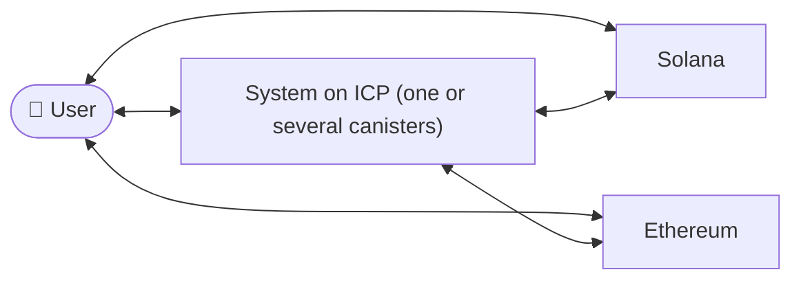
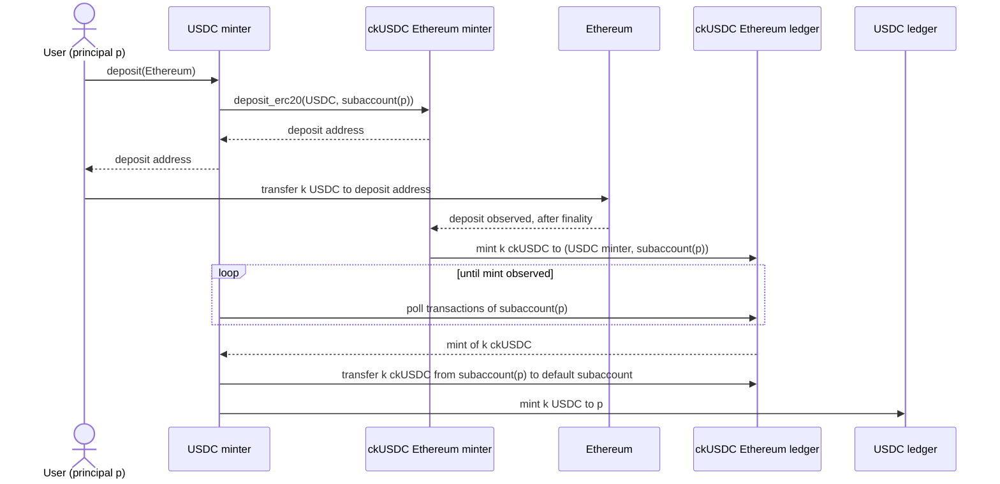
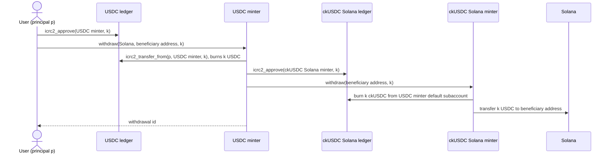

# Multichain token on ICP

- [Motivation](#motivation)
- [System Overview](#system-overview)
- [Glossary](#glossary)
- [Requirements](#requirements)
- [Solution 1: Abstraction Layer](#solution-1-abstraction-layer)

## Motivation

Today a chain-key token on ICP is backed by exactly one asset on exactly one chain:
ckUSDC is backed by USDC on Ethereum only. If USDC on Solana were also supported, a user
would end up with two tokens on ICP that both represent USDC but are not interchangeable.
Liquidity, integrations, and user balances would be fragmented by origin chain even
though the underlying asset is the same.

The goal is that a user on ICP sees USDC as one asset, regardless of which chain it was
deposited from, and can withdraw it to any supported origin chain.

## System Overview

- **User**: holds the token on ICP and moves value in from, or out to, an origin chain.
  The user may hold assets on any subset of the origin chains.
- **System on ICP**: the set of canisters that together implement the token. This is at
  least a ledger and the logic that observes origin chains, mints on deposit, and burns
  on withdrawal. Whether that logic is one minter canister or one per origin chain is a
  design decision, not a requirement.
- **Ethereum**: an origin chain holding USDC as an ERC-20 token. The system controls
  custody addresses on it through threshold ECDSA.
- **Solana**: an origin chain holding USDC as an SPL token. The system controls custody
  token accounts on it through threshold Ed25519.

## Glossary

* An input chain is one of:
    * Ethereum Mainnet
    * Solana Mainnet
* An output chain is one of:
    * Ethereum Mainnet
    * Solana Mainnet

## Requirements

### Requirement 1: Deposit Is Input-Chain Agnostic

**User Story:** As a USDC holder, I want to deposit from whichever input chain my tokens are on, so that I can use them on ICP without caring whether they came from Ethereum or from Solana.

#### Acceptance Criteria

1. WHEN a user deposits k USDC on any input chain at an address given by the System, THE System SHALL mint the user k USDC on ICP.

### Requirement 2: Withdrawal Is Output-Chain Agnostic

**User Story:** As a USDC holder on ICP, I want to withdraw to any output chain of my choice, so that my withdrawal does not depend on which chain I originally deposited from.

#### Acceptance Criteria

1. WHEN a user withdraws k USDC on ICP to an address on a given output chain, THE System SHALL credit the beneficiary address on the given output chain with k USDC.

### Requirement 3: Backing Is 1:1 at All Times

**User Story:** As a USDC holder on ICP, I want every USDC on ICP to be backed by USDC held by the System on an input chain, so that I can always withdraw my holdings independently of what other holders do before me.

#### Acceptance Criteria

1. THE System SHALL, at all times including while deposits and withdrawals are in flight, hold on all input chains a total balance of USDC that is at least the total supply of USDC on ICP.

   $$
   \mathrm{supply}_{\mathrm{ICP}}(\mathrm{USDC}) \;\le\; \sum_{c \,\in\, \mathrm{Chains}} \mathrm{balance}_{c}(\mathrm{USDC})
   $$

   where $\mathrm{Chains} = \{\text{Ethereum Mainnet}, \text{Solana Mainnet}\}$ and
   $\mathrm{balance}_{c}(\mathrm{USDC})$ is the amount of USDC held on chain $c$ at addresses
   controlled by the System.

## Solution 1: Abstraction Layer

Use the existing ckETH/ckERC20 and ckSPL integrations as they are and build on top of them
only what is necessary. A USDC minter acts as an intermediary between the ckUSDC Ethereum
minter and the ckUSDC Solana minter. Each existing minter keeps its own ledger (ckUSDC
backed by Ethereum, ckUSDC backed by Solana), and the USDC minter holds the balances on
those ledgers on behalf of the users, who only ever see the USDC ledger.

### Deposit

1. The user with principal p calls `deposit` on the USDC minter, choosing Ethereum as
   input chain.
2. The USDC minter calls `deposit_erc20` on the ckUSDC Ethereum minter for USDC and for a
   subaccount uniquely derived from p, and returns the deposit address to the user. NOTE: the deposit address is computed for the USDC minter principal and the subaccount (derived from the user's principal) so that the ckUSDC Ethereum tokens when minted are controlled by the USDC minter and not by the user.
3. The user transfers k USDC on Ethereum to the deposit address.
4. After finality, the ckUSDC Ethereum minter mints k ckUSDC to the account
   (USDC minter, subaccount(p)). This balance is controlled by the USDC minter.
5. The USDC minter notices the mint, for example by polling the ckUSDC Ethereum ledger
   transactions for the ledger account (USDC minter principal, subaccount(p)).
6. The USDC minter transfers the k ckUSDC from subaccount(p) to its default subaccount on
   the ckUSDC Ethereum ledger, so that all ckUSDC backing the USDC ledger is pooled in
   one account per chain. This is necessary for withdrawals.
7. The USDC minter mints k USDC on the USDC ledger to p.

The Solana deposit is the same with the ckUSDC Solana minter and ledger in place of the
Ethereum ones.

### Withdrawal

1. The user approves the USDC minter on the USDC ledger for k USDC and calls `withdraw`
   on the USDC minter, choosing Solana as output chain and a beneficiary address.
2. The USDC minter calls `icrc2_transfer_from` on the USDC ledger for k USDC from p to
   itself, which burns them since the USDC minter is the ledger's minting account.
3. The USDC minter approves the ckUSDC Solana minter on the ckUSDC Solana ledger for k
   ckUSDC from its default subaccount and calls `withdraw` on it with the beneficiary
   address.
4. The ckUSDC Solana minter burns k ckUSDC from the USDC minter's default subaccount and
   transfers k USDC on Solana to the beneficiary address.

The Ethereum withdrawal is the same with the ckUSDC Ethereum minter and ledger in place of
the Solana ones.

Step 3 requires the USDC minter's default subaccount on the ckUSDC Solana ledger to hold
at least k ckUSDC. That pool only receives what was deposited from Solana, so a
withdrawal to Solana can exceed what was ever deposited from Solana. This solution does
not resolve this per-chain solvency problem by itself.
