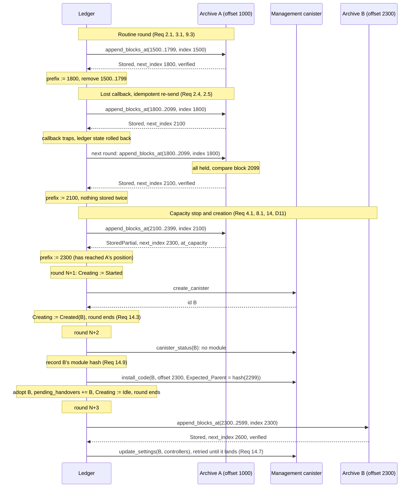

# Archive Chain Continuity And Bounded Archiving Retries — Design

*Companion to [`requirements.md`](requirements.md), and the document an implementer is
handed. Criteria are cited (`Req 5`, `Req 5.1`), never restated.*

## Overview

The design **addresses appends**: a new `append_blocks_at` takes the global index its
batch starts at and returns the archive's own extent, an explicit outcome, and whether
it verified anything; the existing `append_blocks` keeps its signature and gains only
the chain check. The archive can then place an incoming batch exactly (continuation,
already held, straddling, below its range, or a gap) and the ledger stops inferring what
an archive holds and starts being told (Req 2, Req 3). Idempotency follows: a re-send is
recognised and discarded, so a lost acknowledgement costs one round trip. An archive
that lacks the new method rejects the call before storing anything, so a ledger ahead of
its archives, or an archive rolled back beneath its ledger, is safe by construction.

Around that, capacity becomes a reported position plus a flag instead of a failure
(Req 4); a backoff bounds the per-transaction retries a failing archive provokes
(Req 10); a round shrinks to one append to one archive (Req 12); and archive creation is
journaled so a lost reply leaves a canister the ledger can still name (Req 14).
`ic-icrc1-archive` and the shared code in `ledger_canister_core` change; the ICP archive
does not.

Three rounds, against an archive at offset 1000 holding 1000–1499:

## Constraints

- **An archive's offset is immutable and the mapping is a subtraction.**
  `block_index_offset` is written to a stable cell at `init`, `post_upgrade` takes no
  arguments, and reads map `start - block_index_offset`. A node storing the right blocks
  under the wrong offset is wrong at every index, permanently.
- **Two storage refusals never reach the archive's code.** `InsufficientCyclesInMemoryGrow`
  and `ReservedCyclesLimitExceededInMemoryGrow` trap deliberately; every other growth
  failure surfaces as an `Err` from `ic-stable-structures`. This bounds Req 4.2 to the
  latter (Req 4.5). Growth inside a reserved `memory_allocation` charges no reservation.
- **A trap discards its message's state changes, counters included.** Hence Req 6.2.
- **`send_blocks_to_archive` has no ledger access.** It is generic over
  `Rt: Runtime, Wasm: ArchiveCanisterWasm` and cannot call `remove_archived_blocks`;
  only `archive_blocks<LA: LedgerAccess>` can, once per round.
- **Selection happens before any await.** `Blockchain::get_blocks_for_archiving`
  materialises the blocks before `node_and_capacity` asks an archive anything, so
  Req 12.3's cap can use only local values.
- **Every await in the archiving chain must be an inter-canister call.**
  `ic_cdk::futures::spawn` cancels a task whose method handle count reaches zero.
- **The reply buffer is an irreducible allocation.** ic-cdk materialises response bytes
  into its own `Vec`, so every call can trap with earlier messages already committed.
  Cleanup callbacks survive such a trap and are limited to a bool and a `u64`.
- **A call to a method a canister does not export is rejected by the replica** before
  any of the canister's code runs, with a canister-error reject; nothing is stored.
- **Every SNS ledger suite runs `ic-icrc1-archive` with archiving on**, at a 128 kB
  chunk, so rounds are multi-chunk there and (by builder default, unconfirmed on
  mainnet) on ICP; only the chain fusion suites are single-chunk.

## Design Decisions

### D1 — A new `append_blocks_at` beside the unchanged `append_blocks`

Serves Req 2, Req 3, Req 5, Req 11. The old method keeps its signature, so an old ledger
needs nothing; the new one is rejected by an archive that lacks it, so a new ledger
against an old or rolled-back archive stores nothing and needs no probe. The reply is a
record with the outcome as a field, not a variant, because Req 3.1 requires the range on
every answer. `at_capacity` answers only "why did it stop" (Req 4).

### D2 — Placement is decided before the chain is checked, and the skip is clamped

Serves Req 1.6, Req 2.3, Req 2.4. On a re-send the batch's first block continues one of
the archive's own earlier blocks, not its tip, so checking the chain first would refuse
exactly the re-send Req 2.4 makes harmless. The number of leading blocks to skip is
`k = min(offset + log_length - i, blocks.len())`, computed only in the branch where
`offset <= i <= offset + log_length`, and applied with `skip` so the clamp is structural.

### D3 — An indexed append never refuses on protocol grounds by trapping

Serves Req 6.1, Req 6.2. A chain mismatch is the condition an operator most needs to
see, and a trap makes it invisible. The cost is that atomicity (Req 1.5) becomes
ordering-plus-test: every check runs before any append. Index-less appends still trap.

### D4 — The Expected_Parent closes the empty-archive hole

Serves Req 1.2, Req 7.2. The index verifies position and the chain check content, but
an empty archive has no tip to check against; the parent hash at `init` gives it one. It
catches creation and first append seeing different ledger states (the roll-over
corruption, a snapshot restore between the two), not a ledger that had already forked.

### D5 — Only an append that verified a block may advance the Archived_Prefix

Serves Req 9.3, Req 3.4. An empty append, a gap, a below-range report and the
unverifiable first append all report a range but verified nothing. The gate is the reply's `verified` flag,
which the ledger cannot reconstruct: whether an inherited tail was ever given an
Expected_Parent is state only the archive has. The ceiling is one past the highest block
stored or compared, never `next_index`: an archive holding 1000 blocks offered the first
100 on a retry compares index 99 and says nothing about 100..999.

### D6 — Backoff is geometric, transaction-triggered, and reset by an upgrade

Serves Req 10.1, Req 10.7. `BACKOFF_INITIAL` = 30 s, doubling per consecutive failure,
`BACKOFF_CAP` = 1 h. A transient cause recovers within a minute; a permanent one costs one
probe per hour. A timestamp check on the transaction path rather than a timer, per the
every-await-is-a-call constraint.

### D7 — A halt is the backoff at its cap; backoff state is `#[serde(skip)]`, the creation journal persists

Serves Req 10.7, Req 10.8, Req 14.1. Every halt but one is learned from one archive
reply and re-derivable from the next, so it is not a separate state: it is the backoff
pinned at `BACKOFF_CAP` with the reason kept for the metric. Retrying costs one call per
hour and stores nothing, since every such reply refuses or reports; it is what lets a
repaired archive, or a raised archive size, take effect without a ledger upgrade.
Forgetting the state on upgrade costs one attempt, which is the operator's "resume now"
lever. The exception is a creation whose reply was lost: nothing can re-derive an
orphaned canister and a retry would create another, so that state is persisted with
`#[serde(default)]` and no timer clears it (Req 14.1).

### D8 — One seam, `Wasm::INDEXED_APPENDS`; the ICP archive is unchanged

Serves Req 7.5, Req 8.4, Req 9.8, Req 11.4, Req 13.4. `ArchiveCanisterWasm` gains
`const INDEXED_APPENDS: bool`, which selects the method: `append_blocks_at` for
`ic-icrc1-archive`, the legacy `append_blocks` for `ic-icp-archive`, whose empty reply
carries no range and which rejects a batch that does not fit, so the ICP path also keeps
the `remaining_capacity` query that decides its roll-over. Everything else is shared and
fixes both ledgers.

### D9 — No capability state; a rejected indexed append is a failed round

Serves Req 11. Every `append_blocks_at` is self-checking: an archive without the method
rejects it and stores nothing, so there is nothing to probe, cache or persist, and no
downgrade exposure. The reject is counted, backed off (Req 10.1) and retried, never
followed by a fall-back to `append_blocks` (Req 11.3), and archiving resumes when the
archive is upgraded (Req 11.2). An old archive and a trapping one both arrive as a
canister-error reject and are not told apart: one counter covers both, since the
ledger's response is the same, and the archive's own metrics say which it was.

### D10 — `ARCHIVE_CALL_TIMEOUT` is 300 s, and management-canister calls stay unbounded

Serves Req 13. The CDK's `bounded_wait` default. The justification is not a stalling
archive (both archives are synchronous, so a trap arrives as a reject) but the
response-memory reservation: a guaranteed-response call reserves about 2 MiB of subnet
memory for a reply under 100 bytes, from the pool whose exhaustion caused the incident.
Management-canister calls run once per archive fill, so they stay unbounded (Req 13.3).

### D11 — Creation is journaled across three rounds, and adoption precedes handover

Serves Req 14. `create_canister` → record `Created { id }` → **end the round**; the next
round records the module hash, installs, adopts, and ends; the round after that hands
over. Each cut is a durability point before a heavy encode or a controller change, and
the recorded hash is what a later ledger version reconciles against (Req 14.9). The handover is one
`update_settings` retried until it lands or comes back unauthorized (Req 14.8), which is
conclusive only because the ledger is the new canister's sole controller until then.

### D12 — No repair path is built now

A mis-indexed archive is off by one constant everywhere and is repairable by rewriting
its offset at `post_upgrade` and the ledger's ranges alongside; an archive holding a
suffix from an abandoned timeline is repairable by truncating its log at the fork, and
must never be rolled back below the ledger's Archived_Prefix, which would leave blocks
held nowhere. Both are break-glass and the archive cannot validate the value. Build
either only when Step 0 or a halt shows the need.

## Implementation

### `ic-icrc1-archive` — `append_blocks_at` and `append_blocks`

    type append_outcome = variant {
      Stored;                                       // Req 2.1, 2.3, 2.4, 3.3, 3.5
      StoredPartial;                                // Req 4.1, 4.2; at_capacity says why
      BelowRange;                                   // Req 2.6
      Gap;                                          // Req 2.2
      ChainMismatch : record { at_index : nat64 };  // every ground of Req 1, and Req 2.5
      Undecodable   : record { at_index : nat64 };  // Req 6.3
    };

    type append_result = record {
      block_index_offset : nat64;
      next_index         : nat64;
      verified           : bool;     // Req 3.4
      at_capacity        : bool;
      outcome            : append_outcome;
    };

    append_blocks_at : (vec blob, nat64) -> (append_result);
    append_blocks    : (vec blob) -> ();          // unchanged signature, Req 5

Both methods run the same internal function; the legacy one enters it with no index.
`Stored` is a post-condition, not a count: *every block offered that was not already
held is now held*. `StoredPartial` is the one outcome that breaks it, and covers the
zero-stored case where the first new block did not fit (Req 3.3, Req 8.3). One
`ChainMismatch` arm for every ground because the ledger's response is the same (halt per
Req 10.5) while Req 6.1's counters give the operator the distinction.

Order of work:

1. Caller check, unchanged (Req 1.9).
2. `append_blocks_at` with an empty batch: reply per Req 3.1 and stop. No placement, no
   chain check, no counter (Req 3.5, Req 6.4). An empty `append_blocks` must **not**
   take this path (Req 5.1).
3. `append_blocks` skips steps 4 and 5 only, with `k = 0`. Steps 6 onward apply, and any
   refusal fails the call (Req 5.2).
4. Place the index against `block_index_offset` and `block_index_offset + log_length`
   (Req 2.1, 2.2, 2.6), returning without appending in the refusing cases.
5. Compute `k` per D2. If `k > 0`, compare `blocks[k-1]` against the stored block at that
   index and return `ChainMismatch` on a difference (Req 2.5). One comparison suffices:
   a divergence at or below that index propagates forward and cannot heal.
6. Determine the blocks that will actually be stored: the suffix from `k`, trimmed to
   what fits the configured limit and that limit only, since a growth the platform
   refuses in step 7 merely stops an already validated suffix and never causes a
   refusal. Chain-check **only those** (Req 1.6): `blocks[k]`
   against the tip or the Expected_Parent (Req 1.1, 1.2, 1.7), each later block against
   its predecessor (Req 1.3), the genesis rules (Req 1.4), and decodability (Req 6.3).
7. Append the suffix. Indexed: stop short where it must and set `at_capacity` (Req 4).
   Index-less: all-or-nothing, failing the call if the batch does not fit (Req 5.3).
   `StableLog::append` returns a `Result`, so both `trap("no space left")` sites go.
8. Re-read `log_length` and reply (Req 3.1), or reply `()` on the legacy path.

Step 7 is a restructuring: today the check is whole-batch and traps; Req 4.1 needs a
fitting prefix, appended while the next block still fits, and `at_capacity` is whichever
stopped the loop, the archive's own limit (`true`) or a failed grow (`false`). An append
that exactly fills the archive reports `false` and is found full next round: one wasted
round per fill, accepted.

### `ic-icrc1-archive` — `init`

    service : (principal, nat64, opt nat64, opt nat64, opt blob) -> { ... }
    //                                                  ^^^^^^^^ Expected_Parent

The stored field in `ArchiveConfig` needs `#[serde(default)]`, since the config is
CBOR-decoded on every upgrade; without it every existing archive fails its first upgrade.
Verify `archive.did` with `didc` and the CI Candid check.

### `ic-icrc1-archive` — `encode_metrics`

One counter per ground in Req 6.1, all new. Two count non-faults: the unverifiable
append (Req 1.8) should read zero once every ledger supplies an Expected_Parent, and the
own-limit stop (Req 4.1) is normal operation. All of them commit, per D3.

**Release risk.** Req 1.3 makes the archive parse block bytes written by years of ledger
versions, and an index-less decode failure traps (Req 5.2) and halts that suite. Before
release, decode every block of a real mainnet archive log offline per token variant, and
budget the per-block decode-plus-hash instructions of a 1 MiB append.

### `ledger_canister_core::archive` — `send_blocks_to_archive`

Both loops go (Req 12.1, 12.2): pick a node, send the round's selection, one call,
reconcile, return a count for `archive_blocks` to remove. Giving this function ledger
access is not worth redrawing the module boundary: the round *reports* and
`archive_blocks` removes, and with one append per round both land in the same message.

The tail's entry in `nodes_block_ranges` follows the Archived_Prefix, never the reply
(Req 7.3, 7.6, 9.1): when the prefix advances to `N`, the entry becomes
`(offset, N - 1)`, inserted the first time `N` exceeds the offset. Refusals, below-range
reports and empty appends leave the record untouched, so a halt never publishes a range
the ledger has not given up. Today's `push((0, chunk_len - 1))` from the batch length
goes. The reply's `block_index_offset` and `next_index` serve the checks below and
Req 7.1; the reported start must equal the recorded one for every archive (Req 9.7), and
for the entry-less tail the recorded start is one past the previous entry's end, zero for
a first node.

The three range checks live here and report upward: start above the prefix (Req 9.4),
position not past the published end (Req 9.5, tested as `next_index > inclusive_end`,
the one place the inclusive and exclusive conventions meet), and position above the
ledger's own chain tip (Req 9.6, the ledger-only snapshot restore). Per D5 the prefix
advances only on `verified == true`, and only to one past the highest block stored or
compared; the removal count and the published end are capped the same way. A reply that
trips any of 9.4–9.7 changes nothing at all, even when its compared block matched: no
prefix advance, no removal, no published range (Req 9.4, 9.6, 9.7), because a suite in
one of those states is repaired by an operator and the ledger should hand over its
state whole.

`BelowRange` halts (Req 10.6): its one benign route, a straddling re-send into a full
archive that compared nothing, is closed by Req 2.5, and what remains is a wrong record
no ledger action can repair. A rejected `append_blocks_at` is a failed round (D9):
counted (Req 11.1), backed off, and never followed by `append_blocks` (Req 11.3). The
ICP path (D8) calls `append_blocks`, whose empty reply carries no range, and counts it
(Req 11.4).

`post_upgrade` checks `nodes.len()` against `nodes_block_ranges.len()`: more than one
entry-less node (today's oversized-block loop can leave several) halts on Req 9.7's
metric; one entry attributed to the wrong node is caught by the first reply instead.

### `ledger_canister_core::archive` — `Archive` state and halts

`#[serde(skip)]` per D7: last-attempt timestamp, consecutive-failure count and the
reason for the last failure (Req 10), and the tail's last reported `at_capacity`
(Req 8). A halt sets the spacing to `BACKOFF_CAP` and the reason; nothing else is
stored.

    #[serde(skip)]
    backoff: Option<Backoff>,            // None: no failure since the last success

    struct Backoff { next_attempt: Timestamp, failures: u32, reason: Reason }
    enum Reason { Failed, Rejected, OversizedBlock, StartAhead, PositionShort,
                  PositionAhead, StartMoved, Refused(RefusedGround), BelowRange,
                  ForeignModule(CanisterId) }
    // 10.3, 11.1, 8.3, 9.4, 9.5, 9.6, 9.7, 10.5, 10.6, 14.5 respectively

`blocks_to_archive` reads it before the guard, and it is the source of the metric
(Req 10.8): one labelled gauge, `ledger_archiving_halted{reason="..."}`, `1` while the
reason is one of the halts, with `canister_id` as a second label where a halt names one,
so a single alert rule covers every case. Failed rounds and unknown outcomes stay
counters.

| condition | criterion | what a retry does | clears |
|---|---|---|---|
| tail start above the Archived_Prefix | Req 9.4 | comes back below range, nothing stored | after a record migration |
| position not past its published range | Req 9.5 | comes back as a gap, nothing stored | never: blocks are held nowhere |
| position above the ledger's chain tip | Req 9.6 | wholly held re-send: accepted and compared while the ledger's blocks still match, refused once they diverge; nothing advances either way | after the archives are truncated at the fork |
| offset differs from recorded start | Req 9.7 | may store idempotently; record unchanged | after a record migration |
| empty archive reports `at_capacity` | Req 8.3 | halts again, or rolls over once the size is raised | by raising `node_max_memory_size_bytes` |
| refused on chain or position grounds | Req 10.5 | refused again, nothing stored | after the archive is repaired or replaced |
| blocks offered below the archive's range | Req 10.6 | nothing stored | after a record migration |
| created canister carries a foreign module | Req 14.5 | same `canister_status` answer | unreachable while the ledger is sole controller |
| tail rejects `append_blocks_at` | Req 11.1 | rejected again, nothing stored; geometric backoff per Req 10.1, not pinned | after the archive upgrade (Req 11.2) |
| creation begun, no identity recorded | Req 14.1 | **would create another canister**: no retry | a ledger build that clears it; persisted |

Every halt row is one call per hour that stores nothing and re-derives the same answer
until the cause is gone, at which point archiving resumes on its own; the rejected
`append_blocks_at` row is not a halt and follows the geometric backoff of Req 10.1, so
an archive upgrade is picked up within a minute, and the last row never retries. The
upgrade reset of Req 10.7 is the immediate lever when the operator has already fixed
the cause.

**Skip versus act.** A skip before the guard is right for a wait and wrong for a state
that needs the ledger to *do* something: `Created` (Req 14.4) must finish the creation.

### `ledger_canister_core::archive` — `node_and_capacity`

The roll-over test is restated in terms of the last reply's `at_capacity` (Req 8.1,
8.2), and gated on the Archived_Prefix having reached the tail's reported position
(Req 8.1): otherwise an inherited tail that stored an unverified prefix and filled would
have the next archive created above blocks the ledger still serves. The
`remaining_capacity` pre-call goes on the ICRC path: on a cold start, with no last reply
to read, the ledger simply appends to the tail, and a full tail answers `StoredPartial`
with `at_capacity` and its range, which is what Req 7.1 and 8.1 need. One wasted append
per cold start, and the ICRC ledger never calls anything but an append on an archive.
The ICP path keeps the pre-call (Req 8.4), since its archive reports nothing and rejects
a batch that does not fit; it is a query, so Req 12.1's one append per round holds.

An empty archive reporting `at_capacity` (`next_index == block_index_offset`) halts
instead of rolling over (Req 8.3), unless the configured archive size has since been
raised above the block, in which case the roll-over is the fix taking effect; so does a
first block larger than the configured archive size, decided locally, and one that
exceeds one message so the byte cap selects nothing. Creating a node sets
`block_index_offset` from the previous node's reported `next_index` (Req 7.1, not `+ 1`)
and supplies the Expected_Parent (Req 7.2).

The Expected_Parent is the decoded `parent_hash()` of the round's first block: under
D11 a creation round sends no blocks and the next append starts at the selection front,
so no other position is ever a node's first. It is read in `archive_blocks<LA>`, where
the block type is known, and threaded down beside the blocks. For a legacy suite the
tail's first reply is where Req 7.1 gets its value, a partial one if the tail is already
full. Legacy non-tail nodes are never re-queried.

### `ledger_canister_core::ledger` and `::blockchain` — round selection

Cap the selection at `min(num_blocks_to_archive, one message)` in bytes in
`Blockchain::get_blocks_for_archiving` (Req 12.3). "In bytes" means the Candid-encoded
`(vec blob, nat64)`, not the sum of payloads: either measure the encoded argument or
subtract a bound covering the framing (a fixed header plus ten bytes per block). On
multi-chunk suites this makes `num_blocks_to_archive` a per-round cap: the trigger is
re-checked each round, so retention settles between `trigger_threshold` minus one
message and `trigger_threshold`. The effective per-round count follows from the
configured settings, which DEFI-1565 (#11418) exposes as metrics; no further metric.

A short stop with `at_capacity` false counts as a failed round for spacing and the
failure metric while the reported progress is kept (Req 10.4); a stop at the archive's
own limit does not. The failure count and last-attempt timestamp are written before the
append's await or in the cleanup callback, so a round that traps still backs off.
`blocks_to_archive` carries the skip conditions: the backoff, halts included, and
`Started` (Req 14.1), both before the guard.

### `ledger_canister_core::runtime` — `Runtime::call`

`Call::unbounded_wait` is the single call site today. It gains a bounded variant so the
choice is per call (D10):

| call | wait | why |
|---|---|---|
| `append_blocks_at` | bounded | idempotent under Req 2.4 |
| `append_blocks` (ICP) | unbounded | a retry would store twice, Req 13.4 |
| `remaining_capacity` (ICP) | bounded | read-only, resolved by asking again, Req 13.6 |
| `create_canister` | unbounded | unresolvable: an unknown outcome is Req 14.1 |
| `install_code` | unbounded | resolved by `canister_status`; once per fill |
| `update_settings` | unbounded | resolved by retrying; once per fill |

An unknown outcome on a bounded call is a failure (Req 13.1, 13.2), counted distinctly
so the timeout can be revisited. `Runtime::call` today folds insufficient cycles, a
failed `call_perform` and a Candid decode failure of a successful reply into one `-1`
sentinel; the decode failure becomes its own variant, because the creation journal must
treat a reply it could not read as a canister that exists.

### `ledger_canister_core::archive` — the creation journal

    #[serde(default)] creating: Creating,                 // Idle is Default
    #[serde(default)] pending_handovers: Vec<CanisterId>,

    enum Creating { Idle, Started, Created { id: CanisterId, module_hash: Option<[u8; 32]> } }

`Started` before `create_canister`; `Created { id, module_hash: None }` as soon as it
returns, **and the round ends** (Req 14.3), because today's code next encodes the
multi-megabyte `install_code` argument in the same message. Return to `Idle` only on a
reject of `create_canister`, which for the management canister means nothing was
created; a reply that fails to decode means a canister exists whose id is lost, so the
state stays `Started` (Req 14.2). Both non-`Idle` states are
exposed with the id where there is one (Req 14.1, 14.4): `Started` is a halt, `Created`
is "finish this first". A round finding `Created` asks `canister_status` for the module
hash. Absent: write the embedded wasm's hash into `module_hash`, then await
`install_code`, so the await commits the record before the install can land (Req 14.9).
Equal to the recorded hash: adopt, even if the ledger has since been upgraded and now
embeds a different wasm; the archive is upgraded with its siblings later. Anything else
halts as `ForeignModule` (Req 14.5), which the ledger being sole controller makes
unreachable in practice; it stays as a guard.

Adoption (`nodes.push`, the `pending_handovers` entry, `Creating` back to `Idle`) ends
the round (Req 14.7); the handover starts on the next. `pending_handovers` is a
collection because Req 14.6 lets archiving continue past a failed handover, so a later
archive can be adopted while an earlier one is still owed one. One retry per round,
rotating; an entry is removed on success or on an unauthorized reject (Req 14.8). The
list sent is de-duplicated (Non-goals).

### `ledger_canister_core::spawn` and error construction

`install_code` takes `Vec<u8>`, forcing `archive_wasm().into_owned()`, and `Rt::call`
serialises it again. Take `Cow<'static, [u8]>`, pre-reserve the encode buffer before the
first await, and `nodes.reserve(1)`. Correct the comment above `create_canister`: a panic
there rolls the transaction back only for a ledger's first node. Replace
`FailedToArchiveBlocks(pub String)` with an enum carrying `Copy` payloads, rendered only
where logged; keep the canister id in the `create_canister` callback log but drop the
`{result:?}` format. Expect little beyond keeping graceful failures graceful.

## Test plan

Every archive-level row runs for both token variants. Rows needing a trap in the
archiving continuation depend on the archiving-reply change (Delivery) and reuse its
harness. Seams the design owes: backoff state, per-round append count and
unknown-outcome count as metrics. **Not attempted:** inducing a trap in the append
continuation end to end (allocator dependent, flaky). If no returning growth refusal is
controllable, Req 4.2's `false` rests on review of the branch that sets the flag.

| # | level | case | pins |
|---|---|---|---|
| 1 | archive | append a range, re-append it wholly and as a 600-of-1000 prefix: nothing stored, every index resolves | 2.4, 2.7 |
| 2 | archive | first block does not continue the tip; fifth does not continue the fourth: `ChainMismatch` at that index, extent unchanged | 1.1, 1.3, 1.5 |
| 3 | archive | offset `N+1000`, append at `N`: nothing stored, `BelowRange`, offset reported; repeat once non-empty and assert `next_index` differs from the offset | 2.6, 3.1 |
| 4 | archive | `N..N+499` then `N..N+999`: extent 1000, covered prefix compared not skipped; re-send from a chain forked at `N+200`: `ChainMismatch` | 2.3, 2.5, 1.6 |
| 5 | archive | fill so the last block is `T`; send `T-9..T+9`: nothing stored, `at_capacity`, `verified` true | 2.5, 3.4, 4.1 |
| 6 | archive | append at an index above the position: `Gap`, nothing stored | 2.2 |
| 7 | archive | over-large batch with an index: short `next_index`, `at_capacity` true, prefix readable; without an index: call fails, nothing stored; second block exceeds the limit and does not chain or decode: first block stored, not refused, not counted; limit below one block: nothing stored, `at_capacity` true, `next_index == block_index_offset` | 4.1, 4.4, 5.3, 1.6, 8.3 |
| 8 | archive | complete and partial appends are distinguishable from the outcome alone; `at_capacity` false on a full store and on a wholly held re-send | 3.2, 3.3, 4.3 |
| 9 | archive | empty `append_blocks_at` reports the extent, stores nothing, is not counted, even above the position; empty `append_blocks` replies empty and stores nothing | 3.5, 5.1, 6.4 |
| 10 | archive | genesis at offset 0; parentless block refused at non-zero offset and into a non-empty archive; parented block refused at index 0; parentless block declared at 5 refused | 1.4, 2.2 |
| 11 | archive | no Expected_Parent: first indexed append stored, unverifiable counter rises, `verified` false; the same first append through `append_blocks`: stored, empty reply, counter rises (the only call PR 1 sees in production); with Expected_Parent: mismatching first batch refused, matching one stored and not counted | 1.2, 1.7, 1.8, 3.4, 6.1 |
| 12 | archive | `append_blocks` against the new archive: stored, the reply unchanged, a mismatch traps; a call from a principal other than the ledger is refused with nothing stored | 5.1, 5.2, 5.4, 1.9 |
| 13 | candid | `archive.did`'s `append_blocks` is unchanged against the current `.did` (the `didc` check), so an old ledger needs no change | 5.4 |
| 14 | integration | the current archive wasm as tail: the ledger's `append_blocks_at` is rejected, nothing is stored, the count rises, and no `append_blocks` call is ever made | 11.1, 11.3 |
| 15 | archive | each counter in Req 6.1 moves for its own cause, `Undecodable` included, and is readable after; the same refusals index-less fail the call and move nothing | 6.1–6.3 |
| 16 | archive | growth refused by a route that returns control (wasm stable maximum or subnet cap): `at_capacity` false, prefix readable; a low `reserved_cycles_limit`: call rejected, nothing stored | 4.2, 4.5 |
| 17 | unit, archive | pre-change `ArchiveConfig` CBOR decodes with the new field absent | D4 |
| 18 | unit, core | tail start above the prefix end; position not past the published range (`100` passes, `99` halts for `[0, 99]`; a non-tail archive below the aggregate prefix but matching its own range passes); position above the chain tip; offset differing from the recorded start, including a first archive reporting non-zero: each halts on its own metric, record unchanged | 9.4–9.7, 7.3 |
| 19 | unit, core | an empty append's range never advances the prefix; a verifying append advances to one past the highest block verified; 1000 held, first 100 re-sent: prefix 100, not 1000, and the published end is 99, not 999 | 9.3, 3.4, 7.6 |
| 20 | unit, core | after a reply of `next_index = N`, the new offset is `N`; `archives()` tiles; a node whose range starts elsewhere takes no blocks and raises the metric; an empty append's reply with `next_index == block_index_offset` inserts no entry and nothing underflows | 7.1, 7.3, 7.4, 3.5 |
| 21 | unit, core | batch just under the message limit in raw bytes: trimmed so the encoded argument fits | 12.3 |
| 22 | upgrade | pre-change `Archive` with one entry-less trailing node upgrades cleanly; with two, halts on Req 9.7's metric; new fields read `Idle` and empty | 9.7, D7, D11 |
| 23 | integration | `BelowRange`, `Gap`, `ChainMismatch` and a first-block-too-large `StoredPartial`: neither the prefix nor the published range changes; a wholly held re-send: both advance; `BelowRange` also halts on its own metric, distinct from 10.5's, with no further append | 9.3, 7.6, 10.6 |
| 24 | integration | tail without Expected_Parent, first append capacity-shortened: `at_capacity` true, `verified` false, **no** archive created; re-send compared, prefix advances, then the next archive is created; no `BelowRange` ever | 8.1, 9.3, 2.5 |
| 25 | integration | full tail: next round creates an archive; short stop with `at_capacity` false: same archive retried, rounds spaced and counted as failures | 8.1, 8.2, 10.4 |
| 26 | integration | oversized block on all three paths (the reply from an empty tail, the local size check, the byte cap): halt, own metric, no archive created; an ordinary full tail still rolls over, and a cold start against a full tail costs one wasted append and no other call | 8.3, 8.1, 12.1 |
| 27 | integration | archive stopped: attempts spaced per backoff, resume on restart with no intervention; a failed round then a ledger upgrade: next transaction archives immediately | 10.1–10.3, 10.7 |
| 28 | integration | refusal per 1.1, 2.2, 2.5, 6.3 in turn: halt with distinct metric, no append sooner than `BACKOFF_CAP`, then one that re-establishes the halt; upgrade with archive unchanged: one immediate append, halt re-established; repair the archive without touching the ledger: resumes at the next cap-spaced attempt; empty tail at capacity: halts, then rolls over once the configured size is raised | 10.5, 10.7, 10.8, 8.3 |
| 29 | integration | old archive wasm as tail: `append_blocks_at` rejected on every attempt, attempts spaced per backoff, nothing archived, no `append_blocks` call made; upgrade the archive: resumes without a ledger upgrade; ICP ledger archives normally through `append_blocks` and counts | 11.1–11.4, 10.1 |
| 30 | integration | tail does not answer: round ends within `ARCHIVE_CALL_TIMEOUT`, retried, nothing stored twice; ledger stoppable and upgradable with a call in flight | 13.1, 13.2, 13.5 |
| 31 | integration | multi-chunk configuration: one append call per round, moving `min(num_blocks_to_archive, one message)` blocks; a round that fills the tail with blocks left over creates no archive, the next eligible round begins exactly one creation, and no round creates two | 12.1, 12.2, 12.3, 8.1 |
| 32 | integration | every index served before a round is retrievable after it; the ledger stopped serving only indices an archive reports covering | 9.1, 9.2 |
| 33 | integration | ICP ledger creates archives and discards blocks with no reported extent, rolling over from the `remaining_capacity` query when the tail is full | 7.5, 8.4, 9.8 |
| 34 | integration | non-genesis archive: first append accepted; ledger patched to omit the hash: unverifiable counter rises; patched to a wrong hash: refused | 7.2, 1.2, 1.8 |
| 35 | integration | `create_canister` reply lost, or received but undecodable: `Started`, exposed, not self-clearing, survives upgrade; `create_canister` rejected: no halt | 14.1, 14.2 |
| 36 | integration | `install_code` outcome lost after the id was recorded, or a trap at the start of the round after `Created`: resolved via `canister_status`, creation finished, same canister adopted; the ledger upgraded to a build embedding a different archive wasm between the committed install and reconciliation: the recorded hash matches, the canister is adopted, no halt; a module matching neither: halt with id exposed | 14.3–14.5, 14.9 |
| 37 | integration | `update_settings` outcome lost or callback trapped after controllers changed: archive adopted and serving, archiving continues, entry retried and cleared on the unauthorized reject | 14.6–14.8 |
| 38 | integration | one handover keeps failing until a second archive is adopted: first still retried and counted, second completes (rotation); pending handover survives a ledger upgrade; ten configured controllers with a repeat: one de-duplicated `update_settings` accepted | 14.7 |
| 39 | measurement | ledger memory across an archive-creation round stays below a bound | D11 |
| 40 | canbench | `remove_archived_blocks` at the per-round cap, so the one remaining per-round trap source is measured rather than assumed | 12.3 |

Verification:

    cargo check --all-targets --all-features -p ic-icrc1-archive -p ic-icp-archive \
      -p ic-ledger-canister-core -p ic-icrc1-ledger -p ledger-canister
    ./ci/scripts/rust-lint.sh
    bazel test --test_output=errors \
      //rs/ledger_suite/icrc1/archive:archive_integration_tests \
      //rs/ledger_suite/icrc1/archive:archive_integration_tests_u256 \
      //rs/ledger_suite/icp/archive:ledger_archive_node_canister_integration \
      //rs/ledger_suite/common/ledger_canister_core/... \
      //rs/ledger_suite/icrc1/ledger/... //rs/ledger_suite/icp/ledger/...

## Delivery / PR sequence

The suite upgrades in the order index, ledger, archives, so a new ledger meets old
archives unless the work is split. It ships as **two releases in a fixed order, the
archive first, the ledger second**, so that the ledger release finds archives that
implement `append_blocks_at` and archiving never pauses. The order is not a safety rule:
a new ledger against an old archive is rejected and stores nothing (D9), and so is an
archive rolled back beneath its ledger.

**Step 0 — verify the live suites** (DEFI-3019). Nothing here repairs a diverged suite. On each
deployed chain fusion and ICP suite: a Rosetta sync from genesis, and each archive's own
extent against what the ledger publishes for it (`log_length` equals the published
range's length on ICRC; offset-and-count pairs tile up to `first_block_index` on ICP). An
archive holding more than published is a duplicate suffix D12 does not repair. Both
checks passed on every DeFi-owned suite on 2026-09-24 and need repeating if the archive
release lands much later.

**Archive release — PR 1** (DEFI-3016). `append_blocks_at`, placement, the clamp, the
chain check on every stored block through both methods, the Expected_Parent at `init`,
capacity reporting, the counters, the `.did`. The compatibility tests written for the
optional-argument design (`test_append_blocks_ignores_an_extra_optional_start_index`,
`test_old_ledger_decodes_new_archive_reply_as_unit`, and the ICP archive's
`should_ignore_an_extra_optional_start_index`) lock premises this design no longer
makes and are dropped; `test_empty_append_blocks_is_accepted_and_stores_nothing` stays.
Until the ledger release, a re-send after a lost callback is refused and the old ledger
halts on it, retrying per transaction: survivable, but keep the window short.
*Acceptance:* Req 1–6.

**Ledger release — PRs 2–4, stacked and shipped in one ledger upgrade.** Each PR
compiles and passes its tests alone, but none is released alone: PR 3 without PR 4
has no geometric backoff for ordinary failures and no creation journal; PR 2 alone hides
archiving traps while the fresh-archive window is open. The
upgrade should follow the archive release so archiving does not pause; if it does not,
the ledger backs off on rejected appends and resumes once the archives are upgraded.
DEFI-1565 (#11418), which exposes the archiving settings as metrics, should land before
this release, since the design relies on it for the effective per-round count.

- **PR 2 — the ledger's archiving-reply change** (separate specification). Delivers the
  reply half of Req 10.3.
- **PR 3 — one append per round, reconciliation and halts** (DEFI-3017). Both loops
  removed and byte-based selection, so the Expected_Parent needs no per-position
  scaffolding and reconciliation and removal share a message; reconciliation from the
  reported extent, the range checks, offset derivation, the Expected_Parent, the
  rejected-append handling and seam, and the backoff state with its pre-guard skip and
  labelled gauge, carrying the reasons its own checks raise (`StartAhead`,
  `PositionShort`, `PositionAhead`, `StartMoved`, `Rejected`), pinned at the cap since
  the spacing itself lands in PR 4. *Acceptance:* Req 7, Req 9, Req 11, Req 12.
- **PR 4 — retries and creation** (DEFI-3017, DEFI-3018). The geometric backoff, the
  remaining reasons, bounded calls, the creation journal, adoption and handover.
  *Acceptance:* Req 8, Req 10, Req 13, Req 14.

Safety is reached at this release; expect the backlog to drain at one message per
transaction.

**After — re-enable archiving** (DEFI-3020). Lower `trigger_threshold` on the chain
fusion suites by NNS proposal. Not before the ledger release, and not while Step 0 has found a duplicate
suffix an operator has not removed.

## Discussed Alternatives

- **An optional index argument on the existing `append_blocks`.** One entry point, but an
  archive that ignores the argument stores an indexed batch blindly, which makes the
  release order a safety rule, leaves a rollback exposed, and needs a capability probe, a
  positive-only cache and two Candid tolerances as release gates. A separate method is
  rejected by an archive that lacks it before anything is stored.
- **A typed error return with no index.** Subsumed: `append_result` is that return
  value; it would not have delivered Req 2 or Req 3.
- **String-matching the reject message.** Depends on replica formatting and CDK version.
  This is also why an old archive and a trapping one are not told apart (D9).
- **Idempotency without a reported position.** Leaves the ledger counting what it sent,
  so it over-advances after a lost batch; Req 3 is what makes idempotency sufficient.
- **Reconciling from `log_length` by polling.** Superseded by reporting on every append;
  polling remains the only way to fix a suite that has *already* diverged (D12).
- **Advancing on a refusal.** Sound only if gaps are impossible; trades a loud stall for
  quiet data loss.
- **Rolling over to a fresh node when the tail cannot answer.** Costs a canister forever
  and abandons paid-for space.
- **Making response handling infallible.** Needs a CDK change; with idempotent retries it
  becomes irrelevant instead.
- **Letting the archive pull.** Dissolves the commit-point problem but inherits the
  index's timer-fragility problem.
- **A separate range endpoint.** The reply to every indexed append answers the same
  question, and an empty `append_blocks_at` answers it when there is no round to run.
- **Redirecting a `BelowRange` batch to an older archive.** Every piece of that path
  generated failure modes of its own; Req 2.5 removes the benign route, and a halt is
  right for the rest.
