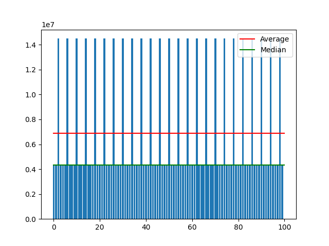
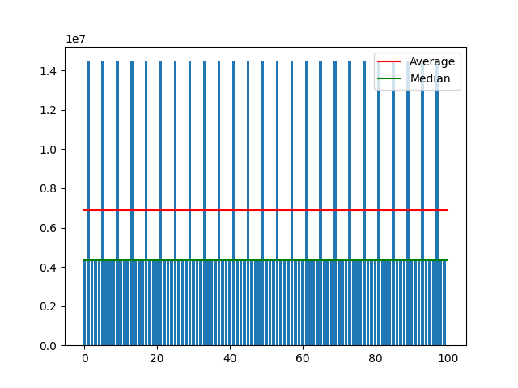
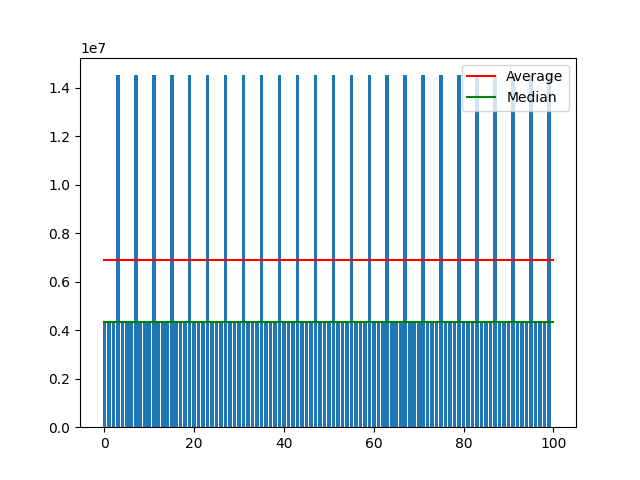

= Archive Canister cycles consumption by operation type

Here are presented the results of cycles cunsumption measures on an archive canister. The calls are made using the ledger canister method get_transaction. +
To setup the measures, 10 transactions of each type (mint, burn and transfer) are stored in the archive canister. +
e.g. 0:9 are mint, 10-19 are burn and 20-29 are transfers. +
[Note] The plots of the first table are the result of 100 calls. +

.Cycles consumption by operation type for get_transaction
[options="header"]
|======================================================================
|Operation | Average cycles consumption per call 
|Mint      | 
|Burn      | 
|Transfer  | 
|======================================================================

[Note] Each cycles measure is the average of 10 calls on a local replica setup. +

.Cycles consumption by operation type for get_transactions(start, N (length))
[options="header"]
|==============================================
|Operation |            | Mint      | Burn       | Transfer
|          | N (length) | Cycles    | Cycles     | Cycles
|          | 1          | 2_163_600 | 7_522_116  | 6_230_653
|          | 2          | 7_243_600 | 12_638_644 | 10_635_856
|          | 3          | 7_243_600 | 10_642_664 | 9_670_532
|          | 4          | 4_195_600 | 10_681_216 | 8_706_272
|          | 5          | 4_195_600 | 10_718_392 | 8_758_408
|          | 6          | 5_211_600 | 10_757_576 | 8_809_152
|          | 7          | 5_211_600 | 10_793_324 | 7_844_720
|          | 8          | 5_211_600 | 5_747_452  | 8_907_788
|          | 9          | 5_211_600 | 8_836_144  | 8_958_156
|          | 10         | 4_195_600 | 6_856_108  | 8_958_156

|==============================================