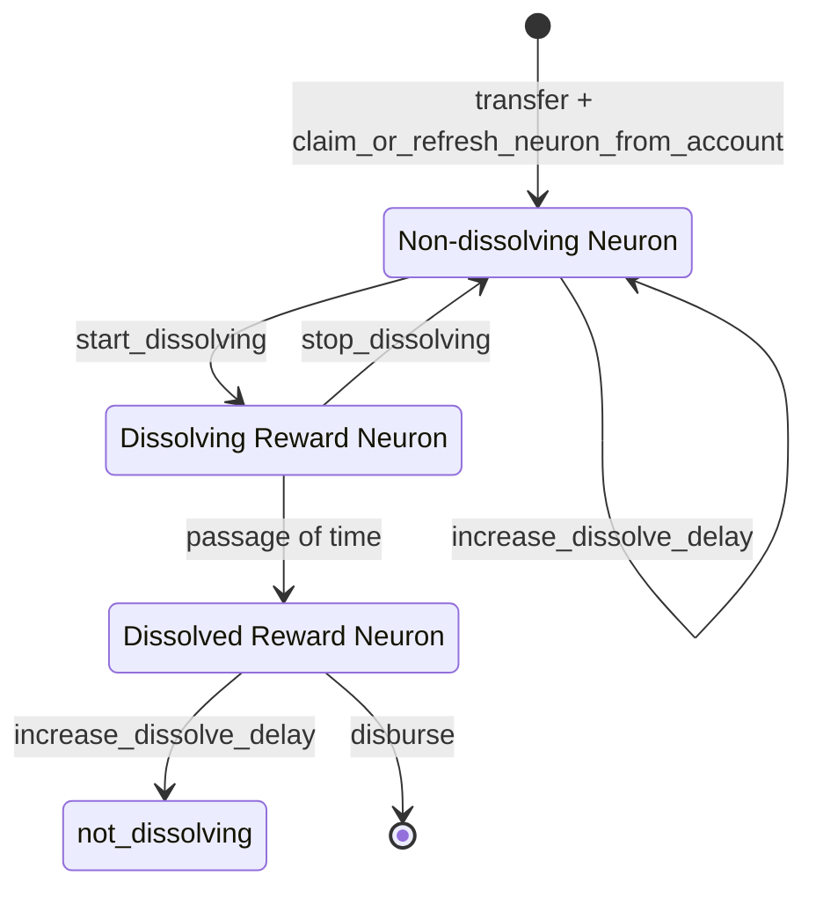

# Neuron lifecycle

Neuron is a type of asset managed by the Internet Computer governance canister smart contract.
It allows its owner to participate in the governance of the network by submitting and voting on proposals.

## Creating a neuron

Creating a neuron involves 2 steps:

  * Transfer some *amount* of ICPs from any ledger account to the neuron's address.
    Neuron address on the ledger is computed from the ID of the principal that owns the future neuron and an integer nonce that allows one to differentiate between neurons of the same principal.
  * Call the `claim_or_refresh_neuron_from_account` method of the governance canister smart contract.
    If the call is successful, the payload contains the "neuron ID", a unique numeric identifier of the newly created neuron.
    The governance canister maintains a mapping between neuron IDs and subaccounts, most management operations can be performed using either the neuron ID or the subaccount address.

## Neuron attributes

A neuron has the following attributes that control its lifecycle and rewards distribution:

  * **Dissolve Delay** is how long it will take a neuron to become "liquid" once it starts dissolving.
    If the neuron is already dissolving, the delay indicates the amount of time left before the neuron transitions to *DISSOLVED* state.
    The dissolve delay of a newly created neuron is 0.
    Only neurons with a dissolve delay of at least 6 months (as of 2021-07-27, the exact delay requirements are a subject to change) can be used to vote on proposals.
    Once set, the dissolve delay cannot be reduced via management commands.
  * **Dissolve State**
    * *NOT_DISSOLVING*
      Neuron has a fixed dissolve delay an accrues *age*.
      This is the default state of a newly created neuron.
    * *DISSOLVING*
      Neuron's dissolve delay is decreasing with the passage of time.
      Once the dissolve delay becomes 0, the neuron transitions to the *DISSOLVED* state and the staked ICPs can be disbursed.
    * *DISSOLVED*
      Neuron's dissolve delay is 0.
      The neuron holder is free to either disburse the staked ICPs or increase the dissolve delay, which will cause a transition to the *NOT_DISSOLVING* state.
  * **Age** is the amount of time that passed since the last time the neuron transitioned to the *NOT_DISSOLVING* state.
    If the neuron is *DISSOLVING*, its age is 0.
  * **Maturity** is the total amount of unspent rewards received by this neuron.
    Maturity is measured in the percent of the staked amount and cannot be converted to ICPs until the disburse event.

The voting power of a neuron is proportional the *amount* of staked ICPs and is a subject to age and dissolve delay multiplicative bonuses.

## Rewards

Once a proposal is accepted, all the neurons that voted on it receive rewards in form of "maturity" percent increase.
The rewards are distributed daily by the governance canister smart contract.
This process doesn't involve any user interaction.
The amount of rewards is proportional to the staked *amount* and is a subject to age and dissolve delay bonuses.
The bonuses are only applicable if the neuron is in *NOT_DISSOLVING* state.

For more information on neuron state transitions and rewards, see [Understanding the Internet Computer’s Network Nervous System, Neurons, and ICP Utility Tokens].

[Understanding the Internet Computer’s Network Nervous System, Neurons, and ICP Utility Tokens]:
   https://medium.com/dfinity/understanding-the-internet-computers-network-nervous-system-neurons-and-icp-utility-tokens-730dab65cae8

## State transitions

