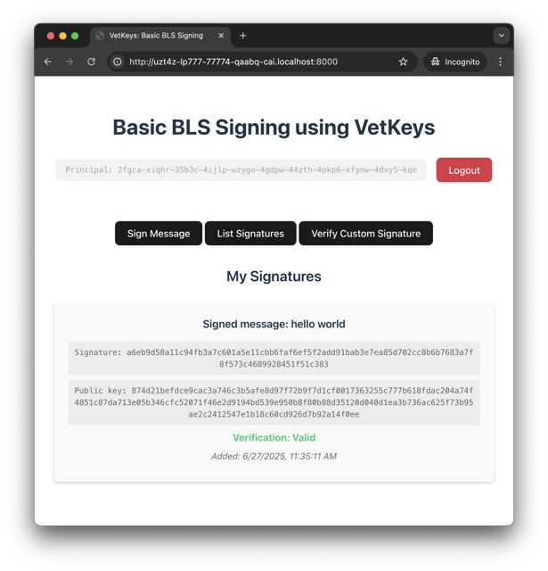

# Threshold BLS Signatures

| Motoko backend | [](http://icp.ninja/editor?g=https://github.com/dfinity/vetkeys/tree/main/examples/basic_bls_signing/motoko)|
| --- | --- |
| Rust backend | [](http://icp.ninja/editor?g=https://github.com/dfinity/vetkeys/tree/main/examples/basic_bls_signing/rust) |

The **Basic BLS signing** example demonstrates how to use **[vetKeys](https://internetcomputer.org/docs/building-apps/network-features/vetkeys/introduction)** to implement a threshold BLS signing service on the **Internet Computer (IC)**, where every authenticated user can ask the canister (IC smart contract) to produce signatures, where the **Internet Identity Principal** identifies the signer. This canister ensures that users can only produce signature for their own principal and not for someone else's principal. Furthermore, the vetKeys in this dapp can only be produced upon a user request, as specified in the canister code, meaning that the canister cannot produce signatures for arbitrary users or messages.

For confirming that the canister can only produce signatures in the intended way, users need to inspect the code installed in the canister. For this, it is crucial that canisters using VetKeys have their code public.



## Features

- **Signer Authorization**: Only authorized users can produce signatures and only for their own identity.
- **Frontend Signature Verification**: Any user can publish any signature from their principal in the canister storage and the frontend automatically checks the signature validity.

## Setup

### Prerequisites

- [Internet Computer software development kit](https://internetcomputer.org/docs/building-apps/getting-started/install)
- [npm](https://www.npmjs.com/package/npm)

### (Optionally) Choose a Different Master Key

This example uses `test_key_1` by default. To use a different [available master key](https://internetcomputer.org/docs/building-apps/network-features/vetkeys/api#available-master-keys), change the `"init_arg": "(\"test_key_1\")"` line in `dfx.json` to the desired key before running `dfx deploy` in the next step.

### Deploy the Canisters Locally

If you want to deploy this project locally with a Motoko backend, then run:
```bash
dfx start --background && dfx deploy
```
from the `motoko` folder.

To use the Rust backend instead of Motoko, run the same command in the `rust` folder.

## Example Components

### Backend

The backend consists of a canister that:
* Produces signatures upon a user request.
* Allows users to retrieve the root public key that can be used to check any user's signature for this canister.
* Allows users to store signatures (real or fake) in a log datastructure.

### Frontend

The frontend is a vanilla typescript application providing a simple interface for signing, showing the signatures stored in the canister, and publishing a signature.

To run the frontend in development mode with hot reloading (after running `dfx deploy`):

```bash
npm run dev
```

## Additional Resources

- **[What are VetKeys](https://internetcomputer.org/docs/building-apps/network-features/encryption/vetkeys)** - For more information about VetKeys and VetKD.
