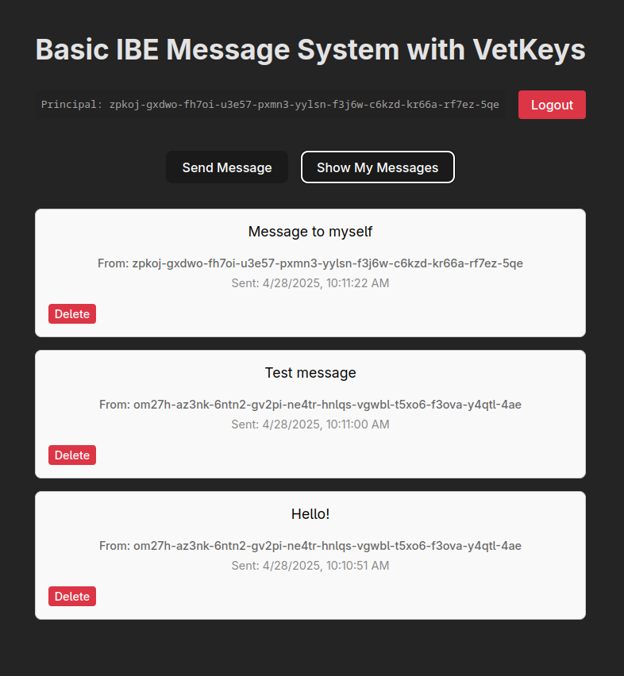

# Identity-Based Encryption

| Motoko backend | [](http://icp.ninja/editor?g=https://github.com/dfinity/vetkeys/tree/main/examples/basic_ibe/motoko)|
| --- | --- |
| Rust backend | [](http://icp.ninja/editor?g=https://github.com/dfinity/vetkeys/tree/main/examples/basic_ibe/rust) |

The **Basic IBE** example demonstrates how to use **[VetKeys](https://internetcomputer.org/docs/building-apps/network-features/vetkeys/introduction)** to implement secure messaging between users by means of Identity-Based Encryption (IBE) on the **Internet Computer (IC)**. This application allows users to send encrypted messages to other users using their **Internet Identity Principal** as the encryption key identifier. This canister (IC smart contract) ensures that only the authorized user can access their private decryption key, meaning that even if someone else knows your principal, they cannot decrypt messages intended for you because neither other users nor this canister can access your private key.

Note that generally it is possible for a canister to request a decryption key to decrypt secrets as part of its code.
However, doing so requires the canister to provide its own transport key instead of requesting a user's transport key and this inherently makes secrets public.
A canister functionality for decrypting secrets can be detected by inspecting the code and, therefore, it is crucial that canisters using VetKeys have their code public to allow to verify that the canister handles secrets in a secure way.



## Features

- **Secure Messaging**: Uses IBE capabilities of IC Vetkeys to encrypt messages that can only be decrypted by the intended recipient.
- **Principal-Based Encryption**: Messages are encrypted using the recipient's principal as the public key identifier.
- **Private Key Management**: Each user's private decryption key is generated by the VetKD protocol and encrypted using the user's transport key, making it inaccessible to the canister itself. The canister only sees the keys in encrypted form and forwards them to the authorized users.

## Setup

### Prerequisites

- [Internet Computer software development kit](https://internetcomputer.org/docs/building-apps/getting-started/install)
- [npm](https://www.npmjs.com/package/npm)

### (Optionally) Choose a Different Master Key

This example uses `test_key_1` by default. To use a different [available master key](https://internetcomputer.org/docs/building-apps/network-features/vetkeys/api#available-master-keys), change the `"init_arg": "(\"test_key_1\")"` line in `dfx.json` to the desired key before running `dfx deploy` in the next step.

### Deploy the Canisters Locally

If you want to deploy this project locally with a Motoko backend, then run:
```bash
dfx start --background && dfx deploy
```
from the `motoko` folder.

To use the Rust backend instead of Motoko, run the same command in the `rust` folder.

## Example Components

### Backend

The backend consists of a canister that:
* Stores encrypted messages between users.
* Allows users to retrieve their personal encrypted messages.
* Allows users to retrieve the decryption key for their messages for later decryption in user's browser.

### Frontend

The frontend is a vanilla typescript application providing a simple interface for sending, receiving, and deleting encrypted messages.

To run the frontend in development mode with hot reloading (after running `dfx deploy`):

```bash
npm run dev
```

## Limitations

This example dapp does not implement key rotation, which is strongly recommended in a production dapp to limit the impact of potential key compromise if a malicious party gains access to the user's decryption key.

## Additional Resources

- **[What are VetKeys](https://internetcomputer.org/docs/building-apps/network-features/vetkeys/introduction)** - For more information about VetKeys and VetKD.
